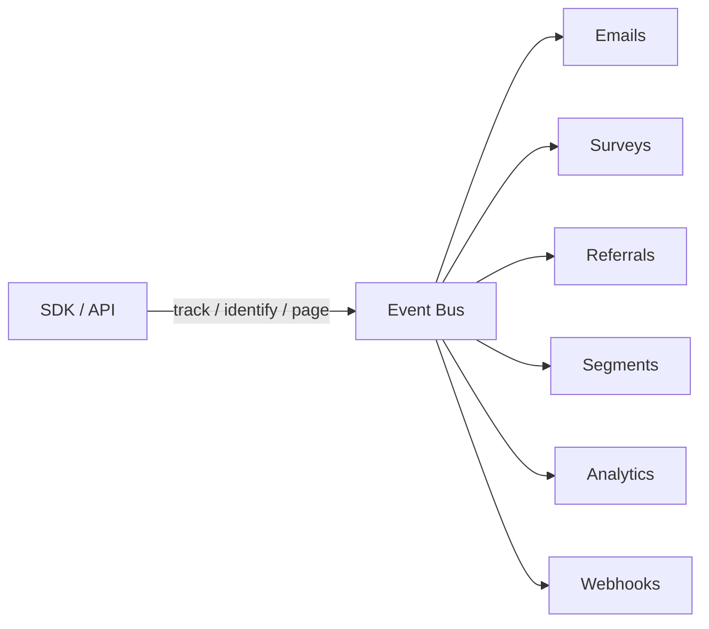
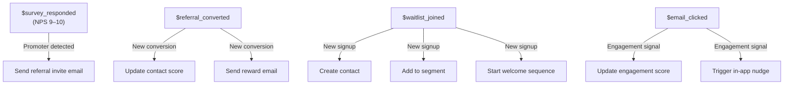

import { Card, CardGrid, Badge, Tabs, TabItem, Steps, Aside, LinkCard } from '@astrojs/starlight/components';

## Event-Driven Architecture

Every event captured by GrowthOS — whether from the client SDK, server API, or internal system — flows through a **unified event bus**. The bus routes each event to every module that subscribes, enabling cross-module automation without point-to-point wiring.



<Aside type="tip">
You do not need to send events to each module individually. The event bus handles fan-out automatically — emit once, route everywhere.
</Aside>

---

## Event Anatomy

Every event in GrowthOS follows a standard envelope structure regardless of its source.

```json
{
  "id": "evt_abc123",
  "type": "track",
  "user_id": "usr_123",
  "anonymous_id": "anon_xyz",
  "event": "feature_activated",
  "properties": {},
  "context": {
    "ip": "203.0.113.1",
    "user_agent": "...",
    "locale": "en-US",
    "page": { "url": "...", "title": "...", "referrer": "..." },
    "library": { "name": "@growthos/js", "version": "1.0.0" },
    "campaign": { "source": "google", "medium": "cpc", "name": "spring_sale" }
  },
  "timestamp": "2025-06-01T12:00:00Z",
  "received_at": "2025-06-01T12:00:01Z",
  "message_id": "msg_unique123",
  "tenant_id": "tenant_abc"
}
```

<CardGrid>
  <Card title="Envelope fields" icon="document">
    `id`, `type`, `message_id`, `tenant_id`, `timestamp`, and `received_at` are present on every event and managed by the platform.
  </Card>
  <Card title="Identity fields" icon="seti:lock">
    `user_id` and `anonymous_id` link the event to a contact. At least one must be present. When both exist, GrowthOS merges them automatically.
  </Card>
  <Card title="Payload fields" icon="setting">
    `event` (the name) and `properties` (arbitrary key-value data) carry the domain-specific information.
  </Card>
  <Card title="Context fields" icon="information">
    `context` is auto-collected by SDKs and includes device, page, campaign, and library metadata.
  </Card>
</CardGrid>

---

## Naming Conventions

Consistent naming keeps automations, segments, and analytics reliable across your team.

<Steps>
1. **Use `snake_case`** for all event names and property keys — e.g., `feature_activated`, `plan_name`.

2. **Use `object.action`** for domain events — e.g., `referral.converted`, `survey.completed`, `invoice.paid`.

3. **System events start with `$`** — e.g., `$page_view`, `$session_start`. These are emitted by the platform automatically.

4. **Custom events omit the `$` prefix** — they are developer-defined and free-form within the rules below.
</Steps>

<Card title="Limits">
  - **Event name length:** 256 characters maximum
  - **Properties per event:** 256 keys maximum
  - **Property value size:** 10 KB maximum per value
</Card>

<Aside type="caution">
Avoid starting custom event names with `$` — the prefix is reserved for system events and will be rejected by the Ingest API.
</Aside>

---

## Reserved System Events

GrowthOS emits the following system events automatically. You can subscribe to them in automations, segments, and webhooks just like custom events.

### Page and Session Events

| Event | Trigger | Key Properties |
|---|---|---|
| `$page_view` | Auto on page load | `url`, `title`, `referrer`, `path` |
| `$session_start` | Auto on new session | `session_id`, `duration` |
| `$session_end` | Auto on session close | `session_id`, `duration`, `pages` |
| `$identify` | `identify()` call | `traits` (merged with contact) |
| `$form_submitted` | Auto on form submit | `form_id`, `fields` |

### Referral Events

| Event | Trigger | Key Properties |
|---|---|---|
| `$referral_link_created` | Referral link generated | `program_id`, `link_code` |
| `$referral_clicked` | Referral link clicked | `referrer_id`, `link_code` |
| `$referral_converted` | Referred user converts | `referrer_id`, `referred_id`, `reward` |

### Survey Events

| Event | Trigger | Key Properties |
|---|---|---|
| `$survey_shown` | Survey displayed | `survey_id`, `type` |
| `$survey_responded` | Survey submitted | `survey_id`, `score`, `answers` |

### Waitlist Events

| Event | Trigger | Key Properties |
|---|---|---|
| `$waitlist_joined` | Waitlist signup | `waitlist_id`, `position` |
| `$waitlist_referred` | Shared waitlist link | `waitlist_id`, `referrer_id` |
| `$waitlist_approved` | Entry approved | `waitlist_id`, `entry_id` |

### Email Events

| Event | Trigger | Key Properties |
|---|---|---|
| `$email_sent` | Email dispatched | `campaign_id`, `template_id` |
| `$email_opened` | Email opened | `campaign_id`, `contact_id` |
| `$email_clicked` | Link clicked in email | `campaign_id`, `url` |
| `$email_bounced` | Bounce received | `campaign_id`, `bounce_type` |
| `$email_unsubscribed` | Unsubscribe action | `campaign_id`, `reason` |

### Nudge and Onboarding Events

| Event | Trigger | Key Properties |
|---|---|---|
| `$nudge_shown` | In-app nudge displayed | `nudge_id`, `type` |
| `$nudge_dismissed` | Nudge dismissed | `nudge_id` |
| `$nudge_clicked` | Nudge CTA clicked | `nudge_id`, `action` |
| `$checklist_step_completed` | Onboarding step done | `checklist_id`, `step_id` |
| `$checklist_completed` | All steps done | `checklist_id` |

### Commerce and Upgrade Events

| Event | Trigger | Key Properties |
|---|---|---|
| `$coupon_redeemed` | Coupon used | `coupon_code`, `discount` |
| `$upgrade_prompt_shown` | Upgrade prompt displayed | `prompt_id`, `trigger` |
| `$upgrade_prompt_clicked` | User clicked upgrade | `prompt_id` |

---

## Cross-Module Event Routing

The real power of the event bus is **cross-module automation** — an event in one module triggers actions in others without any custom code.



| Source Event | Condition | Automated Action |
|---|---|---|
| `$survey_responded` | NPS score is 9 or 10 | Auto-trigger referral invite email to the promoter |
| `$referral_converted` | Referred user completes signup | Update referrer contact score and send reward email |
| `$waitlist_joined` | New waitlist entry | Create contact, add to waitlist segment, start welcome email sequence |
| `$email_clicked` | Link clicked in campaign | Update engagement score on contact; optionally trigger an in-app nudge |

<Aside type="note">
Cross-module routes are configured in **Settings → Automations**. You can add conditions, delays, and branching logic to any route.
</Aside>

---

## Custom Events Best Practices

<CardGrid>
  <Card title="Keep names stable" icon="warning">
    Renaming an event breaks every automation, segment, and funnel that references it. Treat event names as a contract.
  </Card>
  <Card title="Include rich properties" icon="list-format">
    Add enough properties for downstream segmentation — e.g., include `plan_name` and `billing_interval` on a `subscription.created` event.
  </Card>
  <Card title="Use ISO 8601 timestamps" icon="seti:clock">
    Always send timestamps in ISO 8601 format with UTC offset. The SDK does this by default; server-side callers must ensure it.
  </Card>
  <Card title="No PII in properties" icon="seti:lock">
    Do not put personally identifiable information (email, phone, name) in event properties. Store PII as **traits** on the contact via `identify()` instead.
  </Card>
</CardGrid>

<Tabs>
  <TabItem label="Good">
    ```json
    {
      "event": "subscription.created",
      "properties": {
        "plan_name": "pro",
        "billing_interval": "annual",
        "mrr_cents": 9900
      }
    }
    ```
  </TabItem>
  <TabItem label="Avoid">
    ```json
    {
      "event": "SubCreated",
      "properties": {
        "email": "user@example.com",
        "plan": "Pro Plan ($99/yr)"
      }
    }
    ```
  </TabItem>
</Tabs>

<LinkCard
  title="Ingest API Reference"
  description="See the track, identify, and page endpoints for sending events."
  href="/growthos/api/ingest-api/"
/>
