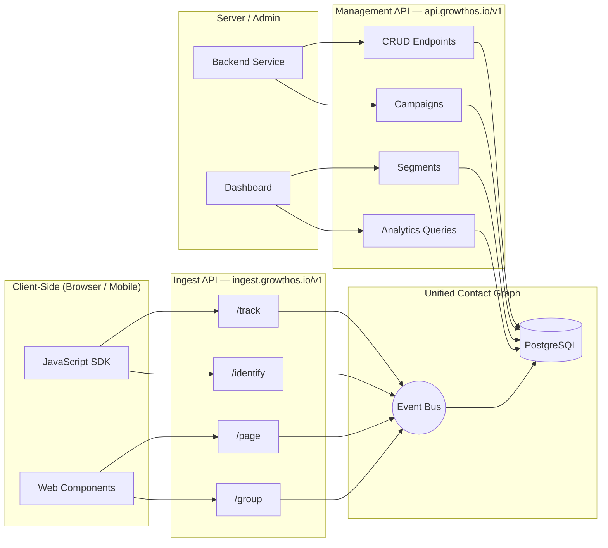

import { Card, CardGrid, LinkCard, Badge, Tabs, TabItem, Steps, Aside } from '@astrojs/starlight/components';

## Design Philosophy

GrowthOS is **API-first**. Every feature you see in the dashboard is backed by a public API endpoint — there are no hidden internal routes. If the UI can do it, your code can do it.

This means you can:
- Build entirely custom growth UIs on top of GrowthOS
- Automate any workflow with scripts and integrations
- Embed referral widgets, survey forms, and waitlists in any frontend framework
- Pipe GrowthOS data into your own analytics stack

<Aside type="tip" title="Inspiration">
  Our API design draws from the best in the industry: **Segment's tracking spec** for event schema, **Customer.io's API split** for separating ingest from management, and **PostHog's capture/query separation** for performance at scale.
</Aside>

---

## Two-API Architecture

GrowthOS splits its API surface into two distinct APIs, each optimized for its use case.



<CardGrid>
  <Card title="Ingest API" icon="rocket">
    High-volume, low-latency. Accepts events, identifies contacts, and powers embedded widgets. Uses **write-only keys** safe to expose in client-side code.
  </Card>
  <Card title="Management API" icon="setting">
    Full CRUD on all resources. Create campaigns, define segments, query analytics, manage settings. Uses **secret keys** with granular permission scopes. Server-side only.
  </Card>
</CardGrid>

---

## API Comparison

| Aspect | Ingest API | Management API |
|---|---|---|
| **Base URL** | `ingest.growthos.io/v1` | `api.growthos.io/v1` |
| **Auth** | Write Key (client-safe) | Secret Key + Scopes |
| **Rate Limit** | 1,000 req/s per key | 100 req/s per key |
| **Use Case** | Track, Identify, Page, Group | CRUD, Query, Admin |
| **Safe for client?** | <Badge text="Yes" variant="success" /> | <Badge text="No — server-side only" variant="danger" /> |
| **Response style** | Minimal (ACK) | Full resource payloads |
| **Idempotency** | Built-in via `message_id` | Via `Idempotency-Key` header |

---

## Versioning Strategy

GrowthOS uses **URL-path versioning**. The current version is `/v1/`.

<Tabs>
  <TabItem label="Rules">
    - **Breaking changes** (removed fields, changed types, removed endpoints) always ship under a new major version (`/v2/`)
    - **Additive changes** (new fields, new endpoints, new enum values) are non-breaking and ship within the current version
    - New optional query parameters are non-breaking
    - New fields in response payloads are non-breaking — your code should ignore unknown fields
  </TabItem>
  <TabItem label="Deprecation Cycle">
    When a version is deprecated:

    <Steps>
      1. A `Sunset` HTTP header appears on all responses from the deprecated version, containing the retirement date
      2. The deprecation is announced via email, changelog, and dashboard banner
      3. A **6-month migration window** begins — the old version continues to work
      4. After 6 months, the deprecated version returns `410 Gone`
    </Steps>
  </TabItem>
</Tabs>

<Aside type="caution">
  Always design your integration to handle unknown fields gracefully. Do not fail on unexpected properties in JSON responses — this lets us add features without breaking your code.
</Aside>

---

## Rate Limiting

Rate limits are enforced per API key and vary by plan tier.

### Limits by Plan

| Plan | Ingest API | Management API |
|---|---|---|
| **Free** | 100 req/s | 10 req/s |
| **Growth** | 500 req/s | 50 req/s |
| **Scale** | 1,000 req/s | 100 req/s |

### Response Headers

Every response includes rate limit headers:

| Header | Description |
|---|---|
| `X-RateLimit-Limit` | Maximum requests allowed in the current window |
| `X-RateLimit-Remaining` | Requests remaining in the current window |
| `X-RateLimit-Reset` | Unix timestamp when the window resets |
| `Retry-After` | Seconds to wait (only on `429` responses) |

```http
HTTP/1.1 429 Too Many Requests
X-RateLimit-Limit: 100
X-RateLimit-Remaining: 0
X-RateLimit-Reset: 1709712000
Retry-After: 12
Content-Type: application/json

{
  "error": {
    "code": "rate_limited",
    "message": "Rate limit exceeded. Retry after 12 seconds.",
    "details": []
  },
  "request_id": "req_abc123def456"
}
```

<Aside type="tip">
  The JavaScript SDK handles rate limiting automatically with exponential backoff. If you are calling the API directly, implement retry logic that respects the `Retry-After` header.
</Aside>

---

## Error Model

All errors follow a consistent JSON envelope, making it straightforward to build generic error handling.

```json
{
  "error": {
    "code": "validation_error",
    "message": "Field 'email' is required.",
    "details": [
      {
        "field": "email",
        "reason": "required",
        "message": "Email address must be provided for contact identification."
      }
    ]
  },
  "request_id": "req_7x9k2m4p1n"
}
```

### HTTP Status Codes

| Code | Meaning | When |
|---|---|---|
| `200` | OK | Successful read or update |
| `201` | Created | Resource successfully created |
| `400` | Bad Request | Malformed JSON or invalid parameters |
| `401` | Unauthenticated | Missing or invalid API key |
| `403` | Forbidden | Valid key but insufficient scopes |
| `404` | Not Found | Resource does not exist |
| `409` | Conflict | Duplicate resource or version conflict |
| `422` | Unprocessable Entity | Valid JSON but fails business logic validation |
| `429` | Rate Limited | Too many requests — check `Retry-After` |
| `500` | Internal Server Error | Something broke on our end — retry is safe |

<Aside type="note">
  Every response includes a `request_id` field. Include this in support tickets to help us trace issues quickly.
</Aside>

---

## Pagination

All list endpoints use **cursor-based pagination** for consistent performance regardless of dataset size.

### Request Parameters

| Parameter | Type | Default | Description |
|---|---|---|---|
| `cursor` | string | _(none)_ | Opaque cursor from a previous response |
| `limit` | integer | 25 | Number of items to return (max: 100) |

### Response Shape

```json
{
  "data": [
    { "id": "cntct_abc", "email": "alice@example.com" },
    { "id": "cntct_def", "email": "bob@example.com" }
  ],
  "has_more": true,
  "next_cursor": "eyJpZCI6ImNudGN0X2RlZiJ9"
}
```

To fetch the next page, pass `next_cursor` as the `cursor` parameter:

```
GET /v1/contacts?cursor=eyJpZCI6ImNudGN0X2RlZiJ9&limit=25
```

<Aside type="caution">
  Do not store cursors long-term. They are opaque, may expire, and their format may change without notice. Always start a fresh pagination sequence when re-querying.
</Aside>

---

## SDKs and Integration

<CardGrid>
  <Card title="JavaScript SDK" icon="seti:javascript">
    Wraps both Ingest and Management APIs. Auto-batches events, handles retries, and provides TypeScript types. Works in browser and Node.js.
  </Card>
  <Card title="Web Components" icon="seti:html">
    Drop-in embeddable widgets for referral forms, waitlist signups, survey popups, and social proof toasts. Framework-agnostic — works with React, Vue, Svelte, or plain HTML.
  </Card>
  <Card title="Server SDKs" icon="laptop">
    **Node.js** — available now. **Python** and **Go** — planned. All server SDKs use the Management API with secret key auth.
  </Card>
  <Card title="REST Direct" icon="external">
    No SDK needed — call the REST API directly from any language. All endpoints accept and return JSON with standard HTTP conventions.
  </Card>
</CardGrid>

### Quick Install

<Tabs>
  <TabItem label="npm">
    ```bash
    npm install @growthos/sdk
    ```
  </TabItem>
  <TabItem label="yarn">
    ```bash
    yarn add @growthos/sdk
    ```
  </TabItem>
  <TabItem label="CDN">
    ```html
    <script src="https://cdn.growthos.io/sdk/v1/growthos.min.js"></script>
    ```
  </TabItem>
</Tabs>

```javascript
import GrowthOS from '@growthos/sdk';

// Client-side — uses Ingest API
const gos = GrowthOS.init({
  writeKey: 'gos_wk_your_write_key',
});

gos.identify('user_123', {
  email: 'alice@example.com',
  plan: 'growth',
});

gos.track('Feature Activated', {
  feature: 'referral_program',
});
```

---

## Explore the API

<CardGrid>
  <LinkCard
    title="Authentication & Security"
    description="API key types, scopes, JWT tokens, HMAC webhook signing, and multi-tenant security."
    href="/growthos/api/authentication/"
  />
  <LinkCard
    title="Ingest API Reference"
    description="Track events, identify contacts, log page views, and group users."
    href="/growthos/api/ingest-api/"
  />
  <LinkCard
    title="Management API Reference"
    description="Full CRUD on contacts, campaigns, segments, surveys, referrals, and more."
    href="/growthos/api/management-api/"
  />
  <LinkCard
    title="Webhooks"
    description="Real-time event delivery to your server with HMAC-signed payloads."
    href="/growthos/api/webhooks/"
  />
  <LinkCard
    title="SDKs & Libraries"
    description="JavaScript SDK, Web Components, and server-side libraries."
    href="/growthos/api/sdks/"
  />
</CardGrid>
