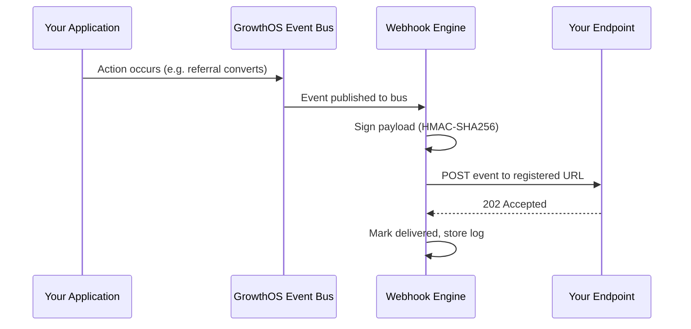

import { Card, CardGrid, Badge, Tabs, TabItem, Steps, Aside, LinkCard } from '@astrojs/starlight/components';

## How Webhooks Work

Instead of polling the API for changes, register a webhook endpoint and GrowthOS will push events to you in real time. Every state change in the platform — a new contact, a referral conversion, an email bounce — fires an event that can be delivered to your HTTPS endpoint.



<CardGrid>
  <Card title="Async Delivery" icon="rocket">
    Events are delivered asynchronously. Your users never wait on your webhook endpoint — GrowthOS fires and continues.
  </Card>
  <Card title="At-Least-Once Guarantee" icon="approve-check">
    Every event is delivered at least once. In rare cases (network hiccups, retries), you may receive a duplicate — use the `idempotency_key` to deduplicate.
  </Card>
  <Card title="Idempotency Keys" icon="random">
    Every webhook payload includes a unique `idempotency_key`. Store it and check for duplicates before processing to ensure safe at-least-once delivery.
  </Card>
  <Card title="Full Observability" icon="open-book">
    Every delivery attempt is logged in the dashboard with status code, latency, and response body. Replay any event with one click.
  </Card>
</CardGrid>

---

## Available Events

GrowthOS emits events across every domain in the platform. Subscribe to specific event types or use wildcard patterns (e.g. `referral.*`) to catch all events in a domain.

### Contact Events

| Event | Description |
|---|---|
| `contact.created` | New contact identified via Ingest API or integration |
| `contact.updated` | One or more contact traits changed |
| `contact.merged` | Two contact records merged (includes both IDs) |
| `contact.deleted` | Contact soft-deleted (data retained for 30 days) |

### Referral Events

| Event | Description |
|---|---|
| `referral.link_created` | New referral link generated for a contact |
| `referral.clicked` | Referral link clicked by a prospective user |
| `referral.converted` | Referred user completed the conversion action |
| `referral.reward_issued` | Reward granted to the referrer |

### Email Events

| Event | Description |
|---|---|
| `email.sent` | Email dispatched to delivery provider |
| `email.delivered` | Delivery confirmed by recipient mail server |
| `email.opened` | Email opened (pixel-tracked) |
| `email.clicked` | Link in email clicked |
| `email.bounced` | Hard or soft bounce recorded |
| `email.unsubscribed` | Recipient unsubscribed via link |
| `email.complained` | Recipient marked email as spam |

### Survey Events

| Event | Description |
|---|---|
| `survey.response_received` | Survey response submitted |
| `survey.nps_promoter` | NPS score of 9 or 10 received |
| `survey.nps_detractor` | NPS score of 0 through 6 received |

### Waitlist Events

| Event | Description |
|---|---|
| `waitlist.entry_created` | New waitlist signup |
| `waitlist.position_changed` | Position moved (typically via referral bumps) |
| `waitlist.entry_approved` | Entry approved, invite sent to user |

### Campaign Events

| Event | Description |
|---|---|
| `campaign.activated` | Campaign started sending |
| `campaign.completed` | All sends in campaign complete |
| `campaign.paused` | Campaign paused by user or automation rule |

### Billing Events

<Aside type="note" title="Stripe passthrough">
  Billing events originate from Stripe and are normalized into the GrowthOS event schema. You receive them through the same webhook endpoint — no need to configure Stripe webhooks separately.
</Aside>

| Event | Description |
|---|---|
| `billing.subscription_created` | New subscription started |
| `billing.subscription_updated` | Plan, quantity, or status changed |
| `billing.payment_failed` | Payment attempt failed |
| `billing.trial_expiring` | Trial period ending within 3 days |

---

## Webhook Payload Structure

Every webhook delivery uses a standard envelope format regardless of event type. The `data` object varies per event, but the outer structure is always the same.

```json
{
  "id": "evt_abc123",
  "type": "referral.converted",
  "created_at": "2025-06-01T12:00:00Z",
  "data": {
    "referral_link_id": "rl_xyz",
    "referrer_id": "usr_123",
    "referred_id": "usr_456",
    "program_id": "prog_001",
    "reward": {
      "type": "credit",
      "amount": 20,
      "currency": "USD"
    }
  },
  "tenant_id": "tenant_abc",
  "idempotency_key": "idk_unique123"
}
```

| Field | Type | Description |
|---|---|---|
| `id` | string | Unique event ID (`evt_` prefix) |
| `type` | string | Event type in `domain.action` format |
| `created_at` | string | ISO 8601 timestamp of when the event occurred |
| `data` | object | Event-specific payload (varies by type) |
| `tenant_id` | string | Your tenant identifier |
| `idempotency_key` | string | Unique key for deduplication (`idk_` prefix) |

---

## Delivery and Retries

GrowthOS uses exponential backoff to retry failed deliveries. Your endpoint must respond with a `2xx` status code within **30 seconds** or the attempt is considered failed.

### Retry Schedule

<Steps>
1. **Attempt 1** — Immediate delivery
2. **Attempt 2** — 5 seconds after failure
3. **Attempt 3** — 30 seconds
4. **Attempt 4** — 2 minutes
5. **Attempt 5** — 15 minutes
6. **Attempt 6** — 1 hour
7. **Attempt 7** — 6 hours
8. **Final attempt** — 24 hours
</Steps>

That is **7 retry attempts** spanning approximately **31 hours** total. After the final attempt, the event is marked as failed in the dashboard and you can manually replay it.

### Response Behavior

| Your Response | GrowthOS Behavior |
|---|---|
| `2xx` | Delivery marked as successful |
| `4xx` (except 429) | **No retry** — treated as a permanent rejection |
| `429 Too Many Requests` | Retried with backoff (respects `Retry-After` header) |
| `5xx` | Retried with exponential backoff |
| Timeout (over 30s) | Retried with exponential backoff |
| Connection refused | Retried with exponential backoff |

<Aside type="caution" title="Timeouts kill deliveries">
  If your endpoint consistently takes over 30 seconds, GrowthOS will disable it after repeated failures. Accept the payload quickly and process it asynchronously.
</Aside>

---

## Signature Verification

Every webhook delivery is signed with your project's webhook signing secret using **HMAC-SHA256**. Always verify the signature before processing the payload to ensure the request genuinely came from GrowthOS.

Three headers are included with every delivery:

| Header | Description |
|---|---|
| `X-GrowthOS-Signature` | HMAC-SHA256 hex digest of the raw request body |
| `X-GrowthOS-Timestamp` | Unix timestamp of when the payload was signed |
| `X-GrowthOS-Event-Type` | The event type (e.g. `referral.converted`) |

To verify, concatenate the timestamp and the raw body with a `.` separator, then compute the HMAC-SHA256 using your webhook signing secret. Compare the result to the `X-GrowthOS-Signature` header value.

<Aside type="tip" title="Replay attack protection">
  Always check that `X-GrowthOS-Timestamp` is within a reasonable window (we recommend 5 minutes). Reject requests with stale timestamps to prevent replay attacks.
</Aside>

<LinkCard
  title="Full Signature Verification Guide"
  description="Step-by-step code examples in Node.js, Python, Ruby, and Go for verifying webhook signatures."
  href="/growthos/api/authentication/#webhook-signing"
/>

---

## Best Practices

<CardGrid>
  <Card title="Respond Fast" icon="rocket">
    Return `202 Accepted` immediately, then process the event asynchronously in a background job or queue. Never do heavy processing inside the request handler.
  </Card>
  <Card title="Use Idempotency Keys" icon="approve-check">
    Store the `idempotency_key` from each payload. Before processing, check if you have already handled that key. This protects you from duplicate deliveries.
  </Card>
  <Card title="Verify Signatures" icon="warning">
    Always validate the `X-GrowthOS-Signature` header before trusting the payload. Without verification, an attacker could send fake events to your endpoint.
  </Card>
  <Card title="Monitor Webhook Logs" icon="open-book">
    Use the **Webhooks** section of the GrowthOS dashboard to monitor delivery attempts, inspect payloads, view error responses, and replay failed events.
  </Card>
</CardGrid>

### Quick Reference: Endpoint Checklist

<Steps>
1. **Accept POST requests** at a publicly reachable HTTPS URL.
2. **Verify the signature** using your webhook signing secret.
3. **Check the timestamp** to reject stale deliveries (over 5 minutes old).
4. **Deduplicate** using the `idempotency_key`.
5. **Return 202 immediately** — enqueue the event for async processing.
6. **Process the event** in a background worker (e.g. Sidekiq, Celery, BullMQ).
7. **Log and alert** on processing failures so you can investigate quickly.
</Steps>
