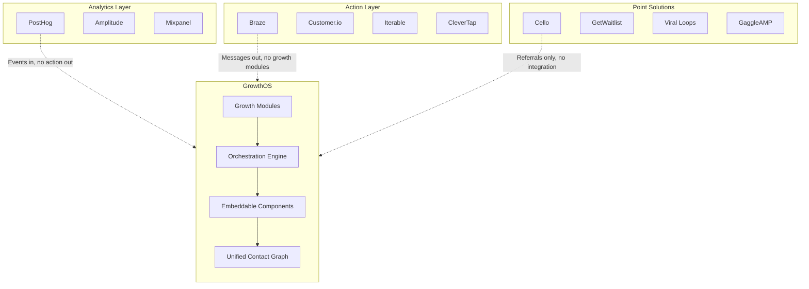

import { Card, CardGrid, LinkCard, Badge, Tabs, TabItem, Steps, Aside } from '@astrojs/starlight/components';

## Strategic Positioning

GrowthOS occupies the **growth engineering layer** — the space between analytics platforms (PostHog, Amplitude) and messaging platforms (Braze, Customer.io). Analytics tools tell you what happened. Messaging tools send campaigns. Neither manages the growth mechanics in between: waitlists, referrals, advocacy, surveys, and the orchestration that connects them.

GrowthOS fills that gap with modular growth primitives, a unified contact graph, and embeddable components — all sharing one identity and one event bus.

---

## Category 1: Customer Engagement Platforms

These platforms excel at cross-channel messaging but lack growth-specific modules like referrals, waitlists, advocacy, and embeddable components.

| Platform | Strengths | Gap |
|---|---|---|
| **Braze** | Best mobile engagement, real-time, cross-channel | $60K-200K/yr. No referrals, waitlist, advocacy, embeddable components |
| **Customer.io** | Event-driven journeys, developer-friendly | No referral, waitlist, surveys, advocacy. Campaign-only |
| **Iterable** | Strong cross-channel orchestration | Enterprise pricing. No product analytics or growth modules |
| **CleverTap / MoEngage / WebEngage** | India-strong, mobile-first, affordable | No referral, waitlist, advocacy, embeddable components |

<Aside type="note">
Engagement platforms are built for **messaging at scale** — not for managing growth mechanics. Adding a referral program to Braze means integrating yet another point solution and wiring identity across both.
</Aside>

---

## Category 2: Product Analytics

Analytics platforms provide deep behavioral data but have no action layer — they observe, they don't activate.

| Platform | Strengths | Gap |
|---|---|---|
| **PostHog** | All-in-one analytics, feature flags, experiments, open source | No outbound messaging, referral, waitlist, campaign orchestration |
| **Amplitude** | Deep behavioral analytics, predictive cohorts | No messaging, no growth modules, expensive |
| **Mixpanel** | Clean event analytics, good SDKs | Analytics only, no action layer |

<Aside type="tip">
GrowthOS is designed to **complement** PostHog and Amplitude — not replace them. Events flow in from analytics; actions flow out through GrowthOS modules.
</Aside>

---

## Category 3: Point Solutions

Each tool solves one problem well but creates identity fragmentation when combined with others.

| Platform | What It Does | Limitation |
|---|---|---|
| **Cello** | SaaS referral programs + widget | Referral only. No waitlist, surveys, or campaigns |
| **GetWaitlist** | Viral waitlist + referral ranking | Waitlist only. Useless after launch |
| **Viral Loops** | Referral campaign templates | Campaign-only. No analytics or CRM integration |
| **GaggleAMP** | Employee advocacy | $500-2K/mo. No user data integration |
| **Typeform / Delighted** | Surveys / NPS | NPS scores don't feed into campaigns |

---

## Category 4: Open-Source Alternatives

Open-source tools offer flexibility and cost savings but remain narrowly scoped to messaging or workflow automation.

| Platform | What It Does | Gap |
|---|---|---|
| **Mautic** | Marketing automation (200K+ orgs) | No referrals, waitlists, embeddable components |
| **Laudspeaker** | Open-source Braze (YC-backed) | Early-stage, messaging only |
| **Dittofeed** | Open-source Customer.io | Messaging only |
| **Novu** | Notification infrastructure | Notifications only |
| **n8n** | Open-source Zapier | Workflow only, no growth modules |

---

## The Gap GrowthOS Fills

Every category has a gap. Messaging platforms don't manage waitlists or referrals. Analytics platforms don't take action. Point solutions create identity fragmentation. Open-source alternatives cover messaging or workflow but not growth mechanics.

**GrowthOS fills the gap** — modular growth primitives (waitlist, referral, surveys, advocacy, lifecycle emails) unified by a single contact graph, a single event bus, and embeddable components that ship in minutes.

---

## Explore Further

<CardGrid>
  <LinkCard
    title="Pricing"
    description="Tiered pricing designed for indie and small SaaS teams."
    href="/growthos/business/pricing/"
  />
  <LinkCard
    title="Unit Economics"
    description="Margins, CAC, LTV, and the path to sustainable growth."
    href="/growthos/business/unit-economics/"
  />
</CardGrid>
