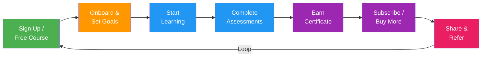

import { Card, CardGrid, Badge, Tabs, TabItem, Steps, Aside, LinkCard } from '@astrojs/starlight/components';

Learning platforms generate a rich stream of engagement data: every lesson started, video completed, assessment submitted, and discussion post created tells a story about learner motivation and progress. A structured event taxonomy lets you identify at-risk students before they churn, personalise learning paths based on behaviour, and build growth loops where course completions and certifications drive organic referrals.

---

## Acquire

Events capturing initial interest and trial enrolment.

| Event Name | Key Properties | Volume | Description |
|---|---|---|---|
| `user.signed_up` | `channel`, `utm_source`, `device_type` | <Badge text="High" variant="tip" /> | New user creates an account |
| `lead.captured` | `source`, `campaign_id`, `interest_topic` | <Badge text="High" variant="tip" /> | Lead collected from landing page, webinar, or partner |
| `trial.started` | `trial_duration_days`, `plan_type`, `source` | <Badge text="Medium" variant="note" /> | User begins a free trial |
| `free_course.enrolled` | `course_id`, `course_title`, `category` | <Badge text="High" variant="tip" /> | User enrols in a free course (top-of-funnel) |

---

## Activate

Enrolment, onboarding, and preference-setting events — getting learners to their first "aha" moment.

| Event Name | Key Properties | Volume | Description |
|---|---|---|---|
| `enrollment.created` | `course_id`, `enrollment_type`, `price_cents` | <Badge text="High" variant="tip" /> | User enrols in a course (free or paid) |
| `enrollment.cancelled` | `course_id`, `cancellation_reason`, `progress_pct` | <Badge text="Low" variant="caution" /> | User cancels an enrolment before completion |
| `onboarding.started` | `onboarding_version`, `device_type` | <Badge text="High" variant="tip" /> | User starts the platform onboarding flow |
| `onboarding.completed` | `onboarding_version`, `duration_seconds`, `steps_completed` | <Badge text="Medium" variant="note" /> | User completes the onboarding flow |
| `profile.learning_preferences_set` | `preferred_topics`, `skill_level`, `learning_goals` | <Badge text="Medium" variant="note" /> | User sets learning preferences or goals |

---

## Engage

The core learning loop — lessons, videos, assessments, discussions, and study sessions.

| Event Name | Key Properties | Volume | Description |
|---|---|---|---|
| `course.started` | `course_id`, `course_title`, `category` | <Badge text="High" variant="tip" /> | User starts their first lesson in a course |
| `lesson.started` | `lesson_id`, `course_id`, `lesson_number` | <Badge text="High" variant="tip" /> | User opens a lesson |
| `lesson.completed` | `lesson_id`, `course_id`, `duration_seconds`, `completion_type` | <Badge text="High" variant="tip" /> | User completes a lesson |
| `video.played` | `video_id`, `lesson_id`, `playback_rate` | <Badge text="High" variant="tip" /> | User starts playing a video |
| `video.paused` | `video_id`, `current_time_seconds`, `total_duration` | <Badge text="High" variant="tip" /> | User pauses a video |
| `video.completed` | `video_id`, `lesson_id`, `watch_pct`, `duration_seconds` | <Badge text="High" variant="tip" /> | User watches a video to the end |
| `video.seeked` | `video_id`, `from_seconds`, `to_seconds` | <Badge text="High" variant="tip" /> | User jumps to a different position in a video |
| `module.completed` | `module_id`, `course_id`, `lessons_completed`, `score_pct` | <Badge text="Medium" variant="note" /> | User completes all lessons in a module |
| `course.progress_updated` | `course_id`, `progress_pct`, `lessons_done`, `total_lessons` | <Badge text="High" variant="tip" /> | Course progress percentage recalculated |
| `course.completed` | `course_id`, `course_title`, `total_duration_hours`, `final_score_pct` | <Badge text="Medium" variant="note" /> | User completes all course requirements |
| `assessment.started` | `assessment_id`, `assessment_type`, `course_id` | <Badge text="Medium" variant="note" /> | User begins a quiz or exam |
| `assessment.submitted` | `assessment_id`, `score_pct`, `time_taken_seconds` | <Badge text="Medium" variant="note" /> | User submits an assessment |
| `assessment.graded` | `assessment_id`, `score_pct`, `passed`, `grader_type` | <Badge text="Medium" variant="note" /> | Assessment graded (auto or manual) |
| `assessment.retried` | `assessment_id`, `attempt_number`, `previous_score_pct` | <Badge text="Low" variant="caution" /> | User retries a failed assessment |
| `assignment.submitted` | `assignment_id`, `course_id`, `file_count`, `word_count` | <Badge text="Medium" variant="note" /> | User submits a written assignment |
| `assignment.graded` | `assignment_id`, `score_pct`, `grader_id`, `feedback_provided` | <Badge text="Low" variant="caution" /> | Assignment graded by instructor or peer |
| `note.created` | `lesson_id`, `note_length`, `note_type` | <Badge text="Medium" variant="note" /> | User creates a note on a lesson |
| `bookmark.added` | `content_id`, `content_type`, `course_id` | <Badge text="Medium" variant="note" /> | User bookmarks a lesson, video, or resource |
| `discussion.post_created` | `discussion_id`, `course_id`, `post_type`, `word_count` | <Badge text="Medium" variant="note" /> | User creates a discussion post |
| `discussion.reply_posted` | `discussion_id`, `parent_post_id`, `word_count` | <Badge text="Medium" variant="note" /> | User replies to a discussion thread |
| `study_session.started` | `session_type`, `planned_duration_minutes` | <Badge text="High" variant="tip" /> | User begins a focused study session |
| `study_session.ended` | `actual_duration_minutes`, `lessons_completed`, `focus_score` | <Badge text="High" variant="tip" /> | Study session ends |
| `live_class.joined` | `class_id`, `instructor_id`, `join_method` | <Badge text="Medium" variant="note" /> | User joins a live class or webinar |
| `live_class.left` | `class_id`, `duration_attended_minutes`, `total_duration_minutes` | <Badge text="Medium" variant="note" /> | User leaves a live class |

---

## Monetise

Subscription, purchase, and certification events that generate revenue.

| Event Name | Key Properties | Volume | Description |
|---|---|---|---|
| `subscription.created` | `plan_name`, `billing_interval`, `mrr_cents` | <Badge text="Medium" variant="note" /> | User subscribes to a paid plan |
| `course.purchased` | `course_id`, `price_cents`, `currency`, `coupon_code` | <Badge text="Medium" variant="note" /> | User purchases an individual course |
| `bundle.purchased` | `bundle_id`, `course_count`, `price_cents`, `discount_pct` | <Badge text="Low" variant="caution" /> | User purchases a course bundle |
| `certificate.earned` | `course_id`, `certificate_id`, `credential_type` | <Badge text="Medium" variant="note" /> | User earns a certificate or credential |
| `certificate.shared` | `certificate_id`, `share_platform`, `share_method` | <Badge text="Low" variant="caution" /> | User shares their certificate on social media or LinkedIn |

---

## Advocate

Ratings, reviews, and referral events that drive organic growth.

| Event Name | Key Properties | Volume | Description |
|---|---|---|---|
| `course.reviewed` | `course_id`, `rating`, `review_length`, `has_text` | <Badge text="Medium" variant="note" /> | User leaves a course review |
| `course.shared` | `course_id`, `share_platform`, `share_method` | <Badge text="Medium" variant="note" /> | User shares a course link with others |
| `referral.link_shared` | `channel`, `program_id`, `share_method` | <Badge text="Medium" variant="note" /> | User shares their referral link |
| `referral.converted` | `referrer_id`, `referred_id`, `reward_type` | <Badge text="Low" variant="caution" /> | Referred user signs up or enrols |
| `instructor.rated` | `instructor_id`, `rating`, `course_id` | <Badge text="Low" variant="caution" /> | User rates an instructor |

---

## Operational

Platform administration and content lifecycle events.

| Event Name | Key Properties | Volume | Description |
|---|---|---|---|
| `content.published` | `content_id`, `content_type`, `course_id`, `author_id` | <Badge text="Low (admin)" variant="danger" /> | New lesson, module, or course published |
| `content.updated` | `content_id`, `content_type`, `change_type`, `author_id` | <Badge text="Low (admin)" variant="danger" /> | Existing content updated |
| `plagiarism.detected` | `assignment_id`, `similarity_score_pct`, `matched_sources` | <Badge text="Low (admin)" variant="danger" /> | Plagiarism detection flags a submission |
| `accreditation.milestone_reached` | `milestone_type`, `course_id`, `compliance_status` | <Badge text="Low (admin)" variant="danger" /> | Accreditation or compliance milestone reached |

---

## Customer Journey



---

## Getting Started — Top Events to Track First

Start with these high-impact events before expanding to the full taxonomy.

```js
// 1. Signup
growthos.track('user.signed_up', {
  channel: 'organic',
  device_type: 'desktop',
});

// 2. Enrolment
growthos.track('enrollment.created', {
  course_id: 'crs_python101',
  enrollment_type: 'free',
  price_cents: 0,
});

// 3. Lesson completed
growthos.track('lesson.completed', {
  lesson_id: 'les_intro_01',
  course_id: 'crs_python101',
  duration_seconds: 420,
  completion_type: 'watched_full',
});

// 4. Assessment submitted
growthos.track('assessment.submitted', {
  assessment_id: 'asmt_quiz_01',
  score_pct: 85,
  time_taken_seconds: 600,
});

// 5. Course completed
growthos.track('course.completed', {
  course_id: 'crs_python101',
  course_title: 'Python 101',
  total_duration_hours: 12.5,
  final_score_pct: 88,
});

// 6. Certificate earned
growthos.track('certificate.earned', {
  course_id: 'crs_python101',
  certificate_id: 'cert_abc123',
  credential_type: 'completion',
});

// 7. Subscription created
growthos.track('subscription.created', {
  plan_name: 'pro',
  billing_interval: 'annual',
  mrr_cents: 1990,
});

// 8. Course reviewed
growthos.track('course.reviewed', {
  course_id: 'crs_python101',
  rating: 5,
  review_length: 280,
  has_text: true,
});

// 9. Referral shared
growthos.track('referral.link_shared', {
  channel: 'linkedin',
  program_id: 'prog_edtech_2025',
  share_method: 'certificate_page',
});
```

<LinkCard
  title="Event Schema & Taxonomy"
  description="See the canonical event envelope, naming conventions, and system events."
  href="/growthos/api/events/"
/>
