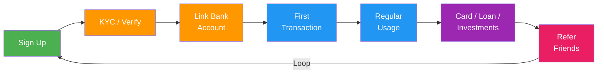

import { Card, CardGrid, Badge, Tabs, TabItem, Steps, Aside, LinkCard } from '@astrojs/starlight/components';

Fintech products span a wide surface area: onboarding with identity verification, daily transactions, card operations, lending, investments, and always-on fraud monitoring. A well-structured event taxonomy lets you build growth loops on top of compliance-grade data — tracking activation through KYC completion, engagement through transaction frequency, and monetisation through cross-sell into lending or investment products.

<Aside type="caution" title="Compliance Requirements">
Financial services events are subject to **PCI DSS**, **SOX**, and **AML/KYC** regulations. Never store full card numbers, CVVs, or bank account numbers in event properties. Use tokenised references (e.g., `card_token`, `account_id`) and ensure your event pipeline is compliant with your organisation's data classification policies. Work with your compliance team to determine retention periods and audit trail requirements.
</Aside>

---

## Acquire

Events that capture initial interest and application intent.

| Event Name | Key Properties | Volume | Description |
|---|---|---|---|
| `user.signed_up` | `channel`, `utm_source`, `device_type` | <Badge text="High" variant="tip" /> | User creates an account with email or phone |
| `lead.captured` | `source`, `campaign_id`, `product_interest` | <Badge text="High" variant="tip" /> | Marketing lead collected from landing page or partner |
| `application.started` | `product_type`, `channel`, `referral_code` | <Badge text="Medium" variant="note" /> | User begins a product application (account, card, loan) |
| `waitlist.joined` | `waitlist_id`, `position`, `referrer_id` | <Badge text="Low" variant="caution" /> | User joins a waitlist for a new product or feature |

---

## Activate / KYC

Events covering identity verification, account creation, and bank linking — the critical path to a funded account.

| Event Name | Key Properties | Volume | Description |
|---|---|---|---|
| `kyc.started` | `verification_level`, `provider` | <Badge text="High" variant="tip" /> | User initiates KYC identity verification flow |
| `kyc.document_uploaded` | `document_type`, `file_format`, `upload_method` | <Badge text="High" variant="tip" /> | User uploads an identity document (passport, licence, etc.) |
| `kyc.identity_verified` | `verification_level`, `provider`, `score` | <Badge text="High" variant="tip" /> | Identity verified successfully by KYC provider |
| `kyc.failed` | `failure_reason`, `document_type`, `retry_count` | <Badge text="Medium" variant="note" /> | KYC verification failed — document issue or mismatch |
| `kyc.review_required` | `review_reason`, `risk_flags` | <Badge text="Low" variant="caution" /> | KYC flagged for manual compliance review |
| `account.created` | `account_type`, `currency`, `product_id` | <Badge text="High" variant="tip" /> | Account record created after passing verification |
| `account.activated` | `account_type`, `activation_method`, `days_since_signup` | <Badge text="High" variant="tip" /> | Account activated — user can now transact |
| `account.frozen` | `freeze_reason`, `initiated_by` | <Badge text="Low" variant="caution" /> | Account frozen due to compliance, fraud, or user request |
| `account.closed` | `close_reason`, `balance_at_close` | <Badge text="Low" variant="caution" /> | Account permanently closed |
| `bank_link.initiated` | `provider`, `institution_name` | <Badge text="Medium" variant="note" /> | User starts linking an external bank account |
| `bank_link.completed` | `provider`, `institution_name`, `account_type` | <Badge text="Medium" variant="note" /> | External bank account linked successfully |
| `bank_link.failed` | `provider`, `failure_reason`, `institution_name` | <Badge text="Low" variant="caution" /> | Bank linking failed — credentials or connectivity issue |

---

## Engage / Transactions

Day-to-day transaction events that signal active usage and habit formation.

| Event Name | Key Properties | Volume | Description |
|---|---|---|---|
| `transaction.initiated` | `amount_cents`, `currency`, `type`, `channel` | <Badge text="High" variant="tip" /> | User initiates any transaction (transfer, deposit, withdrawal) |
| `transaction.completed` | `amount_cents`, `currency`, `type`, `duration_ms` | <Badge text="High" variant="tip" /> | Transaction settled successfully |
| `transaction.failed` | `amount_cents`, `failure_reason`, `error_code` | <Badge text="Medium" variant="note" /> | Transaction failed to complete |
| `transaction.reversed` | `original_transaction_id`, `reason`, `amount_cents` | <Badge text="Low" variant="caution" /> | Transaction reversed or refunded |
| `payment.sent` | `amount_cents`, `currency`, `recipient_type`, `method` | <Badge text="High" variant="tip" /> | User sends money to another user or account |
| `payment.received` | `amount_cents`, `currency`, `sender_type` | <Badge text="High" variant="tip" /> | User receives a payment |
| `payment.scheduled` | `amount_cents`, `scheduled_date`, `frequency` | <Badge text="Medium" variant="note" /> | User schedules a recurring or future payment |
| `card.issued` | `card_type`, `card_network`, `virtual_or_physical` | <Badge text="Medium" variant="note" /> | New card issued to user |
| `card.activated` | `card_type`, `activation_method` | <Badge text="Medium" variant="note" /> | User activates a new card |
| `card.frozen` | `freeze_reason`, `initiated_by` | <Badge text="Low" variant="caution" /> | Card temporarily frozen |
| `card.replaced` | `replacement_reason`, `card_type` | <Badge text="Low" variant="caution" /> | Replacement card issued (lost, stolen, expired) |
| `card.transaction_completed` | `amount_cents`, `merchant_category`, `currency`, `pos_or_online` | <Badge text="High" variant="tip" /> | Card purchase settled |
| `card.transaction_declined` | `amount_cents`, `decline_reason`, `merchant_category` | <Badge text="Medium" variant="note" /> | Card purchase declined |
| `bill_payment.completed` | `biller_name`, `amount_cents`, `category` | <Badge text="Medium" variant="note" /> | Bill payment processed successfully |
| `balance.checked` | `account_type`, `channel` | <Badge text="High" variant="tip" /> | User checks their account balance |

---

## Monetise

Revenue-generating events: lending, investments, and plan upgrades.

| Event Name | Key Properties | Volume | Description |
|---|---|---|---|
| `loan.application_submitted` | `loan_type`, `amount_requested`, `term_months` | <Badge text="Medium" variant="note" /> | User submits a loan application |
| `loan.approved` | `loan_type`, `amount_approved`, `interest_rate`, `term_months` | <Badge text="Medium" variant="note" /> | Loan application approved |
| `loan.rejected` | `loan_type`, `rejection_reason` | <Badge text="Low" variant="caution" /> | Loan application rejected |
| `loan.disbursed` | `loan_id`, `amount_cents`, `disbursement_method` | <Badge text="Medium" variant="note" /> | Loan funds disbursed to user account |
| `loan.payment_made` | `loan_id`, `amount_cents`, `payment_number`, `remaining_balance` | <Badge text="Medium" variant="note" /> | User makes a loan repayment |
| `loan.defaulted` | `loan_id`, `days_overdue`, `outstanding_amount` | <Badge text="Low (admin)" variant="danger" /> | Loan enters default status |
| `investment.order_placed` | `asset_type`, `symbol`, `order_type`, `amount_cents` | <Badge text="Medium" variant="note" /> | User places an investment order |
| `investment.order_filled` | `asset_type`, `symbol`, `fill_price`, `quantity` | <Badge text="Medium" variant="note" /> | Investment order executed |
| `investment.deposit_made` | `amount_cents`, `source_account` | <Badge text="Medium" variant="note" /> | User deposits funds into investment account |
| `investment.withdrawal_made` | `amount_cents`, `destination_account` | <Badge text="Low" variant="caution" /> | User withdraws from investment account |
| `subscription.upgraded` | `from_plan`, `to_plan`, `mrr_delta_cents` | <Badge text="Low" variant="caution" /> | User upgrades to a higher-tier plan |

---

## Advocate

Referral and word-of-mouth events.

| Event Name | Key Properties | Volume | Description |
|---|---|---|---|
| `referral.link_shared` | `channel`, `program_id`, `share_method` | <Badge text="Medium" variant="note" /> | User shares their referral link |
| `referral.converted` | `referrer_id`, `referred_id`, `reward_type`, `reward_amount` | <Badge text="Low" variant="caution" /> | Referred user completes qualifying action |

---

## Operational / Compliance

Fraud detection, AML monitoring, and risk management events.

| Event Name | Key Properties | Volume | Description |
|---|---|---|---|
| `fraud.alert_triggered` | `alert_type`, `risk_score`, `transaction_id` | <Badge text="Medium" variant="note" /> | Fraud detection system flags suspicious activity |
| `fraud.alert_reviewed` | `alert_id`, `reviewer_id`, `outcome` | <Badge text="Low (admin)" variant="danger" /> | Compliance team reviews a fraud alert |
| `fraud.transaction_blocked` | `transaction_id`, `block_reason`, `amount_cents` | <Badge text="Low" variant="caution" /> | Transaction automatically blocked by fraud rules |
| `aml.suspicious_activity_reported` | `report_type`, `case_id`, `filing_status` | <Badge text="Low (admin)" variant="danger" /> | Suspicious Activity Report (SAR) filed |
| `compliance.report_generated` | `report_type`, `period`, `generated_by` | <Badge text="Low (admin)" variant="danger" /> | Regulatory compliance report generated |
| `risk.score_updated` | `previous_score`, `new_score`, `score_factors` | <Badge text="Medium" variant="note" /> | User risk score recalculated |

---

## Customer Journey



---

## Getting Started — Top Events to Track First

Start with these high-impact events before expanding to the full taxonomy.

```js
// 1. Signup
growthos.track('user.signed_up', {
  channel: 'organic',
  device_type: 'mobile',
});

// 2. KYC completed
growthos.track('kyc.identity_verified', {
  verification_level: 'full',
  provider: 'onfido',
});

// 3. Account activated
growthos.track('account.activated', {
  account_type: 'checking',
  activation_method: 'first_deposit',
  days_since_signup: 2,
});

// 4. First transaction
growthos.track('transaction.completed', {
  amount_cents: 5000,
  currency: 'USD',
  type: 'deposit',
});

// 5. Card transaction
growthos.track('card.transaction_completed', {
  amount_cents: 1299,
  merchant_category: 'groceries',
  currency: 'USD',
  pos_or_online: 'pos',
});

// 6. Loan application
growthos.track('loan.application_submitted', {
  loan_type: 'personal',
  amount_requested: 500000,
  term_months: 24,
});

// 7. Investment order
growthos.track('investment.order_placed', {
  asset_type: 'etf',
  symbol: 'VTI',
  order_type: 'market',
  amount_cents: 10000,
});

// 8. Referral shared
growthos.track('referral.link_shared', {
  channel: 'whatsapp',
  program_id: 'prog_fintech_2025',
});
```

<LinkCard
  title="Event Schema & Taxonomy"
  description="See the canonical event envelope, naming conventions, and system events."
  href="/growthos/api/events/"
/>
