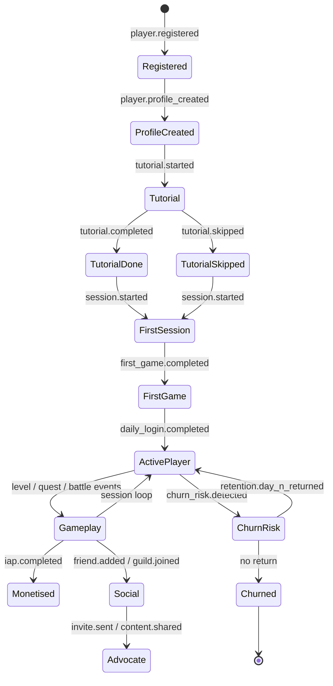

import { Card, CardGrid, Badge, Tabs, TabItem, Steps, Aside, LinkCard } from '@astrojs/starlight/components';

## Domain Overview

Gaming platforms generate some of the highest event volumes of any vertical. Every tap, level completion, currency transaction, and social interaction produces telemetry that drives engagement loops, monetisation optimisation, and churn prediction.

This page defines the canonical event taxonomy for games integrated with GrowthOS — covering player lifecycle, session tracking, gameplay progression, in-app purchases, virtual economy, social features, and operational signals.

<Aside type="tip">
Start with the [Cross-Domain Universal](/growthos/event-catalog/universal/) events first. The events on this page layer game-specific signals on top of that shared foundation.
</Aside>

<Aside type="note" title="GA4 / Firebase Compatibility">
Many events in this taxonomy align with Google Analytics for Firebase gaming event names (e.g., `level_up`, `virtual_currency_earned`, `tutorial_complete`). Where GrowthOS uses `object.action` naming, the equivalent GA4 event name is noted. If you are migrating from Firebase Analytics, map your existing events to the GrowthOS names below for consistent cross-platform reporting.
</Aside>

---

## Acquire — Player Registration and Tutorial

Events that capture the first moments of a new player's experience, from account creation through the tutorial flow.

| Event Name | Key Properties | Volume | Description |
|---|---|---|---|
| `player.registered` | `player_id`, `platform`, `country`, `acquisition_source`, `device_type` | <Badge text="Low" variant="success" /> | A new player account is created. Maps to GA4 `sign_up`. |
| `player.profile_created` | `player_id`, `display_name`, `avatar_id`, `class` | <Badge text="Low" variant="success" /> | The player completed profile setup (name, avatar, starting class). |
| `tutorial.started` | `player_id`, `tutorial_id`, `tutorial_version` | <Badge text="Low" variant="success" /> | The player entered the tutorial or onboarding flow. Maps to GA4 `tutorial_begin`. |
| `tutorial.step_completed` | `player_id`, `tutorial_id`, `step_index`, `step_name`, `duration_sec` | <Badge text="Medium" variant="note" /> | The player completed a single step within the tutorial sequence. |
| `tutorial.completed` | `player_id`, `tutorial_id`, `total_duration_sec`, `steps_completed` | <Badge text="Low" variant="success" /> | The player finished the entire tutorial. Maps to GA4 `tutorial_complete`. |
| `tutorial.skipped` | `player_id`, `tutorial_id`, `skipped_at_step` | <Badge text="Low" variant="success" /> | The player skipped the tutorial before completing it. |

---

## Activate — Sessions and First Value

Events that mark meaningful early engagement — the player has launched the game, completed a session, and experienced core gameplay.

| Event Name | Key Properties | Volume | Description |
|---|---|---|---|
| `session.started` | `player_id`, `session_id`, `platform`, `app_version`, `device_model` | <Badge text="High" variant="caution" /> | A gameplay session has begun. Maps to GA4 `session_start`. |
| `session.ended` | `player_id`, `session_id`, `duration_sec`, `events_count`, `end_reason` | <Badge text="High" variant="caution" /> | A gameplay session has ended (backgrounded, quit, or timed out). |
| `first_game.completed` | `player_id`, `game_mode`, `result`, `duration_sec` | <Badge text="Low" variant="success" /> | The player completed their first real game or match after the tutorial. |
| `daily_login.completed` | `player_id`, `streak_count`, `reward_claimed`, `reward_id` | <Badge text="Medium" variant="note" /> | The player completed a daily login and claimed any streak reward. |

<Aside type="caution">
`session.started` and `session.ended` are extremely high-volume. For games with millions of DAU, batch these events and consider sampling for real-time dashboards. Always store session duration aggregates for retention analysis.
</Aside>

---

## Engage — Gameplay

Core gameplay events that track progression, achievements, item interactions, and competitive play. These events are the backbone of engagement analytics and churn prediction models.

| Event Name | Key Properties | Volume | Description |
|---|---|---|---|
| `level.started` | `player_id`, `level_id`, `difficulty`, `attempt_number` | <Badge text="High" variant="caution" /> | The player started a level or stage. |
| `level.completed` | `player_id`, `level_id`, `score`, `stars`, `duration_sec`, `attempt_number` | <Badge text="High" variant="caution" /> | The player completed a level. Maps to GA4 `level_end` with success. |
| `level.failed` | `player_id`, `level_id`, `failure_reason`, `progress_pct`, `attempt_number` | <Badge text="High" variant="caution" /> | The player failed a level. Track failure funnels for difficulty tuning. |
| `level.up` | `player_id`, `new_level`, `previous_level`, `xp_total` | <Badge text="Medium" variant="note" /> | The player reached a new experience level. Maps to GA4 `level_up`. |
| `achievement.unlocked` | `player_id`, `achievement_id`, `achievement_name`, `category` | <Badge text="Medium" variant="note" /> | The player unlocked an achievement or trophy. Maps to GA4 `unlock_achievement`. |
| `quest.started` | `player_id`, `quest_id`, `quest_type`, `difficulty` | <Badge text="Medium" variant="note" /> | The player accepted or started a quest or mission. |
| `quest.completed` | `player_id`, `quest_id`, `rewards[]`, `duration_sec` | <Badge text="Medium" variant="note" /> | The player completed a quest and received rewards. |
| `quest.abandoned` | `player_id`, `quest_id`, `progress_pct`, `abandon_reason` | <Badge text="Low" variant="success" /> | The player abandoned a quest before completing it. |
| `score.posted` | `player_id`, `leaderboard_id`, `score`, `rank` | <Badge text="Medium" variant="note" /> | The player posted a score to a leaderboard. Maps to GA4 `post_score`. |
| `item.collected` | `player_id`, `item_id`, `item_type`, `source`, `quantity` | <Badge text="High" variant="caution" /> | The player collected or looted an in-game item. |
| `item.used` | `player_id`, `item_id`, `item_type`, `context` | <Badge text="High" variant="caution" /> | The player consumed or used an item during gameplay. |
| `item.crafted` | `player_id`, `item_id`, `recipe_id`, `ingredients[]` | <Badge text="Medium" variant="note" /> | The player crafted a new item from components. |
| `item.traded` | `player_id`, `trade_partner_id`, `items_given[]`, `items_received[]` | <Badge text="Low" variant="success" /> | The player traded items with another player. |
| `character.created` | `player_id`, `character_id`, `class`, `race`, `customisation` | <Badge text="Low" variant="success" /> | The player created a new character. |
| `character.upgraded` | `player_id`, `character_id`, `attribute`, `new_value`, `cost` | <Badge text="Medium" variant="note" /> | The player upgraded a character attribute or skill. |
| `battle.started` | `player_id`, `battle_id`, `opponent_id`, `game_mode`, `arena` | <Badge text="Medium" variant="note" /> | A battle or match started between players or against AI. |
| `battle.completed` | `player_id`, `battle_id`, `result`, `score`, `duration_sec`, `xp_earned` | <Badge text="Medium" variant="note" /> | A battle or match concluded with a result (win, loss, draw). |
| `matchmaking.started` | `player_id`, `game_mode`, `skill_rating`, `queue_id` | <Badge text="Medium" variant="note" /> | The player entered the matchmaking queue. |
| `matchmaking.completed` | `player_id`, `match_id`, `wait_time_sec`, `players_matched`, `skill_spread` | <Badge text="Medium" variant="note" /> | Matchmaking found a match and the player was assigned to a game. |

<Aside type="note">
Gameplay events like `level.started`, `level.completed`, `item.collected`, and `item.used` can fire hundreds of times per player per session. Use client-side batching (flush every 10 seconds or 20 events, whichever comes first) to manage volume without losing granularity.
</Aside>

---

## Monetise — Purchases and Virtual Economy

Events that track revenue generation through in-app purchases, subscriptions, ads, battle passes, and the virtual currency economy.

| Event Name | Key Properties | Volume | Description |
|---|---|---|---|
| `virtual_currency.earned` | `player_id`, `currency_type`, `amount`, `source`, `balance_after` | <Badge text="High" variant="caution" /> | The player earned virtual currency (coins, gems, etc.) through gameplay. Maps to GA4 `earn_virtual_currency`. |
| `virtual_currency.spent` | `player_id`, `currency_type`, `amount`, `item_id`, `context`, `balance_after` | <Badge text="High" variant="caution" /> | The player spent virtual currency on an item or upgrade. Maps to GA4 `spend_virtual_currency`. |
| `iap.initiated` | `player_id`, `product_id`, `price`, `currency`, `store` | <Badge text="Medium" variant="note" /> | The player started an in-app purchase flow (tapped Buy). |
| `iap.completed` | `player_id`, `product_id`, `transaction_id`, `price`, `currency`, `store` | <Badge text="Low" variant="success" /> | The in-app purchase was successfully completed. Maps to GA4 `in_app_purchase`. |
| `iap.failed` | `player_id`, `product_id`, `error_code`, `error_message`, `store` | <Badge text="Low" variant="success" /> | The in-app purchase failed (payment declined, cancelled, or store error). |
| `iap.restored` | `player_id`, `product_id`, `original_transaction_id`, `store` | <Badge text="Low" variant="success" /> | A previously purchased item was restored (e.g., after reinstall). |
| `subscription.created` | `player_id`, `plan_id`, `price`, `currency`, `billing_period` | <Badge text="Low" variant="success" /> | The player subscribed to a recurring plan (VIP, premium pass, etc.). |
| `subscription.renewed` | `player_id`, `plan_id`, `renewal_count`, `price`, `currency` | <Badge text="Low" variant="success" /> | An existing subscription was successfully renewed. |
| `subscription.cancelled` | `player_id`, `plan_id`, `cancel_reason`, `effective_date` | <Badge text="Low" variant="success" /> | The player cancelled their subscription. |
| `ad.watched` | `player_id`, `ad_unit_id`, `ad_network`, `ad_type`, `reward_type`, `reward_amount` | <Badge text="High" variant="caution" /> | The player watched a rewarded or interstitial ad. |
| `battle_pass.purchased` | `player_id`, `season_id`, `tier`, `price`, `currency` | <Badge text="Low" variant="success" /> | The player purchased a battle pass or season pass. |
| `battle_pass.tier_reached` | `player_id`, `season_id`, `tier`, `reward_id`, `is_premium` | <Badge text="Medium" variant="note" /> | The player reached a new tier on the battle pass. |
| `loot_box.opened` | `player_id`, `box_type`, `items_received[]`, `source` | <Badge text="Medium" variant="note" /> | The player opened a loot box, gacha, or randomised reward container. |
| `offer.viewed` | `player_id`, `offer_id`, `offer_type`, `price`, `currency`, `placement` | <Badge text="Medium" variant="note" /> | A special offer or promotion was displayed to the player. |
| `offer.purchased` | `player_id`, `offer_id`, `offer_type`, `price`, `currency` | <Badge text="Low" variant="success" /> | The player purchased a special offer or limited-time bundle. |

<Aside type="caution">
`virtual_currency.earned`, `virtual_currency.spent`, and `ad.watched` are high-volume events. For free-to-play games with heavy virtual economies, these can exceed all other events combined. Batch aggressively on the client and use sampling for real-time dashboards. Store complete payloads only for `iap.completed` and `subscription.created` to ensure accurate revenue reporting.
</Aside>

---

## Advocate — Social

Events related to social features, guilds, gifting, and viral sharing that drive organic growth.

| Event Name | Key Properties | Volume | Description |
|---|---|---|---|
| `friend.added` | `player_id`, `friend_id`, `source` | <Badge text="Medium" variant="note" /> | The player added another player as a friend. |
| `friend.removed` | `player_id`, `friend_id` | <Badge text="Low" variant="success" /> | The player removed a friend from their friends list. |
| `guild.joined` | `player_id`, `guild_id`, `guild_name`, `member_count` | <Badge text="Low" variant="success" /> | The player joined a guild, clan, or alliance. Maps to GA4 `join_group`. |
| `guild.left` | `player_id`, `guild_id`, `reason` | <Badge text="Low" variant="success" /> | The player left a guild. |
| `chat.message_sent` | `player_id`, `channel_type`, `channel_id`, `message_length` | <Badge text="High" variant="caution" /> | The player sent a chat message (global, guild, whisper, or match chat). |
| `invite.sent` | `player_id`, `invite_channel`, `invite_type`, `recipient_id` | <Badge text="Low" variant="success" /> | The player sent a game invite to a friend or contact. Maps to GA4 `invite`. |
| `content.shared` | `player_id`, `content_type`, `share_channel`, `content_id` | <Badge text="Low" variant="success" /> | The player shared game content (screenshot, replay, achievement) externally. Maps to GA4 `share`. |
| `gift.sent` | `player_id`, `recipient_id`, `gift_item_id`, `gift_type` | <Badge text="Medium" variant="note" /> | The player sent an in-game gift to another player. |

---

## Operational

System-level events for app health monitoring, moderation, and retention signals.

| Event Name | Key Properties | Volume | Description |
|---|---|---|---|
| `app.updated` | `player_id`, `previous_version`, `new_version`, `platform` | <Badge text="Low" variant="success" /> | The player updated the app to a new version. |
| `error.occurred` | `player_id`, `error_type`, `error_message`, `screen`, `stack_trace` | <Badge text="Medium" variant="note" /> | A client-side or gameplay error was captured. |
| `performance.fps_drop` | `player_id`, `scene`, `avg_fps`, `min_fps`, `device_model`, `duration_sec` | <Badge text="Medium" variant="note" /> | A significant frame rate drop was detected during gameplay. |
| `moderation.report_submitted` | `player_id`, `reported_player_id`, `reason`, `context` | <Badge text="Low" variant="success" /> | A player submitted a moderation report against another player. |
| `moderation.action_taken` | `reported_player_id`, `action`, `duration`, `moderator_id` | <Badge text="Low (admin)" variant="default" /> | A moderation action was taken (warning, mute, ban, etc.). |
| `churn_risk.detected` | `player_id`, `risk_score`, `risk_factors[]`, `last_active` | <Badge text="Low (admin)" variant="default" /> | The churn prediction model flagged a player as at-risk. |
| `retention.day_n_returned` | `player_id`, `day_number`, `sessions_total`, `last_session_duration_sec` | <Badge text="Medium" variant="note" /> | The player returned on day N after install (D1, D7, D14, D30). Used for retention cohort analysis. |

---

## Player Lifecycle Diagram



---

## Quick-Start: Top Events to Track First

If you are instrumenting a game for the first time, start with these critical events before expanding to the full taxonomy.

<Tabs>
  <TabItem label="JavaScript">
```javascript
// Gaming — essential events to instrument first
// 1. Session start
growthOS.track('session.started', {
  player_id: 'p_12345',
  session_id: 'sess_abc',
  platform: 'ios',
  app_version: '2.4.1'
});

// 2. Tutorial completed
growthOS.track('tutorial.completed', {
  player_id: 'p_12345',
  tutorial_id: 'onboarding_v3',
  total_duration_sec: 142,
  steps_completed: 8
});

// 3. Level completed
growthOS.track('level.completed', {
  player_id: 'p_12345',
  level_id: 'forest_03',
  score: 4500,
  stars: 3,
  duration_sec: 87,
  attempt_number: 1
});

// 4. Virtual currency spent
growthOS.track('virtual_currency.spent', {
  player_id: 'p_12345',
  currency_type: 'gems',
  amount: 50,
  item_id: 'sword_legendary',
  balance_after: 120
});

// 5. In-app purchase completed
growthOS.track('iap.completed', {
  player_id: 'p_12345',
  product_id: 'gem_pack_500',
  transaction_id: 'txn_abc123',
  price: 4.99,
  currency: 'USD',
  store: 'app_store'
});

// 6. Achievement unlocked
growthOS.track('achievement.unlocked', {
  player_id: 'p_12345',
  achievement_id: 'first_boss_kill',
  achievement_name: 'Dragon Slayer',
  category: 'combat'
});

// 7. Friend added
growthOS.track('friend.added', {
  player_id: 'p_12345',
  friend_id: 'p_67890',
  source: 'post_match_screen'
});

// 8. Invite sent
growthOS.track('invite.sent', {
  player_id: 'p_12345',
  invite_channel: 'whatsapp',
  invite_type: 'game_invite'
});

// 9. Day-N retention
growthOS.track('retention.day_n_returned', {
  player_id: 'p_12345',
  day_number: 7,
  sessions_total: 14,
  last_session_duration_sec: 620
});

// 10. Session ended
growthOS.track('session.ended', {
  player_id: 'p_12345',
  session_id: 'sess_abc',
  duration_sec: 1240,
  events_count: 87,
  end_reason: 'user_quit'
});
```
  </TabItem>
  <TabItem label="cURL">
```bash
# Gaming — essential event via Ingest API
curl -X POST https://api.growthos.dev/v1/track \
  -H "Authorization: Bearer gos_sk_..." \
  -H "Content-Type: application/json" \
  -d '{
    "user_id": "p_12345",
    "event": "level.completed",
    "properties": {
      "level_id": "forest_03",
      "score": 4500,
      "stars": 3,
      "duration_sec": 87,
      "attempt_number": 1
    }
  }'
```
  </TabItem>
</Tabs>

---

## Back to Catalog

<LinkCard
  title="Event Catalog Index"
  description="Browse all domain event dictionaries and cross-domain universal events."
  href="/growthos/event-catalog/"
/>
