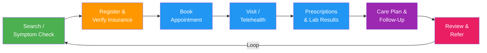

import { Card, CardGrid, Badge, Tabs, TabItem, Steps, Aside, LinkCard } from '@astrojs/starlight/components';

Healthcare platforms bridge the gap between patients and providers across appointments, telehealth, prescriptions, lab results, and long-term care plans. A well-structured event taxonomy enables you to reduce no-show rates, improve medication adherence, surface lab results promptly, and build engagement loops around care plan completion — all while maintaining strict compliance with privacy regulations.

<Aside type="danger" title="HIPAA Compliance — Required Reading">
Healthcare events **must not** contain Protected Health Information (PHI) in event properties unless your analytics platform is covered by a **Business Associate Agreement (BAA)**. This means:

- **Use opaque IDs only** — send `patient_id: "pat_abc123"`, never `patient_name: "Jane Doe"` or `patient_email: "jane@example.com"`
- **No diagnoses, conditions, or treatment details** in event properties — track `appointment.completed` with a `visit_type`, not with `diagnosis_code`
- **No dates of birth, SSNs, or insurance member IDs** in event payloads
- **Audit every event** your team instruments against your organisation's PHI classification policy before shipping to production

Work with your compliance and legal teams to determine which event properties are permissible in your specific BAA scope. When in doubt, leave it out.
</Aside>

---

## Acquire

Events capturing initial patient discovery and symptom-checking flows.

| Event Name | Key Properties | Volume | Description |
|---|---|---|---|
| `user.signed_up` | `channel`, `utm_source`, `device_type` | <Badge text="High" variant="tip" /> | New user creates a platform account |
| `provider.searched` | `specialty`, `location`, `insurance_accepted`, `results_count` | <Badge text="High" variant="tip" /> | User searches for a healthcare provider |
| `provider.profile_viewed` | `provider_id`, `specialty`, `view_duration_ms` | <Badge text="High" variant="tip" /> | User views a provider's profile page |
| `symptom_checker.started` | `entry_point`, `device_type` | <Badge text="Medium" variant="note" /> | User starts the symptom checker flow |
| `symptom_checker.completed` | `symptoms_count`, `recommended_action`, `duration_seconds` | <Badge text="Medium" variant="note" /> | User completes the symptom checker |

---

## Activate

Patient registration, profile completion, and intake events — getting patients ready for their first visit.

| Event Name | Key Properties | Volume | Description |
|---|---|---|---|
| `patient.registered` | `registration_method`, `channel` | <Badge text="High" variant="tip" /> | Patient completes registration |
| `patient.profile_completed` | `fields_completed`, `completion_pct` | <Badge text="Medium" variant="note" /> | Patient fills out their full profile |
| `insurance.verified` | `verification_method`, `verification_status` | <Badge text="Medium" variant="note" /> | Insurance eligibility verified |
| `consent.signed` | `consent_type`, `consent_version` | <Badge text="Medium" variant="note" /> | Patient signs a consent form (HIPAA, treatment, etc.) |
| `intake_form.completed` | `form_type`, `question_count`, `duration_seconds` | <Badge text="Medium" variant="note" /> | Patient completes an intake or pre-visit form |
| `health_record.imported` | `record_source`, `record_type`, `record_count` | <Badge text="Low" variant="caution" /> | Patient imports health records from another provider or system |

---

## Engage

Appointments, telehealth, prescriptions, lab results, messaging, and care plan events — the core care delivery loop.

| Event Name | Key Properties | Volume | Description |
|---|---|---|---|
| `appointment.requested` | `provider_id`, `visit_type`, `urgency` | <Badge text="High" variant="tip" /> | Patient requests an appointment |
| `appointment.scheduled` | `provider_id`, `visit_type`, `scheduled_date`, `booking_lead_days` | <Badge text="High" variant="tip" /> | Appointment confirmed and scheduled |
| `appointment.confirmed` | `appointment_id`, `confirmation_method` | <Badge text="High" variant="tip" /> | Patient confirms the appointment (SMS, email, app) |
| `appointment.rescheduled` | `appointment_id`, `original_date`, `new_date`, `reason` | <Badge text="Medium" variant="note" /> | Patient reschedules an appointment |
| `appointment.cancelled` | `appointment_id`, `cancellation_reason`, `lead_time_hours` | <Badge text="Medium" variant="note" /> | Patient cancels an appointment |
| `appointment.no_show` | `appointment_id`, `provider_id`, `visit_type` | <Badge text="Low" variant="caution" /> | Patient fails to show up for an appointment |
| `appointment.checked_in` | `appointment_id`, `check_in_method`, `minutes_early` | <Badge text="High" variant="tip" /> | Patient checks in for their appointment |
| `appointment.completed` | `appointment_id`, `visit_type`, `duration_minutes` | <Badge text="High" variant="tip" /> | Appointment completed |
| `telehealth.session_started` | `session_id`, `provider_id`, `platform` | <Badge text="Medium" variant="note" /> | Telehealth video session begins |
| `telehealth.session_ended` | `session_id`, `duration_minutes`, `connection_quality` | <Badge text="Medium" variant="note" /> | Telehealth session ends |
| `telehealth.technical_issue` | `session_id`, `issue_type`, `resolution` | <Badge text="Low" variant="caution" /> | Technical issue during telehealth session |
| `prescription.ordered` | `prescription_id`, `medication_category`, `provider_id` | <Badge text="Medium" variant="note" /> | Provider orders a prescription |
| `prescription.filled` | `prescription_id`, `pharmacy_type`, `fill_method` | <Badge text="Medium" variant="note" /> | Prescription filled at pharmacy |
| `prescription.refill_requested` | `prescription_id`, `refill_number`, `channel` | <Badge text="Medium" variant="note" /> | Patient requests a prescription refill |
| `prescription.reminder_sent` | `prescription_id`, `reminder_channel`, `days_until_empty` | <Badge text="Medium" variant="note" /> | Refill or adherence reminder sent |
| `lab_order.created` | `order_id`, `test_category`, `provider_id` | <Badge text="Medium" variant="note" /> | Lab test ordered by provider |
| `lab_result.available` | `order_id`, `test_category`, `turnaround_hours` | <Badge text="Medium" variant="note" /> | Lab results ready for review |
| `lab_result.viewed` | `order_id`, `test_category`, `viewed_by` | <Badge text="Medium" variant="note" /> | Patient or provider views lab results |
| `message.sent` | `message_type`, `sender_role`, `recipient_role` | <Badge text="High" variant="tip" /> | Message sent between patient and care team |
| `message.read` | `message_id`, `time_to_read_minutes` | <Badge text="High" variant="tip" /> | Message read by recipient |
| `health_metric.recorded` | `metric_type`, `source`, `device_type` | <Badge text="High" variant="tip" /> | Patient records a health metric (weight, blood pressure, glucose, etc.) |
| `device.synced` | `device_type`, `manufacturer`, `metrics_synced_count` | <Badge text="Medium" variant="note" /> | Wearable or health device syncs data |
| `care_plan.viewed` | `care_plan_id`, `view_duration_seconds` | <Badge text="Medium" variant="note" /> | Patient views their care plan |
| `care_plan.task_completed` | `care_plan_id`, `task_type`, `task_number`, `total_tasks` | <Badge text="Medium" variant="note" /> | Patient completes a care plan task |

---

## Monetise

Payment and subscription events.

| Event Name | Key Properties | Volume | Description |
|---|---|---|---|
| `payment.completed` | `amount_cents`, `payment_method`, `payment_type` | <Badge text="Medium" variant="note" /> | Payment processed successfully |
| `subscription.created` | `plan_name`, `billing_interval`, `mrr_cents` | <Badge text="Low" variant="caution" /> | User subscribes to a membership or wellness plan |
| `copay.collected` | `amount_cents`, `visit_type`, `collection_method` | <Badge text="Medium" variant="note" /> | Copay collected at time of service |
| `bill.generated` | `bill_id`, `amount_cents`, `line_item_count` | <Badge text="Medium" variant="note" /> | Patient bill generated |
| `bill.paid` | `bill_id`, `amount_cents`, `payment_method`, `days_to_pay` | <Badge text="Medium" variant="note" /> | Patient pays a bill |

---

## Advocate

Provider reviews, referrals, and patient satisfaction events.

| Event Name | Key Properties | Volume | Description |
|---|---|---|---|
| `provider.reviewed` | `provider_id`, `rating`, `review_length`, `visit_type` | <Badge text="Low" variant="caution" /> | Patient leaves a provider review |
| `referral.link_shared` | `channel`, `program_id`, `share_method` | <Badge text="Low" variant="caution" /> | Patient shares a referral link |
| `satisfaction_survey.completed` | `survey_type`, `score`, `touchpoint`, `feedback_length` | <Badge text="Low" variant="caution" /> | Patient completes a satisfaction survey |

---

## Operational

EHR integration, compliance, and provider management events.

| Event Name | Key Properties | Volume | Description |
|---|---|---|---|
| `ehr.record_updated` | `record_type`, `update_source`, `field_count` | <Badge text="Medium" variant="note" /> | Electronic health record updated |
| `compliance.hipaa_audit_logged` | `action_type`, `resource_type`, `accessor_role` | <Badge text="High" variant="tip" /> | HIPAA audit log entry recorded |
| `provider.schedule_updated` | `provider_id`, `change_type`, `affected_slots` | <Badge text="Low (admin)" variant="danger" /> | Provider updates their availability schedule |
| `waitlist.patient_added` | `provider_id`, `visit_type`, `position` | <Badge text="Low" variant="caution" /> | Patient added to a provider's waitlist |

---

## Customer Journey



---

## Getting Started — Top Events to Track First

Start with these high-impact events before expanding to the full taxonomy.

```js
// 1. Signup
growthos.track('user.signed_up', {
  channel: 'organic',
  device_type: 'mobile',
});

// 2. Patient registered
growthos.track('patient.registered', {
  registration_method: 'online',
  channel: 'mobile_app',
});

// 3. Appointment scheduled
growthos.track('appointment.scheduled', {
  provider_id: 'prov_abc123',
  visit_type: 'primary_care',
  scheduled_date: '2025-07-15',
  booking_lead_days: 3,
});

// 4. Appointment completed
growthos.track('appointment.completed', {
  appointment_id: 'appt_xyz789',
  visit_type: 'primary_care',
  duration_minutes: 25,
});

// 5. Prescription filled
growthos.track('prescription.filled', {
  prescription_id: 'rx_def456',
  pharmacy_type: 'retail',
  fill_method: 'pickup',
});

// 6. Lab result viewed
growthos.track('lab_result.viewed', {
  order_id: 'lab_ghi789',
  test_category: 'blood_panel',
  viewed_by: 'patient',
});

// 7. Care plan task completed
growthos.track('care_plan.task_completed', {
  care_plan_id: 'cp_jkl012',
  task_type: 'medication_adherence',
  task_number: 3,
  total_tasks: 10,
});

// 8. Health metric recorded
growthos.track('health_metric.recorded', {
  metric_type: 'blood_pressure',
  source: 'manual_entry',
  device_type: 'none',
});

// 9. Provider reviewed
growthos.track('provider.reviewed', {
  provider_id: 'prov_abc123',
  rating: 5,
  review_length: 150,
  visit_type: 'primary_care',
});
```

<LinkCard
  title="Event Schema & Taxonomy"
  description="See the canonical event envelope, naming conventions, and system events."
  href="/growthos/api/events/"
/>
