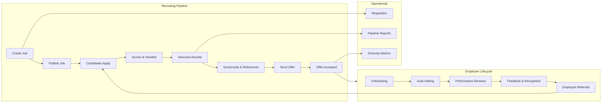

import { Card, CardGrid, Badge, Tabs, TabItem, Steps, Aside, LinkCard } from '@astrojs/starlight/components';

HR Tech and recruitment platforms track a **dual funnel** — the hiring pipeline from job posting to offer acceptance, and the employee lifecycle from onboarding through engagement and retention. This event dictionary covers both sides, from the recruiter creating a job requisition through to the new hire completing their first performance review.

<Aside type="note">
HR events often carry **PII-sensitive data** (candidate names, salaries, diversity attributes). Ensure your event pipeline is configured with appropriate data masking, retention policies, and access controls before instrumenting these events.
</Aside>

---

## Acquire — Job Distribution

Events that track job creation, publishing, and distribution to candidates.

| Event Name | Key Properties | Volume | Description |
|---|---|---|---|
| `job.created` | `job_id`, `department`, `location`, `employment_type`, `recruiter_id` | Low | Recruiter creates a new job posting |
| `job.published` | `job_id`, `channels`, `visibility`, `salary_range_visible` | Low | Job posting goes live on the platform and job boards |
| `job.updated` | `job_id`, `fields_changed`, `update_reason` | Low | Job posting details are updated |
| `job.closed` | `job_id`, `close_reason`, `days_open`, `applications_count` | Low | Job posting is closed (filled, cancelled, or expired) |
| `job.reposted` | `job_id`, `days_since_close`, `changes_made` | Low | Previously closed job is reposted |
| `job.viewed` | `job_id`, `source`, `viewer_type`, `referrer` | High | Candidate views a job posting |
| `job.shared` | `job_id`, `share_method`, `platform`, `sharer_type` | Medium | Job posting is shared externally by a candidate or employee |

---

## Activate — Application

Events that track the candidate application funnel from start to submission.

| Event Name | Key Properties | Volume | Description |
|---|---|---|---|
| `application.started` | `job_id`, `candidate_id`, `source`, `device_type` | High | Candidate begins the application process |
| `application.step_completed` | `application_id`, `step_name`, `step_index`, `total_steps` | High | Candidate completes a step in the application form |
| `application.submitted` | `application_id`, `job_id`, `source`, `resume_attached`, `cover_letter_attached` | Medium | Candidate submits a completed application |
| `application.withdrawn` | `application_id`, `withdrawal_reason`, `stage_at_withdrawal` | Low | Candidate withdraws their application |
| `candidate.created` | `candidate_id`, `source`, `channel`, `has_resume` | Medium | A new candidate record is created in the system |
| `candidate.merged` | `primary_id`, `merged_id`, `merge_reason` | Low | Duplicate candidate records are merged |
| `resume.parsed` | `candidate_id`, `skills_extracted`, `experience_years`, `education_level` | Medium | Resume is parsed and structured data is extracted |
| `candidate.screened` | `candidate_id`, `screening_type`, `result`, `screener_id` | Medium | Candidate passes or fails an initial screening step |

---

## Engage — Interview

Events that track the interview and assessment pipeline.

| Event Name | Key Properties | Volume | Description |
|---|---|---|---|
| `candidate.stage_changed` | `candidate_id`, `job_id`, `from_stage`, `to_stage`, `changed_by` | Medium | Candidate moves between pipeline stages |
| `interview.scheduled` | `candidate_id`, `job_id`, `interview_type`, `interviewer_ids`, `scheduled_date` | Medium | An interview is scheduled |
| `interview.rescheduled` | `interview_id`, `old_date`, `new_date`, `rescheduled_by`, `reason` | Low | A scheduled interview is moved to a new time |
| `interview.completed` | `interview_id`, `duration_minutes`, `interview_type` | Medium | An interview takes place |
| `interview.cancelled` | `interview_id`, `cancelled_by`, `reason`, `notice_hours` | Low | A scheduled interview is cancelled |
| `interview.no_show` | `interview_id`, `no_show_party` | Low | A party fails to attend a scheduled interview |
| `interview.feedback_submitted` | `interview_id`, `interviewer_id`, `overall_rating`, `recommendation` | Medium | Interviewer submits structured feedback |
| `assessment.sent` | `candidate_id`, `assessment_type`, `deadline_date` | Medium | A skills assessment or test is sent to a candidate |
| `assessment.completed` | `candidate_id`, `assessment_type`, `score`, `duration_minutes` | Medium | Candidate completes a skills assessment |
| `scorecard.submitted` | `candidate_id`, `job_id`, `scorer_id`, `overall_score`, `criteria_scores` | Medium | A hiring scorecard is submitted for a candidate |
| `candidate.reference_requested` | `candidate_id`, `reference_email`, `request_type` | Low | A reference check is requested |
| `candidate.reference_received` | `candidate_id`, `reference_id`, `rating`, `response_time_days` | Low | A reference response is received |
| `candidate.background_check_initiated` | `candidate_id`, `check_type`, `provider` | Low | A background check is started |
| `candidate.background_check_completed` | `candidate_id`, `check_type`, `result`, `duration_days` | Low | A background check is completed with results |

---

## Monetise — Hiring

Events that track the offer and hiring process.

| Event Name | Key Properties | Volume | Description |
|---|---|---|---|
| `offer.created` | `candidate_id`, `job_id`, `salary`, `currency`, `equity`, `start_date` | Low | A job offer is drafted |
| `offer.sent` | `offer_id`, `delivery_method`, `expiry_date` | Low | A job offer is sent to the candidate |
| `offer.viewed` | `offer_id`, `view_count`, `time_spent_seconds` | Low | Candidate views the offer details |
| `offer.accepted` | `offer_id`, `negotiation_rounds`, `days_to_accept` | Low | Candidate accepts the job offer |
| `offer.declined` | `offer_id`, `decline_reason`, `competing_offer` | Low | Candidate declines the job offer |
| `offer.negotiated` | `offer_id`, `original_salary`, `negotiated_salary`, `fields_changed` | Low | Candidate negotiates offer terms |
| `hire.completed` | `candidate_id`, `job_id`, `time_to_hire_days`, `source`, `cost_per_hire` | Low | Candidate officially becomes a hire |

---

## Advocate — Employee

Events that track the post-hire employee lifecycle from onboarding through engagement and retention.

| Event Name | Key Properties | Volume | Description |
|---|---|---|---|
| `employee.onboarding_started` | `employee_id`, `department`, `manager_id`, `start_date` | Low | New hire begins the employee onboarding process |
| `employee.onboarding_task_completed` | `employee_id`, `task_name`, `task_category`, `days_since_start` | Medium | New hire completes an onboarding task |
| `employee.onboarding_completed` | `employee_id`, `duration_days`, `tasks_completed`, `satisfaction_score` | Low | New hire finishes all onboarding tasks |
| `employee.feedback_submitted` | `employee_id`, `feedback_type`, `sentiment_score`, `is_anonymous` | Medium | Employee submits feedback (pulse survey, eNPS, etc.) |
| `employee.goal_set` | `employee_id`, `goal_type`, `time_frame`, `is_aligned_to_okr` | Low | Employee sets a performance goal |
| `employee.goal_completed` | `employee_id`, `goal_id`, `completion_pct`, `days_to_complete` | Low | Employee completes a performance goal |
| `employee.review_completed` | `employee_id`, `review_type`, `reviewer_id`, `overall_rating` | Low | A performance review is completed |
| `employee.referral_submitted` | `employee_id`, `referred_candidate_id`, `job_id` | Low | Employee refers a candidate for an open role |
| `employee.recognition_given` | `employee_id`, `recipient_id`, `recognition_type`, `is_public` | Medium | Employee gives recognition or kudos to a colleague |

---

## Operational

Events for requisition management, reporting, and compliance.

| Event Name | Key Properties | Volume | Description |
|---|---|---|---|
| `requisition.created` | `requisition_id`, `department`, `headcount`, `priority`, `budget` | Low | A hiring requisition is created |
| `requisition.approved` | `requisition_id`, `approver_id`, `approval_time_days` | Low | A hiring requisition is approved by leadership |
| `pipeline.report_generated` | `report_type`, `date_range`, `jobs_included`, `generated_by` | Low | A pipeline or recruiting report is generated |
| `diversity.metric_snapshot` | `snapshot_date`, `pipeline_stage`, `demographic_breakdown` | Low | A point-in-time diversity metrics snapshot is captured |

<Aside type="caution">
The `diversity.metric_snapshot` event contains demographic data that may be subject to local privacy regulations (GDPR, CCPA, EEOC). Ensure this data is stored in a restricted, access-controlled table with appropriate retention policies and is only used for aggregate reporting.
</Aside>

---

## HR Tech Customer Journey



---

## Quick-Start: Top Events to Track First

Instrument these events first to cover the core recruiting funnel and time-to-hire metrics.

```js
// HR Tech / Recruitment — Top 10 events to instrument first
const HR_TECH_PRIORITY_EVENTS = [
  "job.published",                 // Supply: role goes live
  "job.viewed",                    // Demand: candidate shows interest
  "application.submitted",         // Pipeline: candidate applies
  "candidate.stage_changed",       // Pipeline: candidate progresses
  "interview.completed",           // Pipeline: interview happens
  "interview.feedback_submitted",  // Quality: structured evaluation
  "offer.sent",                    // Conversion: offer extended
  "offer.accepted",                // Conversion: candidate commits
  "hire.completed",                // Outcome: hire is made
  "employee.onboarding_completed", // Retention: new hire is ramped
];
```

<Aside type="tip">
The most important metric in recruiting is **time-to-hire** — the number of days from `job.published` to `hire.completed`. Instrument these two events first and work inward to identify bottlenecks in the stages between them.
</Aside>

---

<LinkCard
  title="Back to Event Catalog"
  description="Browse all domain event dictionaries and the universal naming convention."
  href="/growthos/event-catalog/"
/>
