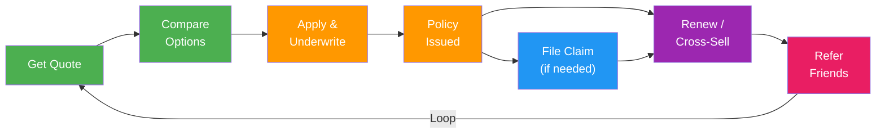

import { Card, CardGrid, Badge, Tabs, TabItem, Steps, Aside, LinkCard } from '@astrojs/starlight/components';

Insurance products have a distinctive lifecycle: users rarely interact daily, but the moments that matter — quoting, binding a policy, filing a claim, and renewal — are high-stakes touchpoints that define retention and lifetime value. A structured event taxonomy lets you optimise the quote-to-bind funnel, reduce claims friction, and automate renewal and cross-sell campaigns that expand coverage at precisely the right time.

---

## Acquire

Events capturing the quoting funnel — from initial interest through comparison to expiry.

| Event Name | Key Properties | Volume | Description |
|---|---|---|---|
| `lead.captured` | `source`, `campaign_id`, `product_line` | <Badge text="High" variant="tip" /> | Marketing lead collected from landing page, aggregator, or partner |
| `quote.requested` | `product_type`, `coverage_type`, `channel` | <Badge text="High" variant="tip" /> | User requests an insurance quote |
| `quote.generated` | `quote_id`, `product_type`, `premium_cents`, `coverage_amount` | <Badge text="High" variant="tip" /> | System generates a quote with pricing |
| `quote.viewed` | `quote_id`, `view_duration_ms`, `device_type` | <Badge text="High" variant="tip" /> | User views a generated quote |
| `quote.compared` | `quote_ids`, `comparison_count`, `product_type` | <Badge text="Medium" variant="note" /> | User compares multiple quotes side by side |
| `quote.shared` | `quote_id`, `share_method`, `recipient_type` | <Badge text="Low" variant="caution" /> | User shares a quote with a spouse, partner, or advisor |
| `quote.expired` | `quote_id`, `days_since_generated`, `product_type` | <Badge text="Medium" variant="note" /> | Quote passes its validity window without conversion |

---

## Activate

Application, underwriting, and policy issuance events — the path from quote to bound policy.

| Event Name | Key Properties | Volume | Description |
|---|---|---|---|
| `application.started` | `quote_id`, `product_type`, `channel` | <Badge text="High" variant="tip" /> | User begins a policy application |
| `application.step_completed` | `step_name`, `step_number`, `total_steps` | <Badge text="High" variant="tip" /> | User completes a step in the multi-step application |
| `application.submitted` | `application_id`, `product_type`, `quote_id` | <Badge text="Medium" variant="note" /> | Application submitted for underwriting |
| `application.document_uploaded` | `document_type`, `application_id`, `file_format` | <Badge text="Medium" variant="note" /> | User uploads a required document (medical records, photos, etc.) |
| `underwriting.started` | `application_id`, `underwriting_type`, `risk_tier` | <Badge text="Medium" variant="note" /> | Underwriting process begins for an application |
| `underwriting.completed` | `application_id`, `decision`, `risk_score`, `conditions` | <Badge text="Medium" variant="note" /> | Underwriting decision rendered (approved, declined, conditional) |
| `policy.issued` | `policy_id`, `product_type`, `premium_cents`, `coverage_amount`, `effective_date` | <Badge text="Medium" variant="note" /> | Policy bound and issued to the customer |
| `policy.document_generated` | `policy_id`, `document_type`, `format` | <Badge text="Medium" variant="note" /> | Policy document (certificate, schedule) generated |

---

## Engage / Claims

Policy servicing and claims processing events — the moments that define customer trust.

| Event Name | Key Properties | Volume | Description |
|---|---|---|---|
| `policy.viewed` | `policy_id`, `section_viewed`, `device_type` | <Badge text="Medium" variant="note" /> | User views their policy details |
| `policy.document_downloaded` | `policy_id`, `document_type` | <Badge text="Low" variant="caution" /> | User downloads a policy document |
| `claim.initiated` | `policy_id`, `claim_type`, `incident_date`, `channel` | <Badge text="Medium" variant="note" /> | User starts a new insurance claim |
| `claim.document_uploaded` | `claim_id`, `document_type`, `file_count` | <Badge text="Medium" variant="note" /> | User uploads supporting evidence for a claim |
| `claim.assessed` | `claim_id`, `assessor_type`, `estimated_amount_cents` | <Badge text="Low" variant="caution" /> | Claim assessed by adjuster or automated system |
| `claim.approved` | `claim_id`, `approved_amount_cents`, `processing_days` | <Badge text="Low" variant="caution" /> | Claim approved for payment |
| `claim.denied` | `claim_id`, `denial_reason`, `appeal_eligible` | <Badge text="Low" variant="caution" /> | Claim denied with reason |
| `claim.payment_issued` | `claim_id`, `amount_cents`, `payment_method` | <Badge text="Low" variant="caution" /> | Claim payment disbursed to customer |
| `claim.closed` | `claim_id`, `resolution`, `total_paid_cents`, `days_to_close` | <Badge text="Low" variant="caution" /> | Claim fully resolved and closed |
| `coverage.change_requested` | `policy_id`, `change_type`, `requested_value` | <Badge text="Low" variant="caution" /> | User requests a change to their coverage |
| `coverage.change_applied` | `policy_id`, `change_type`, `premium_delta_cents` | <Badge text="Low" variant="caution" /> | Coverage change applied to policy |

---

## Monetise

Renewal, retention, and cross-sell events that drive lifetime value.

| Event Name | Key Properties | Volume | Description |
|---|---|---|---|
| `policy.renewed` | `policy_id`, `renewal_premium_cents`, `term_number` | <Badge text="Medium" variant="note" /> | Policy renewed for a new term |
| `policy.renewal_reminder_sent` | `policy_id`, `days_until_expiry`, `channel` | <Badge text="Medium" variant="note" /> | Renewal reminder sent to customer |
| `policy.lapsed` | `policy_id`, `lapse_reason`, `days_past_expiry` | <Badge text="Low" variant="caution" /> | Policy lapsed due to non-renewal or non-payment |
| `policy.reinstated` | `policy_id`, `reinstatement_fee_cents`, `gap_days` | <Badge text="Low" variant="caution" /> | Lapsed policy reinstated by customer |
| `premium.payment_completed` | `policy_id`, `amount_cents`, `payment_method`, `period` | <Badge text="High" variant="tip" /> | Premium payment processed successfully |
| `premium.payment_failed` | `policy_id`, `amount_cents`, `failure_reason` | <Badge text="Low" variant="caution" /> | Premium payment failed |
| `cross_sell.offer_presented` | `source_policy_id`, `offered_product`, `channel`, `trigger` | <Badge text="Medium" variant="note" /> | Cross-sell offer shown to customer (e.g., auto to home) |
| `cross_sell.offer_accepted` | `source_policy_id`, `accepted_product`, `quote_id` | <Badge text="Low" variant="caution" /> | Customer accepts a cross-sell offer |
| `bundle.created` | `policy_ids`, `bundle_discount_pct`, `total_premium_cents` | <Badge text="Low" variant="caution" /> | Customer bundles multiple policies for a discount |

---

## Advocate

Referral and feedback events.

| Event Name | Key Properties | Volume | Description |
|---|---|---|---|
| `referral.link_shared` | `channel`, `program_id`, `share_method` | <Badge text="Low" variant="caution" /> | Customer shares their referral link |
| `referral.converted` | `referrer_id`, `referred_id`, `reward_type`, `product_line` | <Badge text="Low" variant="caution" /> | Referred user binds a policy |
| `nps.responded` | `score`, `feedback_text`, `policy_type`, `touchpoint` | <Badge text="Low" variant="caution" /> | Customer responds to NPS survey |

---

## Customer Journey



---

## Getting Started — Top Events to Track First

Start with these high-impact events before expanding to the full taxonomy.

```js
// 1. Quote requested
growthos.track('quote.requested', {
  product_type: 'auto',
  coverage_type: 'comprehensive',
  channel: 'web',
});

// 2. Quote generated
growthos.track('quote.generated', {
  quote_id: 'qt_abc123',
  product_type: 'auto',
  premium_cents: 85000,
  coverage_amount: 50000000,
});

// 3. Application submitted
growthos.track('application.submitted', {
  application_id: 'app_xyz789',
  product_type: 'auto',
  quote_id: 'qt_abc123',
});

// 4. Policy issued
growthos.track('policy.issued', {
  policy_id: 'pol_def456',
  product_type: 'auto',
  premium_cents: 85000,
  coverage_amount: 50000000,
  effective_date: '2025-07-01',
});

// 5. Claim initiated
growthos.track('claim.initiated', {
  policy_id: 'pol_def456',
  claim_type: 'collision',
  incident_date: '2025-08-15',
  channel: 'mobile_app',
});

// 6. Premium payment
growthos.track('premium.payment_completed', {
  policy_id: 'pol_def456',
  amount_cents: 7083,
  payment_method: 'autopay',
  period: 'monthly',
});

// 7. Policy renewed
growthos.track('policy.renewed', {
  policy_id: 'pol_def456',
  renewal_premium_cents: 82000,
  term_number: 2,
});

// 8. Cross-sell offer
growthos.track('cross_sell.offer_presented', {
  source_policy_id: 'pol_def456',
  offered_product: 'home',
  channel: 'email',
  trigger: 'post_renewal',
});
```

<LinkCard
  title="Event Schema & Taxonomy"
  description="See the canonical event envelope, naming conventions, and system events."
  href="/growthos/api/events/"
/>
