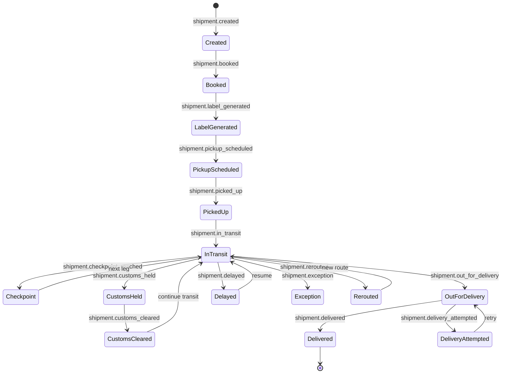

import { Card, CardGrid, Badge, Tabs, TabItem, Steps, Aside, LinkCard } from '@astrojs/starlight/components';

## Domain Overview

Logistics and supply-chain platforms move physical goods through a complex chain of handoffs — from shipper to carrier, through warehouses and customs checkpoints, to the final delivery address. Every handoff generates events that power real-time tracking dashboards, SLA monitoring, billing reconciliation, and customer communication.

This page defines the canonical event taxonomy for logistics platforms integrated with GrowthOS. Events are organized by growth loop stage, from onboarding shippers and carriers through shipment lifecycle, monetisation, and advocacy.

<Aside type="tip">
Start with the [Cross-Domain Universal](/growthos/event-catalog/universal/) events first. The events on this page layer domain-specific logistics signals on top of that shared foundation.
</Aside>

---

## Acquire — Onboarding

Events related to bringing new shippers, carriers, and warehouse partners onto the platform.

| Event Name | Key Properties | Volume | Description |
|---|---|---|---|
| `shipper.registered` | `shipper_id`, `company_name`, `industry`, `channel` | <Badge text="Low" variant="success" /> | A new shipper account is created on the platform. |
| `carrier.onboarded` | `carrier_id`, `carrier_name`, `service_types[]`, `coverage_regions[]` | <Badge text="Low" variant="success" /> | A carrier completes onboarding and is available for booking. |
| `warehouse.onboarded` | `warehouse_id`, `location`, `capacity_sqft`, `services[]` | <Badge text="Low" variant="success" /> | A warehouse facility is registered and active on the platform. |

---

## Activate — Shipment Creation

Events that represent the first meaningful value exchange — a shipment is created and scheduled for pickup.

| Event Name | Key Properties | Volume | Description |
|---|---|---|---|
| `shipment.created` | `shipment_id`, `shipper_id`, `origin`, `destination`, `weight_kg`, `dimensions` | <Badge text="Medium" variant="note" /> | A new shipment record is created in the system. |
| `shipment.booked` | `shipment_id`, `carrier_id`, `service_level`, `estimated_delivery` | <Badge text="Medium" variant="note" /> | A carrier is assigned and the shipment is confirmed for transport. |
| `shipment.label_generated` | `shipment_id`, `tracking_number`, `label_format`, `carrier_id` | <Badge text="Medium" variant="note" /> | A shipping label and tracking number are generated. |
| `shipment.pickup_scheduled` | `shipment_id`, `pickup_date`, `pickup_window`, `pickup_address` | <Badge text="Medium" variant="note" /> | A pickup is scheduled with the carrier for a specific date and time window. |

---

## Engage — Transit and Tracking

High-volume events that track a shipment as it moves through the logistics network. These events drive customer-facing tracking pages, notification workflows, and SLA monitoring.

| Event Name | Key Properties | Volume | Description |
|---|---|---|---|
| `shipment.picked_up` | `shipment_id`, `carrier_id`, `pickup_timestamp`, `pickup_location` | <Badge text="Medium" variant="note" /> | The carrier has physically collected the shipment. |
| `shipment.in_transit` | `shipment_id`, `carrier_id`, `current_location`, `next_hub` | <Badge text="High" variant="caution" /> | The shipment is moving between facilities. Fired at each scan or GPS ping. |
| `shipment.checkpoint_reached` | `shipment_id`, `checkpoint`, `facility_id`, `scan_type` | <Badge text="High" variant="caution" /> | The shipment has been scanned at a hub, sorting centre, or transfer point. |
| `shipment.customs_cleared` | `shipment_id`, `country`, `clearance_duration_hours`, `duty_amount` | <Badge text="Low" variant="success" /> | The shipment has cleared customs in an international shipment. |
| `shipment.customs_held` | `shipment_id`, `country`, `hold_reason`, `required_documents[]` | <Badge text="Low" variant="success" /> | The shipment is held at customs pending documentation or inspection. |
| `shipment.out_for_delivery` | `shipment_id`, `driver_id`, `estimated_arrival`, `delivery_address` | <Badge text="Medium" variant="note" /> | The shipment is on the final delivery vehicle and en route to the recipient. |
| `shipment.delivered` | `shipment_id`, `delivery_timestamp`, `signed_by`, `proof_of_delivery_url` | <Badge text="Medium" variant="note" /> | The shipment has been successfully delivered to the recipient. |
| `shipment.delivery_attempted` | `shipment_id`, `attempt_number`, `failure_reason`, `next_attempt_date` | <Badge text="Medium" variant="note" /> | A delivery attempt was made but the shipment could not be handed over. |
| `shipment.delayed` | `shipment_id`, `delay_reason`, `original_eta`, `revised_eta` | <Badge text="Medium" variant="note" /> | The shipment will not arrive by the original estimated delivery date. |
| `shipment.exception` | `shipment_id`, `exception_type`, `description`, `resolution_status` | <Badge text="Low" variant="success" /> | An abnormal event occurred — damage, loss, address issue, or regulatory hold. |
| `shipment.rerouted` | `shipment_id`, `original_destination`, `new_destination`, `reroute_reason` | <Badge text="Low" variant="success" /> | The shipment destination or route has been changed after dispatch. |
| `tracking.viewed` | `shipment_id`, `viewer_id`, `viewer_type`, `channel` | <Badge text="High" variant="caution" /> | Someone viewed the tracking page or tracking details for a shipment. |
| `tracking.notification_sent` | `shipment_id`, `recipient_id`, `channel`, `notification_type` | <Badge text="Medium" variant="note" /> | A tracking update notification was sent via email, SMS, or push. |

<Aside type="caution">
`shipment.in_transit` and `shipment.checkpoint_reached` are the highest-volume events in this domain. For platforms handling millions of parcels, use batched ingestion and consider sampling for analytics dashboards. Store full payloads only for the latest checkpoint per shipment.
</Aside>

---

## Monetise — Billing and Quoting

Events related to revenue generation — rate quotes, invoicing, and payment collection.

| Event Name | Key Properties | Volume | Description |
|---|---|---|---|
| `shipment.invoiced` | `shipment_id`, `invoice_id`, `amount`, `currency`, `line_items[]` | <Badge text="Low" variant="success" /> | An invoice has been generated for a completed shipment. |
| `invoice.paid` | `invoice_id`, `payment_method`, `amount`, `currency`, `paid_at` | <Badge text="Low" variant="success" /> | An invoice has been paid by the shipper. |
| `rate_quote.requested` | `quote_id`, `shipper_id`, `origin`, `destination`, `weight_kg`, `service_level` | <Badge text="Medium" variant="note" /> | A shipper requested a rate quote for a potential shipment. |
| `rate_quote.provided` | `quote_id`, `carrier_id`, `amount`, `currency`, `valid_until`, `transit_days` | <Badge text="Medium" variant="note" /> | A rate quote was returned to the shipper with pricing and transit time. |

---

## Advocate — Ratings and Feedback

Events that capture satisfaction signals and drive platform reputation.

| Event Name | Key Properties | Volume | Description |
|---|---|---|---|
| `delivery.rated` | `shipment_id`, `rating`, `comment`, `rated_by` | <Badge text="Low" variant="success" /> | The recipient rated the delivery experience after receiving a shipment. |
| `carrier.rated` | `carrier_id`, `shipper_id`, `rating`, `comment`, `shipment_id` | <Badge text="Low" variant="success" /> | A shipper rated a carrier based on service quality for a specific shipment. |

---

## Operational — Warehouse and Returns

Events from warehouse management, returns processing, and fleet operations. These are internal or back-office signals used for operational dashboards and automation.

| Event Name | Key Properties | Volume | Description |
|---|---|---|---|
| `warehouse.inventory_received` | `warehouse_id`, `sku`, `quantity`, `po_number`, `received_at` | <Badge text="Medium" variant="note" /> | Inventory has been received at a warehouse from a supplier or return. |
| `warehouse.inventory_counted` | `warehouse_id`, `sku`, `expected_qty`, `actual_qty`, `variance` | <Badge text="Low (admin)" variant="default" /> | A cycle count or full inventory count was completed for a SKU. |
| `warehouse.order_picked` | `warehouse_id`, `order_id`, `picker_id`, `items[]`, `pick_duration_sec` | <Badge text="High" variant="caution" /> | An order has been picked from warehouse shelves. |
| `warehouse.order_packed` | `warehouse_id`, `order_id`, `packer_id`, `package_count`, `total_weight_kg` | <Badge text="High" variant="caution" /> | An order has been packed and is ready for carrier handoff. |
| `warehouse.order_dispatched` | `warehouse_id`, `order_id`, `shipment_id`, `carrier_id`, `dispatched_at` | <Badge text="Medium" variant="note" /> | A packed order has been handed off to the carrier for transport. |
| `return.initiated` | `return_id`, `shipment_id`, `reason`, `return_method`, `initiated_by` | <Badge text="Low" variant="success" /> | A return request has been created for a previously delivered shipment. |
| `return.received` | `return_id`, `warehouse_id`, `condition`, `received_at` | <Badge text="Low" variant="success" /> | The returned item has been received at the warehouse. |
| `return.processed` | `return_id`, `outcome`, `refund_amount`, `restock_flag` | <Badge text="Low" variant="success" /> | The return has been inspected and a disposition decision made (refund, replace, restock). |
| `fleet.vehicle_status_changed` | `vehicle_id`, `status`, `location`, `driver_id`, `odometer_km` | <Badge text="Medium" variant="note" /> | A fleet vehicle changed status — available, in-transit, maintenance, or offline. |
| `route.optimized` | `route_id`, `vehicle_id`, `stop_count`, `distance_km`, `estimated_duration_min` | <Badge text="Low (admin)" variant="default" /> | A delivery route was generated or re-optimized by the routing engine. |

<Aside type="note">
`warehouse.order_picked` and `warehouse.order_packed` can be extremely high-volume in fulfilment centres processing thousands of orders per hour. Use batched writes and keep retention short for raw events — aggregate into hourly or daily summaries for long-term analysis.
</Aside>

---

## Shipment Lifecycle Diagram



---

## Quick-Start: Top Events to Track First

If you are instrumenting a logistics platform for the first time, start with these high-impact events before expanding to the full taxonomy.

<Tabs>
  <TabItem label="JavaScript">
```javascript
// Logistics — essential events to instrument first
// 1. Shipment created
growthOS.track('shipment.created', {
  shipment_id: 'shp_001',
  shipper_id: 'shipper_42',
  origin: 'Mumbai, IN',
  destination: 'London, UK',
  weight_kg: 12.5
});

// 2. Shipment booked with carrier
growthOS.track('shipment.booked', {
  shipment_id: 'shp_001',
  carrier_id: 'carrier_dhl',
  service_level: 'express',
  estimated_delivery: '2026-03-05'
});

// 3. Shipment picked up
growthOS.track('shipment.picked_up', {
  shipment_id: 'shp_001',
  carrier_id: 'carrier_dhl',
  pickup_timestamp: '2026-02-23T10:30:00Z'
});

// 4. Shipment delivered
growthOS.track('shipment.delivered', {
  shipment_id: 'shp_001',
  delivery_timestamp: '2026-03-04T14:22:00Z',
  signed_by: 'J. Smith'
});

// 5. Shipment invoiced
growthOS.track('shipment.invoiced', {
  shipment_id: 'shp_001',
  invoice_id: 'inv_789',
  amount: 245.00,
  currency: 'USD'
});

// 6. Delivery rated
growthOS.track('delivery.rated', {
  shipment_id: 'shp_001',
  rating: 5,
  comment: 'Fast and careful handling'
});

// 7. Return initiated
growthOS.track('return.initiated', {
  return_id: 'ret_101',
  shipment_id: 'shp_001',
  reason: 'damaged_in_transit',
  return_method: 'pickup'
});
```
  </TabItem>
  <TabItem label="cURL">
```bash
# Logistics — essential event via Ingest API
curl -X POST https://api.growthos.dev/v1/track \
  -H "Authorization: Bearer gos_sk_..." \
  -H "Content-Type: application/json" \
  -d '{
    "user_id": "shipper_42",
    "event": "shipment.created",
    "properties": {
      "shipment_id": "shp_001",
      "origin": "Mumbai, IN",
      "destination": "London, UK",
      "weight_kg": 12.5
    }
  }'
```
  </TabItem>
</Tabs>

---

## Back to Catalog

<LinkCard
  title="Event Catalog Index"
  description="Browse all domain event dictionaries and cross-domain universal events."
  href="/growthos/event-catalog/"
/>
