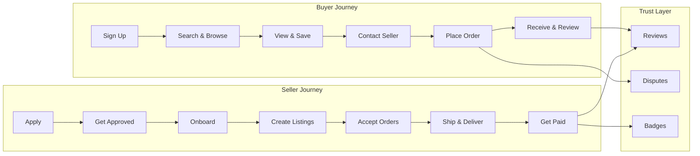

import { Card, CardGrid, Badge, Tabs, TabItem, Steps, Aside, LinkCard } from '@astrojs/starlight/components';

Marketplaces are **two-sided** by nature. Every growth loop must be instrumented from both the **buyer** and **seller** perspective — a listing without a buyer is wasted supply, and a buyer without listings is wasted demand. This event dictionary covers the full lifecycle for both sides of the marketplace, from seller onboarding through order fulfilment to trust and dispute resolution.

<Aside type="caution">
Two-sided marketplaces must track **both** buyer and seller funnels independently. A healthy marketplace balances supply and demand — your event data should make imbalances visible immediately.
</Aside>

---

## Acquire — Buyer

Events that capture buyer registration and profile completion.

| Event Name | Key Properties | Volume | Description |
|---|---|---|---|
| `buyer.signed_up` | `channel`, `referrer`, `platform` | Medium | Buyer creates an account on the marketplace |
| `buyer.profile_completed` | `profile_completeness_pct`, `has_photo`, `has_address` | Medium | Buyer fills in profile details needed to transact |

---

## Acquire — Seller

Events that capture the seller application, approval, and onboarding funnel.

| Event Name | Key Properties | Volume | Description |
|---|---|---|---|
| `seller.application_submitted` | `category`, `business_type`, `country` | Low | Seller submits application to join the marketplace |
| `seller.application_approved` | `review_time_hours`, `reviewer_id` | Low | Application passes review and seller is approved |
| `seller.application_rejected` | `rejection_reason`, `reviewer_id` | Low | Application is rejected with a stated reason |
| `seller.onboarding_started` | `onboarding_version`, `channel` | Low | Seller begins the guided onboarding flow |
| `seller.onboarding_step_completed` | `step_name`, `step_index`, `total_steps` | Low | Seller completes a single onboarding step |
| `seller.onboarding_completed` | `duration_minutes`, `steps_completed` | Low | Seller finishes all onboarding steps |
| `seller.verified` | `verification_method`, `documents_count` | Low | Seller identity or business verification is confirmed |

---

## Activate — Listings

Events that track the creation, publishing, and lifecycle management of listings.

| Event Name | Key Properties | Volume | Description |
|---|---|---|---|
| `listing.created` | `seller_id`, `category`, `has_images` | Medium | Seller creates a new listing (draft state) |
| `listing.published` | `listing_id`, `price`, `category`, `condition` | Medium | Listing goes live and becomes visible to buyers |
| `listing.updated` | `listing_id`, `fields_changed` | Medium | Seller edits one or more listing fields |
| `listing.deactivated` | `listing_id`, `reason` | Low | Listing is taken offline by seller or system |
| `listing.reactivated` | `listing_id`, `days_inactive` | Low | Previously deactivated listing is made live again |
| `listing.price_changed` | `listing_id`, `old_price`, `new_price`, `currency` | Medium | Seller adjusts the price of an active listing |
| `listing.promoted` | `listing_id`, `promotion_type`, `spend` | Low | Seller pays to boost listing visibility |
| `listing.expired` | `listing_id`, `days_active`, `views_count` | Low | Listing auto-expires after the configured duration |

---

## Engage — Discovery

Events that capture how buyers find, explore, and interact with listings and sellers.

| Event Name | Key Properties | Volume | Description |
|---|---|---|---|
| `listing.searched` | `query`, `category_filter`, `results_count`, `sort_by` | High | Buyer performs a search across listings |
| `listing.viewed` | `listing_id`, `source`, `position_in_results` | High | Buyer views a listing detail page |
| `listing.saved` | `listing_id`, `collection_id` | Medium | Buyer saves a listing for later |
| `listing.shared` | `listing_id`, `share_method`, `platform` | Low | Buyer shares a listing externally |
| `listing.contact_seller` | `listing_id`, `seller_id`, `message_length` | Medium | Buyer initiates contact with a seller about a listing |
| `message.sent` | `thread_id`, `sender_role`, `has_attachment` | Medium | A message is sent in a buyer-seller conversation |
| `message.read` | `thread_id`, `reader_role`, `time_to_read_seconds` | Medium | A message is read by the recipient |

---

## Monetise — Orders

Events that track the full order lifecycle from placement through delivery and payout.

| Event Name | Key Properties | Volume | Description |
|---|---|---|---|
| `order.placed` | `order_id`, `listing_id`, `amount`, `currency`, `payment_method` | Medium | Buyer places an order and payment is captured |
| `order.accepted` | `order_id`, `seller_id`, `time_to_accept_minutes` | Medium | Seller accepts the incoming order |
| `order.rejected` | `order_id`, `seller_id`, `rejection_reason` | Low | Seller rejects the order with a reason |
| `order.shipped` | `order_id`, `carrier`, `tracking_number` | Medium | Seller marks the order as shipped |
| `order.delivered` | `order_id`, `delivery_time_days` | Medium | Order is confirmed delivered to the buyer |
| `order.completed` | `order_id`, `total_amount`, `platform_fee` | Medium | Order lifecycle is fully complete |
| `order.cancelled` | `order_id`, `cancelled_by`, `reason`, `refund_amount` | Low | Order is cancelled by buyer, seller, or system |
| `payout.initiated` | `payout_id`, `seller_id`, `amount`, `currency` | Medium | Seller payout is initiated after order completion |
| `payout.completed` | `payout_id`, `settlement_time_hours` | Medium | Funds have been transferred to the seller |
| `payout.failed` | `payout_id`, `failure_reason`, `retry_count` | Low | Payout attempt fails and needs resolution |
| `platform_fee.collected` | `order_id`, `fee_amount`, `fee_pct`, `fee_type` | Medium | Platform take-rate fee is collected from the transaction |

---

## Advocate — Trust

Events that capture the review, dispute, and reputation systems that build marketplace trust.

| Event Name | Key Properties | Volume | Description |
|---|---|---|---|
| `review.submitted` | `order_id`, `reviewer_role`, `rating`, `has_text`, `has_photos` | Medium | Buyer or seller submits a review after order completion |
| `review.responded` | `review_id`, `responder_role`, `response_length` | Low | The reviewed party responds publicly to a review |
| `review.flagged` | `review_id`, `flag_reason`, `flagged_by` | Low | A review is flagged as inappropriate or fraudulent |
| `dispute.opened` | `order_id`, `dispute_type`, `opened_by` | Low | A dispute is opened against an order |
| `dispute.evidence_submitted` | `dispute_id`, `submitted_by`, `evidence_type` | Low | A party submits supporting evidence for a dispute |
| `dispute.resolved` | `dispute_id`, `resolution`, `resolved_by`, `duration_days` | Low | Dispute is resolved with a final outcome |
| `seller.badge_earned` | `seller_id`, `badge_type`, `criteria_met` | Low | Seller earns a trust badge (e.g., "Top Seller", "Fast Shipper") |

---

## Operational

Internal system events for moderation, seller health, and platform integrity.

| Event Name | Key Properties | Volume | Description |
|---|---|---|---|
| `listing.moderation_flagged` | `listing_id`, `flag_type`, `confidence_score` | Low | Listing is flagged by automated moderation or user reports |
| `listing.moderation_resolved` | `listing_id`, `action_taken`, `moderator_id` | Low | Moderation flag is reviewed and resolved |
| `seller.suspended` | `seller_id`, `suspension_reason`, `duration_days` | Low | Seller account is suspended for policy violation |
| `seller.reinstated` | `seller_id`, `reinstatement_reason` | Low | Previously suspended seller is reinstated |
| `seller.performance_scored` | `seller_id`, `score`, `metrics_snapshot` | Low | Periodic seller performance score is calculated |

---

## Marketplace Customer Journey



---

## Quick-Start: Top Events to Track First

These are the most critical marketplace events to instrument before anything else. They cover the core supply-demand loop.

```js
// Marketplace — Top 10 events to instrument first
const MARKETPLACE_PRIORITY_EVENTS = [
  "seller.application_submitted",   // Supply: seller enters funnel
  "seller.onboarding_completed",    // Supply: seller is ready to sell
  "listing.published",              // Supply: inventory goes live
  "listing.searched",               // Demand: buyer is looking
  "listing.viewed",                 // Demand: buyer engages with supply
  "order.placed",                   // Transaction: demand meets supply
  "order.completed",                // Transaction: successful fulfilment
  "payout.completed",               // Seller retention: money in the bank
  "review.submitted",               // Trust: social proof created
  "platform_fee.collected",         // Revenue: platform monetisation
];
```

<Aside type="tip">
Start with these 10 events to cover your core **liquidity loop** — the cycle of sellers listing, buyers purchasing, and both sides returning. Add granularity (e.g., `order.shipped`, `dispute.opened`) once your core funnel is instrumented.
</Aside>

---

<LinkCard
  title="Back to Event Catalog"
  description="Browse all domain event dictionaries and the universal naming convention."
  href="/growthos/event-catalog/"
/>
