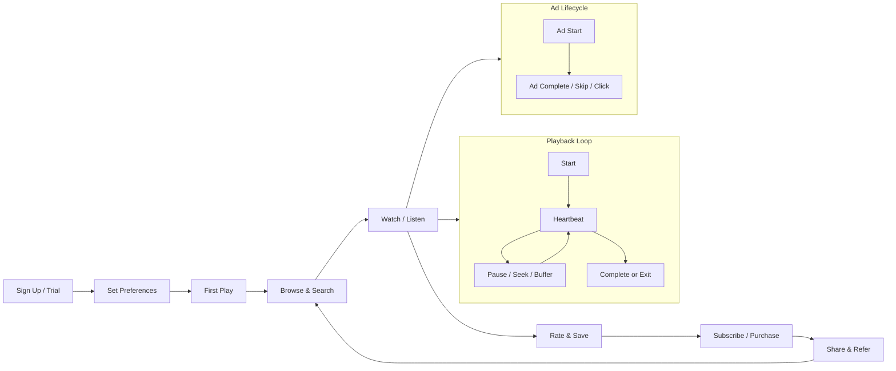

import { Card, CardGrid, Badge, Tabs, TabItem, Steps, Aside, LinkCard } from '@astrojs/starlight/components';

Media and streaming platforms generate some of the **highest event volumes** of any vertical. A single user session can produce hundreds of playback heartbeats, seek events, and ad impressions. This dictionary covers the full lifecycle from content discovery through playback, monetisation, and creator economics.

<Aside type="note">
This taxonomy is designed to be compatible with the **Segment Video Spec** where event names overlap. If you already use Segment, you can map these events 1:1 for playback and ad tracking.
</Aside>

---

## Acquire

Events that bring new users into the platform.

| Event Name | Key Properties | Volume | Description |
|---|---|---|---|
| `user.signed_up` | `channel`, `referrer`, `plan_type`, `platform` | Medium | New user creates an account |
| `trial.started` | `trial_duration_days`, `plan_id`, `source` | Medium | User begins a free trial period |
| `content.shared_externally` | `content_id`, `share_method`, `platform` | Medium | Existing user shares content outside the platform, driving new sign-ups |

---

## Activate

Events that signal a new user is getting value from the platform.

| Event Name | Key Properties | Volume | Description |
|---|---|---|---|
| `onboarding.preferences_set` | `genres`, `languages`, `content_types` | Medium | User sets content preferences during onboarding |
| `profile.created` | `has_avatar`, `display_name_set`, `profiles_count` | Medium | User creates a viewing profile |
| `first_content.consumed` | `content_id`, `content_type`, `time_to_first_play_seconds` | Medium | User watches or listens to their first piece of content |

---

## Engage — Playback

Events that track the full playback lifecycle. These events will be the highest volume in your system.

| Event Name | Key Properties | Volume | Description |
|---|---|---|---|
| `playback.started` | `content_id`, `content_type`, `quality`, `is_autoplay`, `position` | High | User initiates playback of content |
| `playback.paused` | `content_id`, `position`, `duration` | High | User pauses playback |
| `playback.resumed` | `content_id`, `position`, `pause_duration_seconds` | High | User resumes playback after a pause |
| `playback.completed` | `content_id`, `total_duration`, `completion_pct` | High | Content finishes playing to the end |
| `playback.seek_started` | `content_id`, `from_position`, `to_position` | High | User begins seeking to a new position |
| `playback.seek_completed` | `content_id`, `from_position`, `to_position` | High | Seek operation completes |
| `playback.buffer_started` | `content_id`, `position`, `quality` | High | Playback stalls due to buffering |
| `playback.buffer_completed` | `content_id`, `buffer_duration_ms`, `position` | High | Buffering ends and playback resumes |
| `playback.quality_changed` | `content_id`, `from_quality`, `to_quality`, `is_auto` | Medium | Playback quality changes (manual or adaptive) |
| `playback.speed_changed` | `content_id`, `from_speed`, `to_speed` | Low | User changes playback speed |
| `playback.interrupted` | `content_id`, `position`, `interruption_type` | Medium | Playback is interrupted by external event (call, notification) |
| `playback.exited` | `content_id`, `position`, `completion_pct`, `exit_reason` | High | User leaves the player before content completes |
| `playback.heartbeat` | `content_id`, `position`, `quality`, `buffer_count` | **Very High** | Periodic ping every 10 seconds during active playback |
| `ad.started` | `ad_id`, `ad_type`, `position`, `content_id` | High | An advertisement begins playing |
| `ad.completed` | `ad_id`, `ad_type`, `duration`, `content_id` | High | An advertisement plays to completion |
| `ad.skipped` | `ad_id`, `skip_after_seconds`, `content_id` | Medium | User skips an advertisement |
| `ad.clicked` | `ad_id`, `click_url`, `content_id` | Low | User clicks through on an advertisement |

<Aside type="caution">
**`playback.heartbeat`** fires every 10 seconds during active playback and will be your highest-volume event by a wide margin. Use client-side batching (batch size of 10-20 heartbeats) and consider sampling or aggregation before writing to your analytics warehouse.
</Aside>

---

## Engage — Discovery

Events that capture how users find, organise, and save content.

| Event Name | Key Properties | Volume | Description |
|---|---|---|---|
| `content.searched` | `query`, `results_count`, `filters_applied` | High | User searches the content library |
| `content.browsed` | `category`, `genre`, `browse_type` | High | User browses a category or curated collection |
| `content.viewed` | `content_id`, `content_type`, `source`, `position_in_list` | High | User views a content detail page or card |
| `content.rated` | `content_id`, `rating`, `rating_type` | Medium | User rates content (thumbs, stars, percentage) |
| `content.added_to_watchlist` | `content_id`, `watchlist_id`, `source` | Medium | User adds content to their watchlist or queue |
| `content.removed_from_watchlist` | `content_id`, `watchlist_id` | Low | User removes content from their watchlist |
| `playlist.created` | `playlist_id`, `is_public`, `content_type` | Low | User creates a new playlist |
| `playlist.item_added` | `playlist_id`, `content_id`, `position` | Medium | User adds an item to a playlist |
| `playlist.item_removed` | `playlist_id`, `content_id` | Low | User removes an item from a playlist |
| `playlist.shared` | `playlist_id`, `share_method`, `platform` | Low | User shares a playlist externally |
| `content.downloaded` | `content_id`, `quality`, `file_size_mb` | Medium | User downloads content for offline viewing |
| `content.download_deleted` | `content_id`, `days_since_download` | Low | User deletes a previously downloaded file |
| `recommendation.viewed` | `recommendation_id`, `algorithm`, `position` | High | A recommendation is displayed to the user |
| `recommendation.clicked` | `recommendation_id`, `content_id`, `algorithm`, `position` | Medium | User clicks on a recommended piece of content |

---

## Monetise

Events that track subscription lifecycle and revenue.

| Event Name | Key Properties | Volume | Description |
|---|---|---|---|
| `subscription.created` | `plan_id`, `billing_cycle`, `amount`, `currency`, `trial` | Medium | User subscribes to a paid plan |
| `subscription.upgraded` | `from_plan`, `to_plan`, `amount_delta` | Low | User upgrades to a higher-tier plan |
| `subscription.downgraded` | `from_plan`, `to_plan`, `reason` | Low | User downgrades to a lower-tier plan |
| `subscription.cancelled` | `plan_id`, `reason`, `tenure_days`, `cancel_at_period_end` | Low | User cancels their subscription |
| `purchase.completed` | `content_id`, `amount`, `currency`, `purchase_type` | Medium | User makes a one-time purchase (rental, buy-to-own) |
| `ad_revenue.impression` | `ad_id`, `ad_type`, `cpm`, `content_id` | High | Ad impression is recorded for revenue attribution |

---

## Advocate

Events that drive organic growth through sharing and referrals.

| Event Name | Key Properties | Volume | Description |
|---|---|---|---|
| `content.shared` | `content_id`, `share_method`, `platform` | Medium | User shares content with friends or social networks |
| `referral.link_shared` | `referral_code`, `share_method`, `platform` | Low | User shares their personal referral link |
| `referral.converted` | `referral_code`, `referee_user_id`, `plan_id` | Low | A referred user signs up and converts |

---

## Creator Events

Events specific to platforms with a creator or publisher ecosystem.

| Event Name | Key Properties | Volume | Description |
|---|---|---|---|
| `creator.content_uploaded` | `creator_id`, `content_type`, `file_size_mb`, `duration` | Medium | Creator uploads new content to the platform |
| `creator.content_published` | `creator_id`, `content_id`, `visibility`, `monetisation_type` | Medium | Creator publishes content making it available to viewers |
| `creator.content_updated` | `creator_id`, `content_id`, `fields_changed` | Low | Creator updates metadata or replaces media on existing content |
| `creator.payout_earned` | `creator_id`, `amount`, `currency`, `payout_type`, `period` | Low | Creator earns revenue from views, ads, or subscriptions |
| `creator.milestone_reached` | `creator_id`, `milestone_type`, `milestone_value` | Low | Creator hits a milestone (subscriber count, view count, etc.) |

---

## Media Platform Customer Journey



---

## Quick-Start: Top Events to Track First

Instrument these events first to cover the core content consumption loop and monetisation.

```js
// Media / Streaming — Top 10 events to instrument first
const MEDIA_PRIORITY_EVENTS = [
  "user.signed_up",                // Acquisition: new user enters
  "first_content.consumed",        // Activation: user gets value
  "playback.started",              // Engagement: content consumption begins
  "playback.completed",            // Engagement: content consumption finishes
  "playback.heartbeat",            // Engagement: continuous viewing signal
  "content.searched",              // Discovery: intent signal
  "subscription.created",          // Monetisation: user pays
  "subscription.cancelled",        // Retention risk: user may leave
  "content.shared",                // Advocacy: organic growth driver
  "ad_revenue.impression",         // Revenue: ad monetisation signal
];
```

<Aside type="tip">
The **playback.heartbeat** event alone can represent over 80% of your total event volume. Set up batching and sampling strategies before you launch — retroactively managing volume is far harder than planning for it.
</Aside>

---

<LinkCard
  title="Back to Event Catalog"
  description="Browse all domain event dictionaries and the universal naming convention."
  href="/growthos/event-catalog/"
/>
