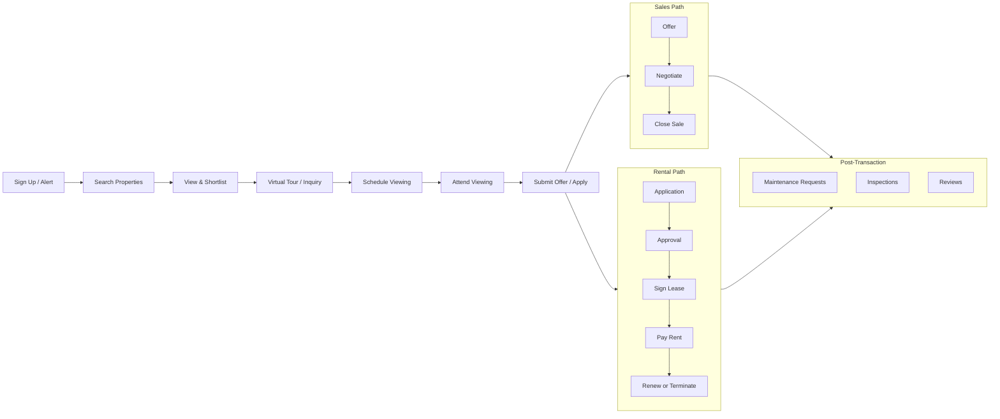

import { Card, CardGrid, Badge, Tabs, TabItem, Steps, Aside, LinkCard } from '@astrojs/starlight/components';

Real estate platforms have **long, high-value transaction cycles** that span weeks or months. Unlike e-commerce where conversion happens in minutes, property transactions involve multiple touchpoints — from initial search through virtual tours, in-person viewings, offers, negotiations, and ultimately lease signing or sale closing. This event dictionary covers the full property lifecycle for both rental and sales platforms, including post-transaction property management.

<Aside type="note">
Real estate events tend to be **low volume but high value**. A single `sale.closed` event might represent hundreds of thousands in transaction value. Prioritise data accuracy and completeness over throughput optimisation.
</Aside>

---

## Acquire

Events that capture new users entering the platform.

| Event Name | Key Properties | Volume | Description |
|---|---|---|---|
| `user.signed_up` | `channel`, `referrer`, `user_type`, `platform` | Medium | New user creates an account (buyer, renter, agent, or landlord) |
| `lead.captured` | `source`, `property_type`, `location`, `budget_range` | Medium | A lead is captured from a form, chatbot, or landing page |
| `alert.created` | `criteria`, `frequency`, `property_type`, `location` | Medium | User sets up a saved search or property alert |

---

## Activate — Listings

Events that track property listing creation and management.

| Event Name | Key Properties | Volume | Description |
|---|---|---|---|
| `listing.created` | `agent_id`, `property_type`, `listing_type`, `location` | Low | Agent or landlord creates a new property listing |
| `listing.published` | `listing_id`, `price`, `property_type`, `bedrooms`, `location` | Low | Listing goes live on the platform |
| `listing.updated` | `listing_id`, `fields_changed`, `update_source` | Medium | Listing details are updated (description, amenities, etc.) |
| `listing.price_changed` | `listing_id`, `old_price`, `new_price`, `change_pct` | Low | Property price is adjusted |
| `listing.photos_uploaded` | `listing_id`, `photos_count`, `has_floor_plan`, `has_virtual_tour` | Low | Photos or media are added to a listing |
| `listing.deactivated` | `listing_id`, `reason`, `days_active` | Low | Listing is taken offline (sold, rented, withdrawn) |

---

## Engage — Discovery

Events that capture property search, exploration, and the inquiry-to-viewing pipeline.

| Event Name | Key Properties | Volume | Description |
|---|---|---|---|
| `listing.searched` | `query`, `location`, `property_type`, `price_range`, `results_count` | High | User searches for properties with filters |
| `listing.viewed` | `listing_id`, `source`, `view_duration_seconds` | High | User views a property detail page |
| `listing.saved` | `listing_id`, `collection_id` | Medium | User saves a property to their shortlist |
| `listing.unsaved` | `listing_id`, `collection_id` | Low | User removes a property from their shortlist |
| `listing.shared` | `listing_id`, `share_method`, `platform` | Low | User shares a property listing externally |
| `listing.compared` | `listing_ids`, `comparison_criteria` | Low | User compares two or more properties side by side |
| `virtual_tour.started` | `listing_id`, `tour_type`, `device_type` | Medium | User begins a virtual property tour (3D, video, VR) |
| `virtual_tour.completed` | `listing_id`, `duration_seconds`, `rooms_viewed` | Medium | User finishes a virtual tour |
| `inquiry.submitted` | `listing_id`, `inquiry_type`, `message_length` | Medium | User submits an inquiry about a property |
| `inquiry.responded` | `inquiry_id`, `response_time_hours`, `responder_type` | Medium | Agent or landlord responds to an inquiry |
| `viewing.scheduled` | `listing_id`, `viewing_type`, `scheduled_date` | Medium | An in-person or virtual viewing is scheduled |
| `viewing.completed` | `listing_id`, `viewing_id`, `duration_minutes`, `feedback_rating` | Medium | A scheduled viewing takes place |
| `viewing.cancelled` | `viewing_id`, `cancelled_by`, `reason`, `notice_hours` | Low | A scheduled viewing is cancelled |
| `viewing.no_show` | `viewing_id`, `no_show_party` | Low | A party fails to attend a scheduled viewing |
| `open_house.attended` | `listing_id`, `attendee_count`, `event_id` | Low | User attends an open house event |
| `mortgage_calculator.used` | `listing_id`, `loan_amount`, `term_years`, `interest_rate` | Medium | User interacts with the mortgage calculator tool |

---

## Monetise — Transactions

Events that track offers, applications, lease signing, sales, and payments.

| Event Name | Key Properties | Volume | Description |
|---|---|---|---|
| `offer.submitted` | `listing_id`, `offer_amount`, `conditions`, `buyer_id` | Low | Buyer submits an offer on a property |
| `offer.countered` | `offer_id`, `counter_amount`, `counter_conditions` | Low | Seller responds with a counter-offer |
| `offer.accepted` | `offer_id`, `final_amount`, `acceptance_time_days` | Low | An offer is accepted by the seller |
| `offer.rejected` | `offer_id`, `rejection_reason` | Low | An offer is rejected by the seller |
| `application.submitted` | `listing_id`, `applicant_id`, `application_type` | Low | Tenant submits a rental application |
| `application.approved` | `application_id`, `credit_score_range`, `review_time_days` | Low | Rental application is approved |
| `lease.signed` | `listing_id`, `lease_term_months`, `monthly_rent`, `deposit` | Low | Tenant signs a lease agreement |
| `lease.renewed` | `lease_id`, `new_term_months`, `rent_change_pct` | Low | Existing lease is renewed |
| `lease.terminated` | `lease_id`, `termination_reason`, `notice_days` | Low | Lease is terminated early or at expiry |
| `sale.closed` | `listing_id`, `sale_price`, `days_on_market`, `closing_costs` | Low | Property sale closes and ownership transfers |
| `rent.payment_completed` | `lease_id`, `amount`, `payment_method`, `period` | Medium | Tenant makes a rent payment |
| `rent.payment_late` | `lease_id`, `days_late`, `amount_due`, `late_fee` | Low | Rent payment is past due |
| `commission.earned` | `transaction_id`, `agent_id`, `commission_amount`, `commission_pct` | Low | Agent earns commission on a completed transaction |

---

## Advocate

Events that drive reviews and referrals in the real estate ecosystem.

| Event Name | Key Properties | Volume | Description |
|---|---|---|---|
| `agent.reviewed` | `agent_id`, `rating`, `review_source`, `transaction_type` | Low | Client submits a review for an agent |
| `property.reviewed` | `listing_id`, `rating`, `reviewer_type`, `tenure_months` | Low | Tenant or buyer reviews a property |
| `referral.link_shared` | `referral_code`, `share_method`, `referrer_type` | Low | User shares a referral link for the platform |

---

## Operational

Events for property management and maintenance workflows.

| Event Name | Key Properties | Volume | Description |
|---|---|---|---|
| `maintenance.request_submitted` | `property_id`, `category`, `priority`, `description_length` | Medium | Tenant submits a maintenance request |
| `maintenance.request_assigned` | `request_id`, `assignee_type`, `estimated_completion_date` | Low | Maintenance request is assigned to a vendor or team |
| `maintenance.request_completed` | `request_id`, `resolution_time_days`, `cost`, `satisfaction_rating` | Low | Maintenance work is completed |
| `inspection.scheduled` | `property_id`, `inspection_type`, `scheduled_date` | Low | A property inspection is scheduled |
| `inspection.completed` | `property_id`, `inspection_type`, `findings_count`, `condition_score` | Low | A property inspection is completed with findings |

---

## Real Estate Customer Journey



---

## Quick-Start: Top Events to Track First

Instrument these events first to cover the core property discovery-to-transaction funnel.

```js
// Real Estate / PropTech — Top 10 events to instrument first
const REAL_ESTATE_PRIORITY_EVENTS = [
  "user.signed_up",                // Acquisition: new user enters
  "listing.published",             // Supply: property goes live
  "listing.searched",              // Demand: user is looking
  "listing.viewed",                // Engagement: user explores a property
  "listing.saved",                 // Intent: user shortlists
  "inquiry.submitted",             // High intent: user reaches out
  "viewing.completed",             // Pipeline: user sees property in person
  "offer.submitted",               // Conversion: buyer commits
  "lease.signed",                  // Conversion: renter commits
  "sale.closed",                   // Revenue: transaction completes
];
```

<Aside type="tip">
Real estate funnels have the longest time-to-conversion of almost any vertical. Set your attribution windows accordingly — a `listing.viewed` event may lead to a `sale.closed` event 60 to 90 days later.
</Aside>

---

<LinkCard
  title="Back to Event Catalog"
  description="Browse all domain event dictionaries and the universal naming convention."
  href="/growthos/event-catalog/"
/>
