import { Card, CardGrid, Badge, Tabs, TabItem, Steps, Aside, LinkCard } from '@astrojs/starlight/components';

This page defines domain-specific events for SaaS and B2B software products. Events are organized by growth loop stage to help you instrument the complete customer journey.

<Aside type="tip">
Before adding these events, make sure you have implemented the [Cross-Domain Universal Events](/growthos/event-catalog/universal/) first. Universal events (authentication, billing, support, lifecycle) are required for all domains.
</Aside>

---

## SaaS Customer Journey

The following diagram shows how events map to each stage of the SaaS growth loop.

```mermaid
flowchart LR
    subgraph ACQ["Acquire"]
        A1["demo.requested"]
        A2["demo.completed"]
        A3["lead.captured"]
        A4["user.signed_up"]
    end

    subgraph ACT["Activate"]
        B1["onboarding.started"]
        B2["onboarding.completed"]
        B3["trial.started"]
        B4["integration.connected"]
        B5["workspace.created"]
    end

    subgraph ENG["Engage"]
        C1["feature.activated"]
        C2["feature.used"]
        C3["report.generated"]
        C4["dashboard.viewed"]
        C5["api.request_made"]
    end

    subgraph MON["Monetise"]
        D1["subscription.created"]
        D2["subscription.upgraded"]
        D3["seat.added"]
        D4["addon.purchased"]
    end

    subgraph ADV["Advocate"]
        E1["invite.sent"]
        E2["invite.accepted"]
        E3["referral.link_shared"]
        E4["review.posted"]
    end

    ACQ --> ACT --> ENG --> MON --> ADV
    ADV -.->|"Viral loop"| ACQ
```



---

## Acquire

4 events covering lead capture and demo-driven acquisition.

| Event | Key Properties | Volume | Description |
|---|---|---|---|
| `demo.requested` | `source`, `company_size`, `use_case`, `utm_source`, `utm_medium` | <Badge text="Low" variant="success" /> | Prospect requests a product demo |
| `demo.completed` | `demo_id`, `duration_minutes`, `attendees_count`, `outcome` (qualified / not_qualified / no_show) | <Badge text="Low" variant="success" /> | Demo session finishes |
| `lead.captured` | `source` (form / chat / webinar / content), `lead_score`, `company_name`, `role` | <Badge text="Low" variant="success" /> | New lead enters the pipeline |
| `user.signed_up` | `method`, `source`, `referral_code`, `plan` | <Badge text="Low" variant="success" /> | New user account created |

---

## Activate

11 events covering onboarding, trial management, integrations, and workspace setup.

| Event | Key Properties | Volume | Description |
|---|---|---|---|
| `account.created` | `account_name`, `plan`, `team_size`, `industry` | <Badge text="Low" variant="success" /> | New organization/account created |
| `onboarding.started` | `onboarding_version`, `steps_total` | <Badge text="Low" variant="success" /> | User begins the onboarding flow |
| `onboarding.step_completed` | `step_name`, `step_index`, `steps_total`, `time_spent_seconds` | <Badge text="Medium" variant="note" /> | Individual onboarding step finished |
| `onboarding.completed` | `onboarding_version`, `steps_completed`, `total_time_seconds`, `skipped_steps` (array) | <Badge text="Low" variant="success" /> | Full onboarding flow completed |
| `trial.started` | `plan_name`, `trial_days`, `source` | <Badge text="Low" variant="success" /> | Free trial begins |
| `trial.extended` | `plan_name`, `original_days`, `extended_days`, `reason` | <Badge text="Low" variant="success" /> | Trial period extended |
| `trial.ended` | `plan_name`, `converted` (bool), `days_active`, `features_used_count` | <Badge text="Low" variant="success" /> | Trial expires or converts to paid |
| `integration.connected` | `integration_name`, `provider`, `scopes` (array), `auth_method` | <Badge text="Low" variant="success" /> | Third-party integration activated |
| `integration.disconnected` | `integration_name`, `reason` | <Badge text="Low" variant="success" /> | Third-party integration removed |
| `workspace.created` | `workspace_name`, `type` (personal / team / enterprise) | <Badge text="Low" variant="success" /> | New workspace or project space created |
| `workspace.settings_updated` | `workspace_id`, `fields_changed` (array) | <Badge text="Low" variant="success" /> | Workspace configuration modified |

---

## Engage

13 events covering feature usage, search, reporting, dashboards, API activity, and data import/export.

| Event | Key Properties | Volume | Description |
|---|---|---|---|
| `feature.activated` | `feature_name`, `feature_tier`, `activation_method` | <Badge text="Low" variant="success" /> | User activates a feature for the first time |
| `feature.used` | `feature_name`, `action`, `duration_seconds` | <Badge text="High" variant="caution" /> | User performs an action within a feature |
| `search.performed` | `query`, `results_count`, `filters_applied` (array), `search_context` | <Badge text="High" variant="caution" /> | User runs a search |
| `report.generated` | `report_type`, `date_range`, `filters` (array), `rows_count` | <Badge text="Medium" variant="note" /> | User generates a report |
| `report.exported` | `report_type`, `export_format` (csv / pdf / xlsx), `rows_count` | <Badge text="Low" variant="success" /> | User exports a report |
| `dashboard.viewed` | `dashboard_id`, `dashboard_name`, `widgets_count` | <Badge text="High" variant="caution" /> | User opens a dashboard |
| `dashboard.customized` | `dashboard_id`, `action` (widget_added / widget_removed / layout_changed) | <Badge text="Low" variant="success" /> | User modifies a dashboard layout |
| `api.key_created` | `key_name`, `permissions` (array), `expiry_days` | <Badge text="Low" variant="success" /> | New API key generated |
| `api.request_made` | `endpoint`, `method`, `status_code`, `response_time_ms` | <Badge text="High" variant="caution" /> | API call made by the customer's integration |
| `api.rate_limit_hit` | `endpoint`, `limit`, `window_seconds` | <Badge text="Medium" variant="note" /> | Customer hits an API rate limit |
| `import.started` | `source` (csv / api / integration), `record_type`, `rows_total` | <Badge text="Low" variant="success" /> | Bulk data import initiated |
| `import.completed` | `source`, `record_type`, `rows_imported`, `rows_failed`, `duration_seconds` | <Badge text="Low" variant="success" /> | Bulk data import finishes |
| `export.completed` | `export_type`, `format`, `rows_count`, `file_size_bytes` | <Badge text="Low" variant="success" /> | Data export completed |

---

## Monetise

8 events covering subscription changes, seat management, add-ons, and usage limits.

| Event | Key Properties | Volume | Description |
|---|---|---|---|
| `subscription.created` | `plan_name`, `billing_interval`, `mrr_cents`, `seats`, `trial` (bool) | <Badge text="Low" variant="success" /> | New paid subscription activated |
| `subscription.upgraded` | `from_plan`, `to_plan`, `mrr_delta_cents`, `trigger` | <Badge text="Low" variant="success" /> | Plan upgraded to a higher tier |
| `subscription.downgraded` | `from_plan`, `to_plan`, `mrr_delta_cents`, `reason` | <Badge text="Low" variant="success" /> | Plan downgraded to a lower tier |
| `seat.added` | `plan_name`, `new_seat_count`, `total_seats`, `mrr_delta_cents` | <Badge text="Low" variant="success" /> | Additional seat purchased |
| `seat.removed` | `plan_name`, `new_seat_count`, `total_seats`, `mrr_delta_cents` | <Badge text="Low" variant="success" /> | Seat removed from subscription |
| `addon.purchased` | `addon_name`, `amount_cents`, `billing_interval` | <Badge text="Low" variant="success" /> | Add-on module or feature purchased |
| `usage_limit.approaching` | `resource` (api_calls / storage / seats / contacts), `current_usage`, `limit`, `percentage_used` | <Badge text="Medium" variant="note" /> | Usage nears the plan limit |
| `usage_limit.exceeded` | `resource`, `current_usage`, `limit`, `overage_action` (blocked / throttled / billed) | <Badge text="Low" variant="success" /> | Usage exceeds the plan limit |

---

## Advocate

6 events covering invitations, team growth, referrals, and reviews.

| Event | Key Properties | Volume | Description |
|---|---|---|---|
| `invite.sent` | `invite_method` (email / link / slack), `role`, `workspace_id` | <Badge text="Medium" variant="note" /> | User invites someone to their workspace |
| `invite.accepted` | `invite_id`, `role`, `time_to_accept_hours` | <Badge text="Low" variant="success" /> | Invited user joins the workspace |
| `team.member_added` | `role`, `department`, `team_size_after` | <Badge text="Low" variant="success" /> | New member added to the team |
| `team.member_removed` | `role`, `reason`, `team_size_after` | <Badge text="Low" variant="success" /> | Member removed from the team |
| `referral.link_shared` | `channel` (email / social / direct), `program_id` | <Badge text="Low" variant="success" /> | User shares their referral link |
| `review.posted` | `platform` (g2 / capterra / trustpilot / app_store), `rating`, `prompted` (bool) | <Badge text="Low" variant="success" /> | User posts a public review |

---

## Operational

5 events covering webhooks, SSO, audit logging, and permissions.

| Event | Key Properties | Volume | Description |
|---|---|---|---|
| `webhook.delivered` | `webhook_id`, `endpoint_url`, `event_type`, `status_code`, `response_time_ms` | <Badge text="High" variant="caution" /> | Outbound webhook delivered successfully |
| `webhook.failed` | `webhook_id`, `endpoint_url`, `event_type`, `status_code`, `retry_count`, `error_message` | <Badge text="Low" variant="success" /> | Outbound webhook delivery failed |
| `sso.configured` | `provider` (okta / azure_ad / google), `protocol` (saml / oidc), `domain` | <Badge text="Low (admin)" variant="default" /> | SSO connection configured |
| `audit_log.entry_created` | `actor_id`, `action`, `resource_type`, `resource_id`, `ip_address` | <Badge text="High" variant="caution" /> | Action logged to the audit trail |
| `permission.changed` | `actor_id`, `target_user_id`, `resource`, `old_role`, `new_role` | <Badge text="Low (admin)" variant="default" /> | User role or permission modified |

---

## Quick Start: Top 10 SaaS Events

If you are just getting started, instrument these 10 events first. They cover the critical path from signup through monetisation.

```javascript
import GrowthOS from '@growthos/js';

const gos = GrowthOS.init('YOUR_WRITE_KEY');

// 1. Signup
gos.track('user.signed_up', {
  method: 'google_oauth',
  source: 'pricing_page',
  plan: 'free'
});

// 2. Identify
gos.identify('usr_42', {
  email: 'alex@acme.com',
  name: 'Alex Rivera',
  company: 'Acme Inc',
  plan: 'free'
});

// 3. Onboarding started
gos.track('onboarding.started', {
  onboarding_version: 'v3',
  steps_total: 5
});

// 4. Onboarding completed
gos.track('onboarding.completed', {
  onboarding_version: 'v3',
  steps_completed: 5,
  total_time_seconds: 180,
  skipped_steps: []
});

// 5. Integration connected
gos.track('integration.connected', {
  integration_name: 'slack',
  provider: 'slack',
  scopes: ['chat:write', 'channels:read'],
  auth_method: 'oauth'
});

// 6. Feature activated (first use)
gos.track('feature.activated', {
  feature_name: 'automated_reports',
  feature_tier: 'pro',
  activation_method: 'onboarding_prompt'
});

// 7. Invite sent (viral loop)
gos.track('invite.sent', {
  invite_method: 'email',
  role: 'member',
  workspace_id: 'ws_abc'
});

// 8. Subscription created
gos.track('subscription.created', {
  plan_name: 'pro',
  billing_interval: 'annual',
  mrr_cents: 4900,
  seats: 5,
  trial: false
});

// 9. Seat added (expansion revenue)
gos.track('seat.added', {
  plan_name: 'pro',
  new_seat_count: 6,
  total_seats: 6,
  mrr_delta_cents: 980
});

// 10. Feature used (engagement)
gos.track('feature.used', {
  feature_name: 'automated_reports',
  action: 'scheduled_weekly_report',
  duration_seconds: 45
});
```

---

## Event Count by Stage

| Stage | Count | Key Metric |
|---|---|---|
| Acquire | 4 | Demo conversion rate |
| Activate | 11 | Time to first value |
| Engage | 13 | Feature adoption breadth |
| Monetise | 8 | MRR growth and expansion |
| Advocate | 6 | Viral coefficient |
| Operational | 5 | System health |
| **Total** | **47** | |

---

## Next Steps

<CardGrid>
  <LinkCard
    title="Cross-Domain Universal Events"
    description="Required baseline events for authentication, billing, support, and lifecycle signals."
    href="/growthos/event-catalog/universal/"
  />
  <LinkCard
    title="E-Commerce / D2C Events"
    description="Event taxonomy for online stores, checkout flows, and loyalty programs."
    href="/growthos/event-catalog/ecommerce/"
  />
  <LinkCard
    title="Event Schema & Taxonomy"
    description="Canonical event envelope, naming rules, and reserved system events."
    href="/growthos/api/events/"
  />
</CardGrid>
