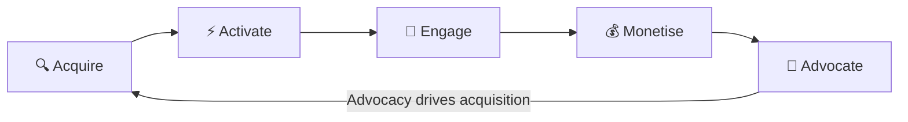

import { Card, CardGrid, LinkCard, Badge, Tabs, TabItem, Steps, Aside } from '@astrojs/starlight/components';

## TL;DR

GrowthOS is a **unified growth platform** that replaces 5+ disconnected SaaS growth tools — waitlists, referrals, lifecycle emails, surveys, NPS, and embeddable components — with a single integrated system. Every module shares one contact graph, one event bus, and one SDK. The result: **compound growth leverage** where each module makes every other module smarter, at a fraction of the cost of a stitched-together stack.

- **One identity** across every touchpoint — no more "same person, three records"
- **One SDK** integration — under 30 minutes, not 20–40 engineer-weeks
- **One price** — $49–$149/mo, not $200–$2,000/mo across 6–10 vendors

---

## The Growth Loop

Every GrowthOS module maps to one stage of the SaaS growth loop. Advocacy feeds back into acquisition — creating a **compounding flywheel** where each cycle is stronger than the last.

<Aside type="tip" title="The Compound Effect">
Point solutions break the loop — your waitlist tool doesn't talk to your referral tool, your survey tool doesn't trigger your email tool. GrowthOS keeps the loop unbroken because every module shares one contact graph and one event bus.
</Aside>

### Acquire — Fill the top of the funnel

Capture leads, generate awareness, and bring prospects into your world.

<CardGrid>
  <Card title="Viral Waitlist" icon="list-format">
    Priority-ranked waitlists with share-to-move-up mechanics. Your launch queue becomes a growth loop before you ship.
  </Card>
  <Card title="Gated Content" icon="document">
    Gate any content behind an email capture. Auto-create contacts, trigger nurture sequences — zero manual export.
  </Card>
  <Card title="Social Proof Widget" icon="approve-check">
    Real-time "X people signed up" notifications that boost conversion 10–15%.
  </Card>
  <Card title="Landing Page Builder" icon="puzzle">
    Template-based pages with native GrowthOS components — waitlist, referral, testimonials — all auto-connected.
  </Card>
</CardGrid>

### Activate — Turn signups into engaged users

Guide new users to their "aha moment" as fast as possible.

<CardGrid>
  <Card title="Onboarding Checklist" icon="approve-check">
    In-app checklist widget guiding users through key steps. Completion events trigger downstream flows automatically.
  </Card>
  <Card title="Welcome Sequences" icon="email">
    Branching welcome emails based on persona, plan, and behavior. Developers get path A, marketers get path B.
  </Card>
</CardGrid>

### Engage — Keep users active and coming back

Drive habitual usage through timely, contextual communication.

<CardGrid>
  <Card title="Lifecycle Emails" icon="email">
    Event-triggered sequences — onboarding nudges, trial expiry, re-engagement — powered by real product events, not just page visits.
  </Card>
  <Card title="Broadcast Emails" icon="rocket">
    One-time newsletters and announcements to segments. Reuses the same email infra, same contact graph.
  </Card>
  <Card title="In-App Nudges" icon="information">
    Targeted banners, modals, and tooltips — no code changes needed. Segment-targeted, event-triggered, frequency-capped.
  </Card>
  <Card title="Surveys & NPS" icon="star">
    Contextual micro-surveys with auto-actions. NPS detractors get retention emails. Promoters get referral invites. The loop closes itself.
  </Card>
</CardGrid>

### Monetise — Convert value into revenue

Capture revenue at the right moment with intelligent prompts.

<CardGrid>
  <Card title="Coupon Engine" icon="random">
    Generate, distribute, and track discount codes tied to segments and campaigns. Know which coupons drive real conversions.
  </Card>
  <Card title="Upgrade Prompts" icon="up-caret">
    Contextual upgrade nudges when users hit plan limits or show expansion signals. Timing is everything.
  </Card>
  <Card title="Stripe Integration" icon="setting">
    Billing events flow into the contact graph. Trial expiry, failed payment, plan upgrade — all trigger automated campaigns.
  </Card>
</CardGrid>

### Advocate — Turn happy users into your growth engine

Mobilize promoters to drive the next wave of acquisition — closing the loop.

<CardGrid>
  <Card title="Referral Engine" icon="rocket">
    Per-user referral links, configurable rewards, embeddable widget. Referral data flows into the contact graph and triggers email sequences.
  </Card>
  <Card title="Tiered Referrals" icon="star">
    Graduated reward tiers — the more friends you refer, the better the rewards. Automated Stripe payouts.
  </Card>
  <Card title="Review Prompts" icon="approve-check">
    Prompt NPS promoters to leave reviews on G2, Capterra, Product Hunt at exactly the right moment.
  </Card>
  <Card title="Employee Amplification" icon="random">
    Pre-approved social content for your team. UTM-tracked per employee. Know which shares drive signups.
  </Card>
</CardGrid>

### The Platform Layer — powers every stage

<CardGrid>
  <Card title="Unified Contact Graph" icon="document">
    The foundation. Single identity per human across all touchpoints. Every module reads from and writes to the same profile.
  </Card>
  <Card title="PostHog Analytics" icon="magnifier">
    Product analytics, feature flags, experiments, session replay — the intelligence backbone that tells you what happened.
  </Card>
  <Card title="Journey Builder" icon="puzzle">
    Visual drag-and-drop canvas orchestrating multi-step, multi-channel growth journeys across every module.
  </Card>
  <Card title="AI Layer" icon="star">
    Send-time optimization, churn prediction, auto-generated copy, module recommendations — intelligence on top of data.
  </Card>
</CardGrid>

<Aside type="note" title="See the full mapping">
Every feature — shortlisted, prioritized, and killed — mapped to the growth loop with scores and links: **[Growth Loop Feature Map](/growthos/roadmap/growth-loop/)**
</Aside>

---

## The Cost Comparison

| Dimension | Current Stack | GrowthOS |
|---|---|---|
| **Monthly cost** | $200 – $2,000/mo | $49 – $149/mo |
| **Number of tools** | 6–10 separate vendors | 1 platform |
| **Integration effort** | 20–40 engineer-weeks | Under 30 minutes |
| **Identity resolution** | Manual, fragmented | Automatic, unified |
| **Cross-tool workflows** | Custom code + Zapier | Built-in, zero-config |
| **Data portability** | Scattered across vendors | Single export, single API |
| **Annual cost (mid-range)** | $15,000 – $260,000 | $588 – $1,788 |

<Aside type="tip">
The real savings are not just in tool spend. The **integration tax** — 20–40 engineer-weeks at $150–$200/hr — represents $80K–$200K in hidden engineering cost that disappears with GrowthOS.
</Aside>

---

## Explore the Strategy

<CardGrid>
  <LinkCard
    title="The Tool-Sprawl Problem"
    description="Why every SaaS growth team drowns in disconnected tools — and what it really costs."
    href="/growthos/vision/problem/"
  />
  <LinkCard
    title="Growth Loop Feature Map"
    description="Every feature mapped to Acquire → Activate → Engage → Monetise → Advocate with scores and phase assignments."
    href="/growthos/roadmap/growth-loop/"
  />
  <LinkCard
    title="Platform Architecture"
    description="How the unified contact graph, event bus, and module system work together."
    href="/growthos/platform/architecture/"
  />
  <LinkCard
    title="Pricing"
    description="Simple, transparent pricing that replaces $200–$2,000/mo in tool spend."
    href="/growthos/business/pricing/"
  />
  <LinkCard
    title="Competitive Landscape"
    description="How GrowthOS compares to point solutions, suites, and DIY approaches."
    href="/growthos/business/competitive-landscape/"
  />
  <LinkCard
    title="Master Scorecard"
    description="All 49 features scored on Pain, Revenue, Build, and Moat — the complete prioritization framework."
    href="/growthos/roadmap/master-scorecard/"
  />
</CardGrid>
