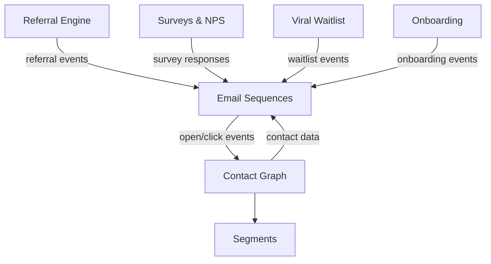

import { Card, CardGrid, LinkCard, Badge, Tabs, TabItem, Steps, Aside } from '@astrojs/starlight/components';

**Multi-step email sequences triggered by product events.**

---

## Scoring Card

| Dimension | Score | Rationale |
|-----------|-------|-----------|
| Pain | 5/5 | Every SaaS needs lifecycle emails; setup is painful and expensive |
| Revenue | 5/5 | Automated lifecycle emails generate 320% more revenue than blasts |
| Build | 3/5 | Sequence orchestration, template rendering, delivery integration |
| Moat | 4/5 | Sequences reactive to ALL module events — not just page visits |
| **Total** | **17/20** | |

---

## Classification

<Badge text="Painkiller" variant="tip" />

<Aside type="tip" title="Painkiller">
Event-triggered email sequences are the single highest-ROI growth automation. Most teams either pay $100–$1,000/mo for Customer.io or settle for primitive Mailchimp automations. GrowthOS makes lifecycle emails a **native, integrated capability**.
</Aside>

---

## The Pain It Kills

> *"Setting up event-triggered emails requires Segment + Customer.io + app events + 2 days of engineering. Every. Single. Time."*

> *"We pay Customer.io $400/mo and Braze quoted us $60K/yr. All we need is 5 sequences."*

- Customer.io costs **$100–$1,000/mo**. Braze costs **$60K/yr**.
- Setting up event-triggered emails requires stitching together a CDP, an email tool, and app events — **2+ days of engineering** per sequence.
- Most indie teams settle for blast emails because automation is too expensive and complex.
- Automated lifecycle emails generate **320% more revenue** than one-time blasts.

---

## What It Does

- **Sequence builder** — trigger event → delay → condition branches → email send.
- **5 pre-built templates** — launch with proven sequences, customize later.
- **MJML-based templates** — responsive email templates with merge tags (e.g. `contact.name`, `contact.referral_link`).
- **SES/Postmark delivery** — reliable transactional email delivery.
- **Open/click tracking** — engagement data flows back into the contact record.
- **Unsubscribe handling** — CAN-SPAM compliant, per-sequence and global unsubscribe.

---

## Competition & What We Replace

| Tool | Pricing | Limitation |
|------|---------|------------|
| Customer.io | $100–$1,000/mo | Messaging only, no referral/survey/waitlist integration |
| Mailchimp Automation | $13–$350/mo | Primitive event triggers, no product event support |
| Braze | $60K/yr | Enterprise pricing, overkill for growth-stage teams |
| Loops | $49–$499/mo | Email only, no cross-module event triggers |

All competitors are **messaging-only platforms** with no native integration to referral programs, surveys, waitlists, or contact identity resolution.

---

## Moat & Defensibility

**Cross-module reactivity is the moat (4/5).**

GrowthOS email sequences can react to events from **every module** — not just page visits or custom events:

- Survey response received → trigger follow-up sequence
- Referral completed → send reward notification
- Waitlist position changed → send update email
- NPS score submitted → branch to retention or advocacy sequence

This **closed-loop responsiveness** is unique. No standalone email tool can react to referral completions or NPS scores without custom integration work.

---

## Interoperability Advantage

---

## What Ships

- **Sequence builder** — event trigger, delay steps, condition branches, send steps
- **5 pre-built templates:**
  1. Welcome sequence
  2. Onboarding nudge
  3. Trial expiry warning
  4. Re-engagement
  5. Referral prompt
- **MJML templates with merge tags** — responsive, customizable
- **SES/Postmark delivery integration** — bring your own API key
- **Open/click tracking** — engagement metrics per email and per contact
- **Unsubscribe handling** — per-sequence and global, CAN-SPAM compliant
- **Basic analytics** — sent, delivered, opened, clicked, unsubscribed per sequence

---

## What Does NOT Ship

- Drag-and-drop visual email builder — Phase 3
- Visual journey canvas (multi-branch flow editor) — Phase 3
- Send-time optimization (ML-based optimal delivery time) — Phase 4
- A/B testing on email variants — Phase 3

---

## Build vs Buy

**BUILD** — sequence orchestrator via Temporal.io, email renderer, delivery integration.

The orchestration layer is the core differentiator. Temporal.io provides durable execution for multi-step sequences with delays, retries, and condition evaluation. The email renderer and delivery layer are straightforward integrations.

**Estimated effort:** 5–6 weeks.

---

## Dependencies

| Dependency | Why |
|-----------|-----|
| [Contact Graph (P1-01)](/growthos/phase-1/unified-contact-graph/) | Every email is sent to a contact. Merge tags pull from the contact record. |
| Event Bus | Sequences trigger on events emitted by other modules. |
