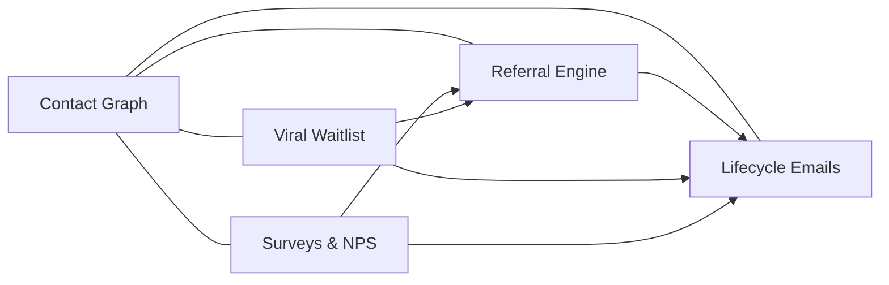

import { Card, CardGrid, LinkCard, Badge, Tabs, TabItem, Steps, Aside } from '@astrojs/starlight/components';

**Months 1–4 | Team: 3–5 engineers + 1 designer**

Replace five disconnected tools with one integrated growth stack, land the first 30 paying customers, and prove that cross-module interoperability delivers compounding value from day one.

---

## Phase 1 Features

| # | Feature | Score | Category |
|---|---------|-------|----------|
| P1-01 | [Unified Contact Graph](/growthos/phase-1/unified-contact-graph/) | 16/20 | <Badge text="Foundation" variant="note" /> |
| P1-02 | [Referral Engine](/growthos/phase-1/referral-engine/) | 18/20 | <Badge text="Painkiller" variant="tip" /> |
| P1-03 | [Lifecycle Emails](/growthos/phase-1/lifecycle-emails/) | 17/20 | <Badge text="Painkiller" variant="tip" /> |
| P1-04 | [Viral Waitlist](/growthos/phase-1/viral-waitlist/) | 16/20 | <Badge text="Painkiller" variant="tip" /> |
| P1-05 | [Surveys & NPS](/growthos/phase-1/surveys-nps/) | 17/20 | <Badge text="Painkiller" variant="tip" /> |

---

## Feature Deep Dives

<CardGrid>
  <LinkCard title="P1-01 Unified Contact Graph" href="/growthos/phase-1/unified-contact-graph/" description="Single identity record per human across ALL touchpoints. The foundation everything else builds on." />
  <LinkCard title="P1-02 Referral Engine" href="/growthos/phase-1/referral-engine/" description="Per-user referral links, configurable rewards, embeddable in-app widget." />
  <LinkCard title="P1-03 Lifecycle Emails" href="/growthos/phase-1/lifecycle-emails/" description="Multi-step email sequences triggered by product events." />
  <LinkCard title="P1-04 Viral Waitlist" href="/growthos/phase-1/viral-waitlist/" description="Embeddable waitlist with share-to-move-up viral mechanics." />
  <LinkCard title="P1-05 Surveys & NPS" href="/growthos/phase-1/surveys-nps/" description="In-app micro-surveys with automatic downstream actions." />
</CardGrid>

---

## Success Metrics

| Metric | Target |
|--------|--------|
| Paying customers | 30+ |
| Modules active per tenant | 3+ |
| Net Promoter Score | ≥ 40 |
| Time to integrate | < 30 minutes |

---

## What Makes Phase 1 Special

<Aside type="tip" title="Interoperability from Day 1">
Every module connects to the **Contact Graph** and the **Event Bus**. Cross-module workflows work from day one — not as a future promise, but as a shipped reality.
</Aside>

A referral completion updates the contact record, triggers a welcome email sequence, and feeds the analytics pipeline — all without a single Zapier zap or manual wiring step.

This is the core bet of Phase 1: **prove that an integrated stack of five modules delivers more value than five best-of-breed point solutions stitched together with glue code.**
