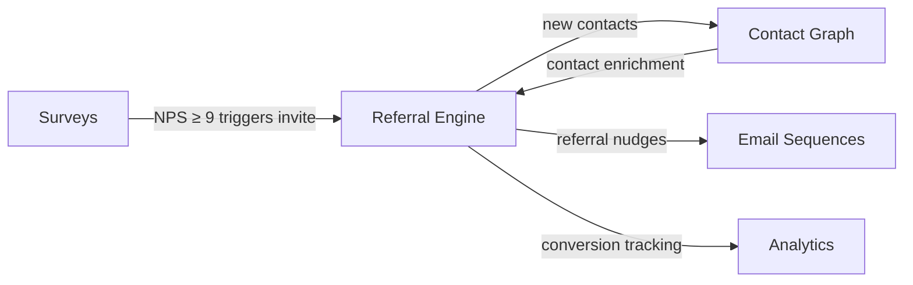

import { Card, CardGrid, LinkCard, Badge, Tabs, TabItem, Steps, Aside } from '@astrojs/starlight/components';

**Per-user referral links, configurable rewards, embeddable in-app widget.**

---

## Scoring Card

| Dimension | Score | Rationale |
|-----------|-------|-----------|
| Pain | 5/5 | Every SaaS team wants referrals; building them is a nightmare |
| Revenue | 5/5 | Direct revenue driver — referral customers convert 3–5x better |
| Build | 4/5 | Moderate complexity — link tracking, fraud detection, widget |
| Moat | 4/5 | Integration with contact graph and email creates strong lock-in |
| **Total** | **18/20** | |

---

## Classification

<Badge text="Painkiller" variant="tip" />

<Aside type="tip" title="Painkiller">
Referral programs are one of the most requested growth features by SaaS founders. Existing tools are expensive, disconnected, and fragile. GrowthOS makes referrals a **first-class, integrated module** — not a bolted-on afterthought.
</Aside>

---

## The Pain It Kills

> *"Built referrals on Google Sheet + Zapier + Stripe webhook. Took 3 weeks. Breaks every billing change."*

> *"We pay Cello $200/mo for a referral widget that has zero connection to our email tool or user data."*

- Referral tools cost **$49–$1,000/mo** and are completely disconnected from the rest of the growth stack.
- In-app referral widgets increase activation by **400%** compared to external referral portals.
- DIY solutions with Zapier/Sheets break constantly and have no fraud prevention.
- Referral data never flows back into the contact record, making attribution impossible.

---

## What It Does

- **Unique referral link per contact** — generated automatically on signup or on demand.
- **Configurable reward tiers** — credits, discounts, free months, custom webhook rewards.
- **Embeddable Web Component** — `<growthOS-referral>` drops into any app with one line of HTML.
- **Tracking dashboard** — full referral funnel from share → click → signup → conversion.
- **Conversion tracking** — attribute signups and payments to the referring contact.
- **Basic fraud prevention** — self-referral detection, IP duplicate detection, velocity limits.

---

## Competition & What We Replace

| Tool | Pricing | Limitation |
|------|---------|------------|
| Cello | $49–$200/mo | Referral only, no contact graph or email integration |
| ReferralHero | $49–$499/mo | Single-purpose, no lifecycle automation |
| Rewardful | $49–$299/mo | Stripe-only, no in-app widget |
| Viral Loops | $35–$240/mo | Campaign-focused, no product integration |

All four are **single-purpose tools** with no connection to email sequences, surveys, or contact data. GrowthOS replaces them and connects referrals to the entire growth stack.

---

## Moat & Defensibility

**Integration is the moat (4/5).**

- Referral data flows into the [Contact Graph](/growthos/phase-1/unified-contact-graph/) — every referred contact is enriched with source attribution.
- Referral events trigger [Email Sequences](/growthos/phase-1/lifecycle-emails/) — automated nudges, reward notifications, re-engagement.
- NPS promoters (score ≥ 9) from [Surveys](/growthos/phase-1/surveys-nps/) auto-receive referral invites — closing the loop between satisfaction and advocacy.

This integration is **impossible** with standalone referral tools.

---

## Interoperability Advantage

---

## What Ships

- **Unique referral link per contact** — auto-generated, shareable
- **Configurable rewards** — credits, discounts, free months, custom webhooks
- **`<growthOS-referral>` Web Component** — embeddable in any app
- **SDK integration** — `growthOS.referral.getLink()`, `growthOS.referral.track()`
- **Dashboard with funnel** — shares → clicks → signups → conversions
- **Server-side tracking** — reliable attribution even with ad blockers
- **Fraud detection** — self-referral blocking, IP duplicate detection, velocity limits

---

## What Does NOT Ship

- Tiered rewards (escalating rewards for multiple referrals) — Phase 2
- Automated Stripe payout — Phase 2
- Leaderboard (public referral rankings) — Phase 2
- Double-sided different-type rewards (e.g., referrer gets credits, referee gets discount)

---

## Build vs Buy

**BUILD.**

No adequate open-source solution exists with multi-tenancy + embeddable widgets + integrated event emission. The referral engine must be a native module that speaks the same event language as every other GrowthOS feature.

**Estimated effort:** 3–4 weeks.

---

## Dependencies

| Dependency | Why |
|-----------|-----|
| [Contact Graph (P1-01)](/growthos/phase-1/unified-contact-graph/) | Every referral link is tied to a contact record. New referrals create contacts automatically. |
