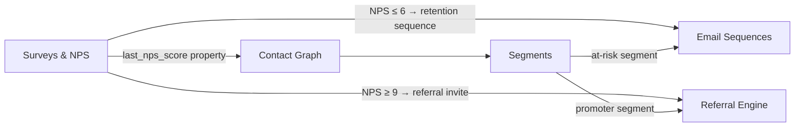

import { Card, CardGrid, LinkCard, Badge, Tabs, TabItem, Steps, Aside } from '@astrojs/starlight/components';

**In-app micro-surveys with automatic downstream actions.**

---

## Scoring Card

| Dimension | Score | Rationale |
|-----------|-------|-----------|
| Pain | 4/5 | Everyone collects NPS; nobody acts on it automatically |
| Revenue | 4/5 | Retention saves and referral activation directly impact revenue |
| Build | 5/5 | Simple component + reuses email orchestrator for auto-actions |
| Moat | 4/5 | Auto-action loop is impossible with standalone survey tools |
| **Total** | **17/20** | |

---

## Classification

<Badge text="Painkiller" variant="tip" />

<Aside type="tip" title="Painkiller">
The pain is not collecting survey data — Typeform does that fine. The pain is the **gap between "collect score" and "do something about it."** Connecting survey → email → referral requires 3 integrations that nobody builds. GrowthOS closes the loop natively.
</Aside>

---

## The Pain It Kills

> *"Our NPS is 62 but I don't know which users are detractors or what to do about them."*

> *"Typeform data sits in a dashboard nobody checks. We ran an NPS survey 3 months ago and never followed up with a single detractor."*

> *"Connecting survey → email → referral requires 3 integrations. We tried with Zapier. It broke after the second survey."*

- The real pain is the **action gap**: teams collect scores but never act on them.
- Connecting survey responses to email sequences and referral invites requires **3 separate integrations** that nobody builds.
- Detractors churn silently. Promoters never get asked to refer.
- Survey data lives in a silo — it never enriches the contact record.

---

## What It Does

- **1–3 question in-app micro-surveys** — NPS (0–10), CSAT (1–5), or custom questions.
- **Event-triggered delivery** — show surveys post-purchase, after N days, on cancellation, or on any custom event.
- **`<growthOS-survey>` Web Component** — embed in any app or page.
- **Email-embeddable survey link** — collect responses without requiring app login.
- **Responses flow into the contact graph** — `last_nps_score`, `last_survey_date`, `survey_responses[]`.
- **Auto-action rules** — the core differentiator:

<Steps>
1. **NPS ≤ 6 (Detractor)** → Trigger retention email sequence automatically
2. **NPS 7–8 (Passive)** → Tag contact, add to re-engagement segment
3. **NPS ≥ 9 (Promoter)** → Auto-send referral invite + prompt app store review
</Steps>

---

## Competition & What We Replace

| Tool | Pricing | Limitation |
|------|---------|------------|
| Typeform | $25–$83/mo | Survey only, no auto-actions |
| Delighted | $224/mo | NPS only, expensive, no growth integration |
| SurveyMonkey | $25–$99/mo | Generic surveys, no product event triggers |
| PostHog Surveys | Free tier | Basic, no auto-action loop |

All competitors are **survey-only tools**. None of them can trigger email sequences, referral invites, or contact segmentation based on responses.

---

## Moat & Defensibility

**The auto-action loop is the moat (4/5).**

The survey component itself is a commodity. Any tool can collect a 0–10 score. What no standalone tool can do:

- **NPS ≤ 6** → automatically trigger a retention email sequence via [Lifecycle Emails](/growthos/phase-1/lifecycle-emails/)
- **NPS ≥ 9** → automatically send a referral invite via the [Referral Engine](/growthos/phase-1/referral-engine/) + prompt an app store review
- **Every response** enriches the [Contact Graph](/growthos/phase-1/unified-contact-graph/) with `last_nps_score`, enabling segmentation and scoring

This **closed loop** from score → action → outcome is impossible with standalone survey tools without custom Zapier/webhook wiring that breaks constantly.

---

## Interoperability Advantage

---

## What Ships

- **`<growthOS-survey>` Web Component** — in-app micro-surveys
- **Email-embeddable survey link** — collect responses via email
- **Dashboard builder** — NPS, CSAT, and custom survey results
- **Event triggers** — show surveys based on product events
- **Auto-action rules** — configurable response → action mappings
- **Response data flows into contact graph** — `last_nps_score`, `last_csat_score`, `survey_responses[]`

---

## What Does NOT Ship

- Advanced survey logic (skip logic, piping, multi-page surveys)
- Advanced analytics (trend analysis, cohort breakdowns, statistical significance)
- AI response analysis (sentiment detection, theme extraction)

---

## Build vs Buy

**BUILD.** Simple survey component + reuses the email orchestrator for auto-actions.

The survey UI is straightforward (1–3 questions, standard scale types). The real value is in the auto-action rules engine, which leverages the existing [Lifecycle Email](/growthos/phase-1/lifecycle-emails/) sequence orchestrator and [Referral Engine](/growthos/phase-1/referral-engine/) APIs.

**Estimated effort:** 2 weeks.

---

## Dependencies

| Dependency | Why |
|-----------|-----|
| [Contact Graph (P1-01)](/growthos/phase-1/unified-contact-graph/) | Survey responses are stored on the contact record. |
| [Email Sequences (P1-03)](/growthos/phase-1/lifecycle-emails/) | Auto-actions trigger email sequences for detractors and promoters. |
