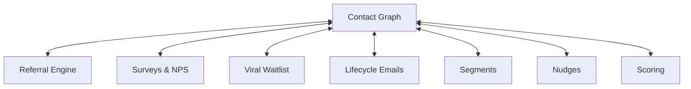

import { Card, CardGrid, LinkCard, Badge, Tabs, TabItem, Steps, Aside } from '@astrojs/starlight/components';

**Single identity record per human across ALL touchpoints.**

---

## Scoring Card

| Dimension | Score | Rationale |
|-----------|-------|-----------|
| Pain | 5/5 | Identity fragmentation is universal — every multi-tool team suffers |
| Revenue | 4/5 | Foundation enables all revenue-generating modules |
| Build | 2/5 | Merge logic, multi-tenancy, and SDK require significant engineering |
| Moat | 5/5 | Once enriched with cross-module data, switching cost is enormous |
| **Total** | **16/20** | |

---

## Classification

<Badge text="Foundation" variant="note" />

<Aside type="note" title="Foundation Module">
The Contact Graph is not a standalone feature customers buy — it is the **substrate** that makes every other module dramatically more valuable. Without it, GrowthOS is just another bundle of disconnected tools.
</Aside>

---

## The Pain It Kills

> *"Mailchimp says 4,200 contacts. App DB says 3,800. Referral tool says 2,100. How many actual people do we have?"*

> *"We spent all of Tuesday reconciling Intercom contacts with our Stripe customers. Again."*

- Teams lose **15–20% of leads** to identity fragmentation across tools.
- Manual reconciliation burns **3–5 hours per week** for growth teams.
- Attribution breaks when the same person appears as three different records in three different tools.
- No single source of truth means no reliable segmentation, no accurate LTV, no trustworthy reporting.

---

## What It Does

- **Single identity per human** — email, phone, anonymous browser session, and app user ID all resolve to one record.
- **Every interaction attributed to source** — UTM parameters, referral codes, direct visits, QR codes.
- **Deterministic merge on email/phone** — when a known identifier matches, records merge automatically.
- **Anonymous-to-known resolution** — browser sessions retroactively attach to a contact when they identify themselves.
- **Multi-tenant isolation** — every query scoped by `tenant_id`, zero data leakage.

---

## Competition & What We Replace

| Tool | Pricing | Limitation |
|------|---------|------------|
| Segment | $120–$1,200/mo | CDP only — no growth modules, no merge logic |
| Rudderstack | Open-source | Complex self-hosting, no integrated growth features |
| HubSpot CRM | Free tier | Limited identity resolution, no event-level attribution |
| Mixpanel / Amplitude | $25–$2,000/mo | Analytics identity, not a contact record |

<Aside type="caution">
No integrated growth-module-aware contact graph exists today. CDPs handle identity but do not connect to referrals, surveys, or waitlists. CRMs handle contacts but lack event-level attribution and anonymous resolution.
</Aside>

---

## Moat & Defensibility

**Maximum defensibility (5/5).**

No point solution can replicate the value of an integrated data layer where every growth interaction — referral, survey response, waitlist signup, email click — enriches the same contact record.

Once a tenant has **50K+ contacts** enriched with cross-module data (referral history, NPS scores, email engagement, waitlist position), the switching cost is enormous. This data does not exist in any single competitor.

---

## Interoperability Advantage

The Contact Graph sits at the center of every data flow. Every module reads from it and writes back to it. This is what makes GrowthOS a **system** rather than a **bundle**.

---

## What Ships

- **`contacts` table** — `email`, `phone`, `app_user_id`, `anonymous_id`, `profile_json`, `source`, `utm_params`, `merged_into`
- **Deterministic merge rules** — automatic deduplication on email and phone match
- **JS SDK** — `init()`, `identify()`, `track()` methods
- **REST API** — `POST /contacts`, `PATCH /contacts/:id`, `GET /contacts/:id`, `POST /events`
- **Contact list UI** — searchable, filterable contact browser in the dashboard
- **Multi-tenant isolation** — all data scoped via `tenant_id`

---

## What Does NOT Ship

- Probabilistic merge (fuzzy matching on name/address) — too error-prone for MVP
- Native iOS/Android SDKs — JS SDK covers web and React Native
- CSV import/export — manual data operations deferred to Phase 2

---

## Build vs Buy

**BUILD** — this is core IP.

No adequate open-source solution exists with multi-tenancy + merge logic + attribution at this level of integration. The Contact Graph is the single most important architectural decision in GrowthOS.

**Estimated effort:** 6–8 weeks MVP.

---

## Dependencies

<Aside type="note" title="No Dependencies">
The Unified Contact Graph has **zero dependencies**. It is the foundation that every other Phase 1 module builds on.
</Aside>
