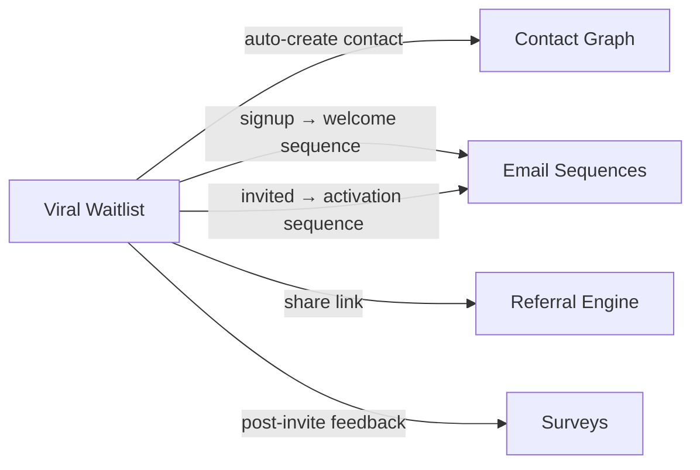

import { Card, CardGrid, LinkCard, Badge, Tabs, TabItem, Steps, Aside } from '@astrojs/starlight/components';

**Embeddable waitlist with share-to-move-up viral mechanics.**

---

## Scoring Card

| Dimension | Score | Rationale |
|-----------|-------|-----------|
| Pain | 4/5 | Every launch needs a waitlist; existing tools are disposable |
| Revenue | 4/5 | Pre-launch revenue signal, converts to paying users post-launch |
| Build | 5/5 | Low complexity — reuses referral infrastructure |
| Moat | 3/5 | Low standalone, high when integrated with growth stack |
| **Total** | **16/20** | |

---

## Classification

<Badge text="Painkiller" variant="tip" />

<Aside type="tip" title="Painkiller">
Waitlist tools are single-use — they generate hype before launch and then die. GrowthOS turns the waitlist into a **permanent growth asset** by connecting signups to the contact graph, referral engine, and email sequences.
</Aside>

---

## The Pain It Kills

> *"GetWaitlist costs $80/mo and after launch day, the data just sits there. Total waste."*

> *"We wanted the share-to-move-up mechanic like Superhuman but building it took 2 weeks of engineering."*

- GetWaitlist costs **$20–$80/mo**. Prefinery costs **$49–$199/mo**. Both are **single-use tools that die after launch**.
- Waitlist data never connects to the growth stack — signups live in a silo.
- The share-to-move-up mechanic (each referral moves the sharer up N positions) is hard to build from scratch.
- ChatGPT, Notion, Linear, CRED, and Superhuman all used invite-only viral waitlists to drive pre-launch growth.

---

## What It Does

- **`<growthOS-waitlist>` Web Component** — embed a waitlist anywhere with one line of HTML.
- **Real-time position tracking** — users see their current position and how to move up.
- **Share-to-move-up** — each successful referral moves the sharer up N positions (configurable).
- **Auto-invite drip** — automatically invite the next N users on a schedule or manually.

---

## Competition & What We Replace

| Tool | Pricing | Limitation |
|------|---------|------------|
| GetWaitlist | $20–$80/mo | Single-use, no post-launch value |
| Prefinery | $49–$199/mo | No integration with growth tools |
| LaunchList | $19–$49/mo | Basic, no viral mechanics |

All three are **single-use, disposable tools** with no connection to referral programs, email sequences, or contact records. After launch day, the data sits in a dashboard nobody visits.

---

## Moat & Defensibility

**Low standalone moat (3/5). High integrated moat.**

The waitlist itself is simple. The real moat is the **zero-wiring integration**:

- Waitlist signup **auto-creates a contact** in the [Contact Graph](/growthos/phase-1/unified-contact-graph/)
- Signup **auto-enters the welcome email sequence** via [Lifecycle Emails](/growthos/phase-1/lifecycle-emails/)
- Share link is powered by the [Referral Engine](/growthos/phase-1/referral-engine/) — no separate referral setup
- Post-invite feedback collected via [Surveys](/growthos/phase-1/surveys-nps/)

This zero-wiring integration is **impossible** with standalone waitlist tools.

---

## Interoperability Advantage

---

## What Ships

- **`<growthOS-waitlist>` Web Component** — embeddable, customizable
- **Dashboard management** — view queue, manually invite, adjust positions
- **Share-to-move-up mechanic** — configurable positions-per-referral
- **Auto-invite drip** — scheduled or manual batch invitations
- **Waitlist → contact auto-creation** — every signup becomes a contact record
- **Waitlist events feed into email sequences** — signup, position change, invited, activated

---

## What Does NOT Ship

- Custom waitlist page hosting (use the embeddable widget on your own page)
- Advanced analytics (conversion funnels, cohort analysis)
- Priority access rules beyond position (e.g., VIP tiers, manual overrides)

---

## Build vs Buy

**BUILD.** Reuses referral infrastructure for share-to-move-up mechanics and link tracking.

The waitlist module is architecturally thin — it is primarily a queue with a Web Component frontend and event emission. The heavy lifting (referral tracking, contact creation, email triggering) is handled by modules that already exist.

**Estimated effort:** 2 weeks.

---

## Dependencies

| Dependency | Why |
|-----------|-----|
| [Contact Graph (P1-01)](/growthos/phase-1/unified-contact-graph/) | Every waitlist signup creates a contact record. |
| [Referral Engine (P1-02)](/growthos/phase-1/referral-engine/) | Share-to-move-up uses referral link infrastructure. |
