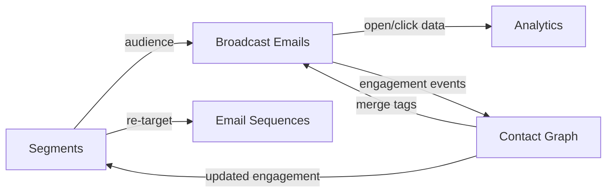

import { Card, CardGrid, LinkCard, Badge, Tabs, TabItem, Steps, Aside } from '@astrojs/starlight/components';

**One-time email broadcasts to segments — newsletters, announcements, promotions.**

---

## Scoring Card

| Dimension | Score | Rationale |
|-----------|:-----:|-----------|
| **Pain** | 4 / 5 | Teams pay $30-300/mo for Mailchimp, disconnected from event data |
| **Revenue** | 4 / 5 | Directly replaces paid email tools — clear cost savings |
| **Build** | 3 / 5 | Reuses P1 email infra; main work is composer + scheduling |
| **Moat** | 3 / 5 | Value from segment targeting and unified analytics |
| **Total** | **14 / 20** | |

---

## Classification

<Badge text="Painkiller" variant="tip" />

<Aside type="tip" title="Engage — Direct Revenue Replacement">
Broadcast Emails directly replace Mailchimp, ConvertKit, and similar paid tools. Every tenant currently paying for a separate broadcast tool can eliminate that cost.
</Aside>

---

## The Pain It Kills

Email sequences (P1) handle automated drip campaigns. But growth teams also need to send **one-time broadcasts** — newsletters, product announcements, promotions, event invitations.

Today, this means a separate tool:

1. **Mailchimp for broadcasts** ($30-300/mo) — but audience lists are disconnected from GrowthOS contact data. Teams manually sync lists.
2. **ConvertKit for newsletters** ($15-59/mo) — subscriber management is separate from the product's contact graph.
3. **No unified analytics** — broadcast engagement data lives in Mailchimp. Sequence engagement lives in GrowthOS. Can't see the full picture.
4. **Merge tag mismatches** — Mailchimp has different contact fields than GrowthOS. Personalization is limited to whatever was manually synced.

**Real scenarios:**
- A SaaS company sends a weekly product changelog via Mailchimp. They want to personalize it by plan tier, but plan data lives in GrowthOS, not Mailchimp.
- A growth team wants to send a promotion only to "users who haven't logged in for 14 days AND are on the free plan." This segment exists in GrowthOS but not in Mailchimp.

---

## What It Does

Broadcast Emails add one-time send capability to the existing P1 email infrastructure:

- **Compose** — write email content with merge tags (contact properties from the Contact Graph).
- **Target** — select a segment as the audience. Full access to all Segment Builder rules.
- **Schedule** — send immediately or schedule for a future date/time.
- **Track** — open rates, click rates, unsubscribes — all flowing back into the Contact Graph.

Broadcasts reuse the same email sending infrastructure, deliverability configuration, and unsubscribe handling from P1 Email Sequences.

---

## Competition & What We Replace

| Tool | Price | Limitation |
|------|-------|------------|
| **Mailchimp** | $30-300/mo | Separate contact lists. No event-based segments. |
| **ConvertKit** | $15-59/mo | Creator-focused. Limited segmentation. |
| **Buttondown** | $9-29/mo | Newsletter-only. No product data integration. |
| **SendGrid Marketing** | $15-60/mo | Email-focused. No lifecycle integration. |
| **GrowthOS Broadcasts** | **Included** | **Same contact graph, same segments, unified analytics** |

---

## Moat & Defensibility

The moat is **unified data**:

- Broadcasts use the same segments as sequences, nudges, and review prompts.
- Engagement data (opens, clicks) flows back into the Contact Graph, enriching segments and scoring.
- A user who opens a broadcast can be auto-added to a segment, triggering a sequence, powering a nudge.

Standalone email tools create data silos. GrowthOS broadcasts create data loops.

---

## Interoperability Advantage

Broadcast engagement data feeds back into the Contact Graph, creating a virtuous cycle where every send makes future targeting smarter.

---

## What Ships

<Steps>
1. **Broadcast composer** — simple text/HTML editor with merge tag support
2. **Segment selection** — target any Segment Builder segment as the audience
3. **Schedule send** — send immediately or schedule for a specific date/time
4. **Merge tags** — personalize with any Contact Graph property (name, plan, company, etc.)
5. **Open/click tracking** — per-recipient tracking flowing into Contact Graph
6. **Unsubscribe handling** — reuses P1 unsubscribe infrastructure, CAN-SPAM compliant
</Steps>

---

## What Does NOT Ship

- **Visual drag-and-drop email builder** — planned for P3. Broadcasts use a simple text/HTML editor.
- **A/B testing** — subject line and content A/B testing planned for P3.
- **RSS-to-email** — no automatic newsletter generation from blog RSS feeds.
- **Template library** — no pre-built email templates in this phase.

---

## Build vs Buy

<Tabs>
  <TabItem label="Build (chosen)">
    - P1 email infra handles sending, deliverability, tracking, and unsubscribes
    - Incremental work: composer UI, segment selection, scheduling
    - Estimated: **1.5 weeks**
  </TabItem>
  <TabItem label="Buy">
    - Mailchimp/ConvertKit would require constant contact list sync
    - Engagement data would be siloed outside GrowthOS
    - Integration maintenance cost exceeds the build cost of the composer + scheduler
  </TabItem>
</Tabs>

---

## Dependencies

| Dependency | Phase | Status | Notes |
|------------|-------|--------|-------|
| [Email Infrastructure](/growthos/phase-1/lifecycle-emails/) | P1 | Required | Sending, deliverability, tracking, unsubscribes |
| [Contact Graph](/growthos/phase-1/unified-contact-graph/) | P1 | Required | Merge tags and engagement data storage |
| [Segment Builder](/growthos/phase-2/segment-builder/) | P2 | Required | Audience targeting for broadcasts |
