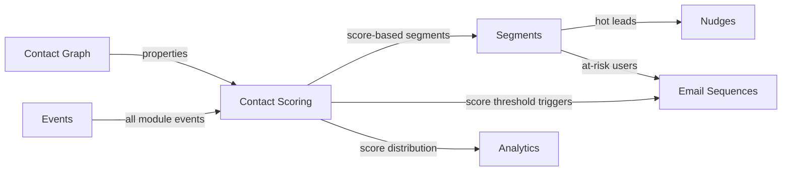

import { Card, CardGrid, LinkCard, Badge, Tabs, TabItem, Steps, Aside } from '@astrojs/starlight/components';

**Automatically score contacts based on engagement, behavior, and profile data.**

---

## Scoring Card

| Dimension | Score | Rationale |
|-----------|:-----:|-----------|
| **Pain** | 3 / 5 | No way to prioritize contacts. Sales can't find hot leads. |
| **Revenue** | 3 / 5 | Improves targeting efficiency across all modules |
| **Build** | 4 / 5 | Scoring rules engine + time decay + segment integration |
| **Moat** | 3 / 5 | Scores become more valuable as more events feed in |
| **Total** | **13 / 20** | |

---

## Classification

<Badge text="Platform" variant="note" />

<Aside type="note" title="Platform Primitive">
Contact Scoring is infrastructure that enriches every contact with a numerical health/engagement signal. Segments, sequences, nudges, and sales workflows all benefit from knowing "how engaged is this contact?"
</Aside>

---

## The Pain It Kills

Growth and sales teams need to prioritize, but every contact looks the same in a flat list:

1. **No prioritization** — sales doesn't know which trial users are most likely to convert. They call everyone or nobody.
2. **Manual lead scoring** — growth teams build SQL queries ("users who logged in 5+ times AND invited a teammate AND viewed pricing") to identify hot leads. These queries break and are never maintained.
3. **Enterprise tools are overkill** — HubSpot lead scoring requires Marketing Hub Professional ($800/mo). Salesforce Einstein requires Enterprise edition ($150/user/mo). Both are designed for enterprise sales processes, not PLG.
4. **No decay** — a user who was active 6 months ago but hasn't logged in since still shows as "engaged" because there's no time decay.
5. **At-risk users are invisible** — growth teams can't identify users whose engagement is declining before they churn.

**Real scenarios:**
- A SaaS product has 500 trial users. The growth team wants to focus their limited time on the 50 most likely to convert. Today: they export login frequency from analytics, merge with feature usage from the database, and manually rank in a spreadsheet. Takes 2 hours and is outdated by the time it's done.
- A customer success manager wants to know which paying customers are at risk of churning. Today: gut feel based on last support ticket.
- A product team wants to show upgrade nudges only to users with high engagement scores. Today: impossible without custom code.

---

## What It Does

Contact Scoring automatically calculates and maintains a numerical score for every contact based on configurable rules:

- **Event-based scoring** — assign points for actions: login (+2), invite teammate (+10), create project (+5), view pricing (+15), complete onboarding (+20).
- **Property-based scoring** — bonus points for profile attributes: paid plan (+30), company_size > 50 (+10), role = decision_maker (+20).
- **Time decay** — scores decay over time. A login 30 days ago is worth less than a login today. Configurable decay rate.
- **Score history** — full history of score changes per contact, enabling trend analysis ("engagement increasing" vs "engagement declining").
- **Segment integration** — create segments based on score thresholds ("hot leads: score > 80," "at-risk: score declining > 20 points in 7 days").

---

## Competition & What We Replace

| Tool | Price | Limitation |
|------|-------|------------|
| **HubSpot lead scoring** | $800+/mo (Professional) | Enterprise pricing. Sales-focused, not PLG. |
| **Salesforce Einstein** | $150+/user/mo | Enterprise. AI-powered but requires massive data. |
| **Custom SQL queries** | Engineering time | Fragile, no decay, no real-time updates. |
| **Mixpanel engagement score** | Analytics plan | Analytics-only. Can't trigger actions. |
| **GrowthOS Contact Scoring** | **Included** | **Event + property + decay, real-time, powers segments and sequences** |

---

## Moat & Defensibility

The moat is **data breadth**:

- Contact Scoring consumes events from every GrowthOS module: email opens, nudge clicks, referrals, survey responses, onboarding progress, feature usage.
- The more modules a tenant activates, the more accurate the scoring becomes.
- Standalone scoring tools only have access to the data you send them. GrowthOS scoring has access to everything.
- Score data feeds into segments, which power sequences, nudges, and review prompts — creating a virtuous cycle that makes the scoring more useful over time.

---

## Interoperability Advantage

Contact Scoring consumes data from every module and feeds scores into Segments, which power every outreach module.

---

## What Ships

<Steps>
1. **Scoring rule builder** — dashboard UI to configure event weights and property bonuses
2. **Event-based scoring** — assign points for any GrowthOS event (login, feature use, email open, etc.)
3. **Property-based scoring** — bonus points based on contact properties (plan, role, company size)
4. **Time decay** — configurable decay rate so scores reflect recent engagement, not historical
5. **Score history** — full timeline of score changes per contact with trend indicators
6. **Segment integration** — use score thresholds in Segment Builder rules
</Steps>

---

## What Does NOT Ship

- **Predictive scoring** — ML-based "likelihood to convert/churn" scoring is planned for P4.
- **Custom ML models** — no ability to train custom scoring models on tenant data.
- **Intent signals from external data** — no ingesting third-party intent data (Bombora, G2 intent, etc.).
- **Multi-score models** — one score per contact in P2. Multiple scores (engagement, fit, intent) are a future enhancement.

---

## Build vs Buy

<Tabs>
  <TabItem label="Build (chosen)">
    - Scoring rules engine is similar to Segment Builder rules (shared infrastructure)
    - Deep integration with Event Bus is essential — no off-the-shelf tool plugs in
    - Time decay requires a background job but is straightforward
    - Estimated: **2 weeks**
  </TabItem>
  <TabItem label="Buy">
    - MadKudu ($500+/mo) provides scoring but requires data export/import pipeline
    - HubSpot scoring requires adopting the full HubSpot stack
    - No standalone scoring tool integrates with GrowthOS events natively
  </TabItem>
</Tabs>

---

## Dependencies

| Dependency | Phase | Status | Notes |
|------------|-------|--------|-------|
| [Contact Graph](/growthos/phase-1/unified-contact-graph/) | P1 | Required | Contact properties for property-based scoring |
| [Event Bus](/growthos/platform/architecture/) | P1 | Required | All module events for event-based scoring |
| [Segment Builder](/growthos/phase-2/segment-builder/) | P2 | Optional | Score-based segments (bidirectional integration) |
