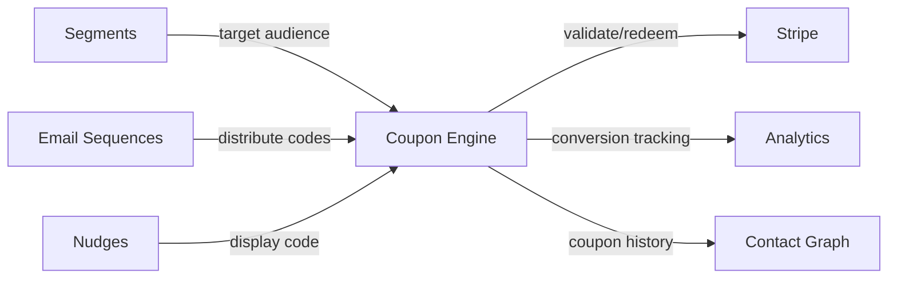

import { Card, CardGrid, LinkCard, Badge, Tabs, TabItem, Steps, Aside } from '@astrojs/starlight/components';

**Generate, distribute, and track discount codes tied to segments and campaigns.**

---

## Scoring Card

| Dimension | Score | Rationale |
|-----------|:-----:|-----------|
| **Pain** | 4 / 5 | Teams create coupons manually in Stripe with no campaign tracking |
| **Revenue** | 5 / 5 | Directly drives conversion and expansion — highest revenue signal in P2 |
| **Build** | 3 / 5 | Code generation + rules engine + Stripe integration + tracking |
| **Moat** | 2 / 5 | Coupons are table stakes; moat comes from campaign integration |
| **Total** | **14 / 20** | |

---

## Classification

<Badge text="Painkiller" variant="tip" />

<Aside type="tip" title="Monetise — Direct Revenue Impact">
The Coupon Engine directly drives conversions. Targeted discounts at the right moment (trial expiry, annual upsell, win-back) are among the highest-ROI growth tactics.
</Aside>

---

## The Pain It Kills

Discount codes are one of the most effective conversion tools, but the implementation is manual and disconnected:

1. **Stripe coupons are manual** — create a coupon in the Stripe dashboard, copy the code, paste it into an email. No automation.
2. **No campaign tracking** — which coupon drove which conversion? Stripe shows redemptions but not the campaign context.
3. **No targeting** — every coupon is available to everyone. No way to restrict to a segment (e.g., "only free-tier users who've been active for 30+ days").
4. **No lifecycle integration** — can't auto-send a coupon when a trial is about to expire or when a user hits a usage milestone.

**Real scenarios:**
- A SaaS startup wants to send a 20% discount to users whose trials expire in 3 days. Today: export trial-expiring users from the database, create a Stripe coupon, manually email the code. By the time it's done, half the trials have already expired.
- A growth team runs a Product Hunt launch and wants to offer a unique code per lead. They generate codes in a spreadsheet and copy-paste them into individual emails.

---

## What It Does

The Coupon Engine generates, distributes, and tracks discount codes within the GrowthOS ecosystem:

- **Generate** — create unique or shared coupon codes with rules: percentage off, fixed amount, expiry date, usage limits (per-code or per-contact).
- **Distribute** — attach coupons to email sequences, broadcasts, or nudges. Each contact can receive a unique code.
- **Track** — redemption tracking linked to the contact record. Dashboard showing coupon → conversion → revenue attribution.
- **Validate** — API endpoint for the customer's checkout flow to validate and redeem codes.

---

## Competition & What We Replace

| Tool | Price | Limitation |
|------|-------|------------|
| **Stripe coupons** | Free (basic) | Manual creation. No campaign integration. No per-contact tracking. |
| **Voucherify** | $99+/mo | Powerful but standalone. No email/nudge integration. |
| **Custom-built** | Engineering time | One-off implementations. Hard to maintain, no analytics. |
| **GrowthOS Coupon Engine** | **Included** | **Auto-distribute via sequences, segment-targeted, full tracking** |

---

## Moat & Defensibility

The moat is **lifecycle-aware distribution**:

- Coupons are not just codes — they are growth tactics tied to specific moments in the user journey.
- "Trial expiring in 3 days" + "engagement score > 50" + "hasn't seen pricing page" = auto-send 20% off coupon via email sequence.
- Redemption data feeds back into the Contact Graph, enriching segments and scoring.

Standalone coupon tools generate codes. GrowthOS generates conversions.

---

## Interoperability Advantage

The Coupon Engine plugs into every distribution channel (email, nudge, broadcast) and every data system (Stripe, Contact Graph, Analytics).

---

## What Ships

<Steps>
1. **Coupon generator** — unique or shared codes with configurable formats
2. **Rules engine** — percentage off, fixed amount, expiry, usage limits, minimum spend
3. **Distribution via sequences** — embed coupon codes in email sequences and broadcasts
4. **Redemption tracking** — per-contact redemption linked to campaign source
5. **Dashboard analytics** — coupon performance: distributed, redeemed, revenue generated
6. **Validation API** — REST endpoint for checkout flow to validate and redeem codes
</Steps>

---

## What Does NOT Ship

- **Loyalty points** — no points-based reward system. Coupons are discount codes only.
- **Physical gift cards** — no physical card generation or fulfillment.
- **Multi-currency discounts** — coupons are single-currency. Multi-currency support is a future enhancement.
- **Referral-specific rewards** — referral rewards are handled by the [Tiered Referrals](/growthos/phase-2/tiered-referrals/) module.

---

## Build vs Buy

<Tabs>
  <TabItem label="Build (chosen)">
    - Code generation is trivial
    - Rules engine is moderate complexity
    - Stripe Coupon API integration is well-documented
    - Main value is in the distribution and tracking integration with other modules
    - Estimated: **2.5 weeks**
  </TabItem>
  <TabItem label="Buy">
    - Voucherify provides coupon management but no email/nudge distribution
    - Would still need to build the bridge between Voucherify and every outreach module
    - $99+/mo per tenant adds up — building is more cost-effective at scale
  </TabItem>
</Tabs>

---

## Dependencies

| Dependency | Phase | Status | Notes |
|------------|-------|--------|-------|
| [Segment Builder](/growthos/phase-2/segment-builder/) | P2 | Required | Target coupons to specific audience segments |
| [Email Sequences](/growthos/phase-1/lifecycle-emails/) | P1 | Optional | Distribute coupons via automated sequences |
| [Stripe Integration](/growthos/phase-2/stripe-integration/) | P2 | Optional | Validate and redeem codes against Stripe |
| [Contact Graph](/growthos/phase-1/unified-contact-graph/) | P1 | Required | Store coupon history on contact records |
