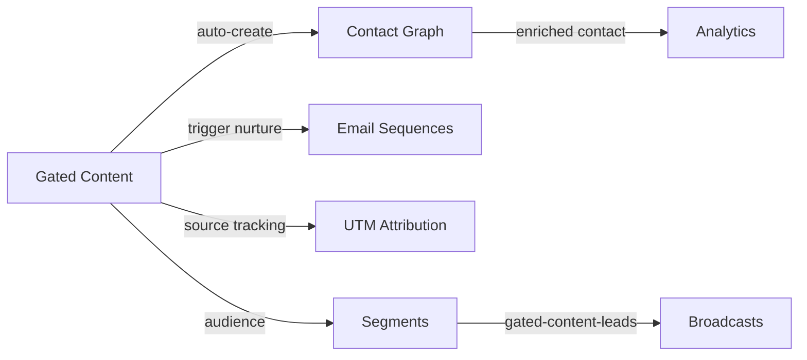

import { Card, CardGrid, LinkCard, Badge, Tabs, TabItem, Steps, Aside } from '@astrojs/starlight/components';

**Gate any content behind an email capture form — auto-create contacts, trigger sequences.**

---

## Scoring Card

| Dimension | Score | Rationale |
|-----------|:-----:|-----------|
| **Pain** | 4 / 5 | Teams use Typeform or custom forms, then manually export leads |
| **Revenue** | 4 / 5 | Direct acquisition feature — drives top-of-funnel growth |
| **Build** | 3 / 5 | Web Component + backend contact creation + sequence trigger |
| **Moat** | 3 / 5 | Value comes from auto-connection to Contact Graph and Sequences |
| **Total** | **14 / 20** | |

---

## Classification

<Badge text="Painkiller" variant="tip" />

<Aside type="tip" title="Acquire — Top of Funnel">
Gated Content is a direct acquisition tool. It captures leads at the moment of highest intent (wanting to read your content) and immediately feeds them into the growth engine.
</Aside>

---

## The Pain It Kills

Content-led growth is one of the most effective SaaS acquisition channels, but the tooling is fragmented:

1. **Typeform/Google Forms for gating** — Visitor fills out a form, gets a PDF link. The lead sits in Typeform until someone exports it.
2. **Manual CSV export** — Marketing exports leads weekly, uploads to Mailchimp, starts a drip campaign. Days of delay.
3. **No attribution** — No connection between the gated content download and the eventual signup. Can't answer "which ebook drove the most conversions?"
4. **Custom code** — Engineering builds a one-off gate for the blog, hardcoded to one email provider. Fragile, unmaintainable.

**Real scenarios:**
- A SaaS startup publishes a "State of the Industry" report. They gate it with Typeform. Leads trickle into a spreadsheet. By the time marketing sends a follow-up email, the lead has gone cold.
- A developer tools company wants to gate API documentation behind a signup. They build a custom solution that breaks every time they redesign the docs site.

---

## What It Does

GrowthOS ships an embeddable **`<growthOS-gate>`** Web Component that can wrap any content — blog posts, ebooks, whitepapers, videos, tools.

The flow:

1. Visitor lands on a page with gated content.
2. They see a preview + the gate overlay asking for their email (and optional custom fields).
3. Visitor submits their email.
4. **Contact auto-created** in the Contact Graph (or merged if existing).
5. **Content unlocked** — either revealed in-place or redirected to the full content.
6. **Nurture sequence triggered** — the contact enters a configurable email sequence.
7. **UTM data captured** — source attribution stored on the contact record.

Everything happens in one seamless flow. Zero manual steps.

---

## Competition & What We Replace

| Tool | Price | Limitation |
|------|-------|------------|
| **ConvertKit** | $15-59/mo | Email-first. Gating is basic. No connection to product analytics. |
| **Leadpages** | $37-74/mo | Landing page builder with forms. No CRM or sequence integration. |
| **HubSpot forms** | Free (limited) | Good forms, but free tier is limited. Full power requires $800+/mo. |
| **Typeform** | $25-83/mo | Beautiful forms, zero automation. Manual export required. |
| **GrowthOS Gated Content** | **Included** | **Auto-create contact + trigger sequence + UTM attribution in one flow** |

---

## Moat & Defensibility

The moat is the **automatic connection** between lead capture and the rest of the growth stack:

- Captured leads immediately appear in the Contact Graph with full UTM attribution.
- Sequences start within seconds, not days.
- Segment Builder can create "gated-content-leads" segments for targeted follow-up.
- Analytics show content → signup → activation → revenue attribution.

No standalone form tool can replicate this without extensive integration work.

---

## Interoperability Advantage

Gated Content is the entry point for new contacts. Every downstream module benefits from the leads it captures.

---

## What Ships

<Steps>
1. **Embeddable `<growthOS-gate>` Web Component** — drop into any page with a single HTML tag
2. **Configurable fields** — email (required) + optional custom fields (name, company, role)
3. **Unlock modes** — reveal content in-place OR redirect to a URL on capture
4. **Dashboard analytics** — views, captures, conversion rate per gated asset
5. **Sequence trigger** — configure which email sequence to trigger on capture
6. **UTM passthrough** — UTM params from the page URL stored on the contact record
</Steps>

---

## What Does NOT Ship

- **Content hosting** — GrowthOS does not host your PDFs, videos, or blog posts. The gate wraps content you host.
- **Paywall functionality** — this is lead capture, not monetization. No payment collection.
- **Advanced form builder** — no multi-step forms, conditional logic, or file uploads. Keep it simple: email + a few fields.

---

## Build vs Buy

<Tabs>
  <TabItem label="Build (chosen)">
    - Web Component is lightweight to build (~1 week)
    - Must integrate with Contact Graph and Email Sequences natively
    - UTM capture requires SDK integration
    - Estimated: **2 weeks**
  </TabItem>
  <TabItem label="Buy">
    - Typeform/Leadpages provide form UI but zero backend integration
    - Would still need to build the Contact Graph sync, sequence trigger, and UTM capture
    - Integration maintenance cost exceeds build cost
  </TabItem>
</Tabs>

---

## Dependencies

| Dependency | Phase | Status | Notes |
|------------|-------|--------|-------|
| [Contact Graph](/growthos/phase-1/unified-contact-graph/) | P1 | Required | Auto-create contacts on capture |
| [Email Sequences](/growthos/phase-1/lifecycle-emails/) | P1 | Required | Trigger nurture sequences post-capture |
| [UTM Attribution](/growthos/phase-2/utm-attribution/) | P2 | Optional | Source tracking on captured contacts |
| [Segment Builder](/growthos/phase-2/segment-builder/) | P2 | Optional | Create segments of gated-content leads |
