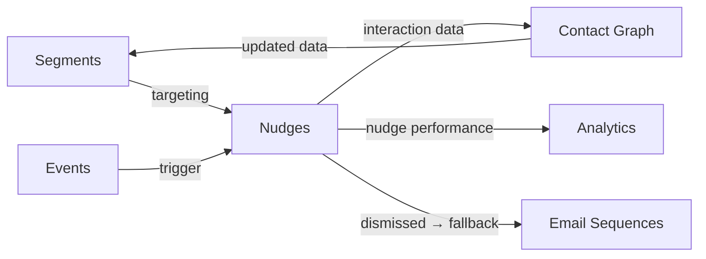

import { Card, CardGrid, LinkCard, Badge, Tabs, TabItem, Steps, Aside } from '@astrojs/starlight/components';

**Show targeted banners, modals, or tooltips inside the user's app — no code changes needed.**

---

## Scoring Card

| Dimension | Score | Rationale |
|-----------|:-----:|-----------|
| **Pain** | 3 / 5 | Teams hard-code banners. No targeting by segment or event without custom code. |
| **Revenue** | 3 / 5 | Nudges drive activation, feature adoption, and upsell conversations |
| **Build** | 4 / 5 | Web Component + dashboard config + segment targeting + event triggers |
| **Moat** | 3 / 5 | Value from deep integration with segments, events, and contact data |
| **Total** | **13 / 20** | |

---

## Classification

<Badge text="Painkiller" variant="tip" />

<Aside type="tip" title="Engage — In-Product Communication">
In-App Nudges give growth teams a direct communication channel inside the product itself. Unlike email (which requires the user to leave the product), nudges appear exactly when and where they're most relevant.
</Aside>

---

## The Pain It Kills

Growth teams need to communicate with users inside the product — announcements, feature tips, upgrade prompts, warnings. Today, this is painful:

1. **Hard-coded banners** — engineering builds a banner component, deploys it, and removes it manually when the campaign ends. Every banner is a deploy.
2. **No targeting** — the banner shows to everyone. Free users see upgrade messages that don't apply to them. Power users see beginner tips.
3. **No event triggers** — can't show a tooltip right after a user completes a specific action. Banners appear on page load, regardless of context.
4. **Expensive alternatives** — Appcues ($249/mo+), Intercom messages ($74/mo+), Pendo guides ($5K+/yr). All expensive and disconnected from the growth stack.

**Real scenarios:**
- A SaaS product ships a new feature. They want to show a tooltip pointing to the new button, but only for users who use the related feature. Today: show it to everyone or don't show it at all.
- A growth team wants to show a modal to free-tier users who have hit 80% of their usage limit: "Upgrade to Pro for unlimited usage." Today: requires custom code that checks the usage API and renders a modal.
- A product team wants to show a congratulatory banner when a user completes onboarding. Today: hard-code it and never remove it.

---

## What It Does

GrowthOS ships a **`<growthOS-nudge>`** Web Component that renders nudges (banners, modals, tooltips) inside the customer's app, all configured from the dashboard:

- **Three nudge types** — top/bottom banner, centered modal, element-anchored tooltip.
- **Segment targeting** — show nudges only to contacts in a specific segment ("free-plan users," "inactive 7 days," "NPS detractors").
- **Event triggering** — trigger a nudge when a specific event fires ("completed_first_task," "viewed_pricing_page").
- **Page targeting** — show nudges on specific URL patterns.
- **Dismiss tracking** — track when users dismiss nudges. Feed interaction data back to the Contact Graph.
- **Frequency capping** — don't overwhelm users. Limit how many nudges a user sees per session/day/week.

---

## Competition & What We Replace

| Tool | Price | Limitation |
|------|-------|------------|
| **Appcues** | $249/mo+ | Expensive. Data siloed in Appcues. |
| **Intercom messages** | $74/mo+ | Part of a larger suite. In-app messages are basic. |
| **Pendo guides** | $5K+/yr | Enterprise pricing. Analytics-first. |
| **Custom-built** | Engineering time | One-off, no targeting, no analytics. |
| **GrowthOS Nudges** | **Included** | **Segment-targeted, event-triggered, dashboard-configured** |

---

## Moat & Defensibility

The moat is **contextual targeting**:

- Nudges powered by Segment Builder rules can target micro-audiences that no standalone tool can match.
- Event-triggered nudges respond to real-time behavior, not just page loads.
- Interaction data (dismissed, clicked, converted) feeds back into the Contact Graph, making future targeting smarter.
- When a nudge is dismissed, an email fallback can be triggered automatically — cross-channel coordination that Appcues can't do.

---

## Interoperability Advantage

Nudges consume segment and event data, and produce interaction data that enriches the Contact Graph and Analytics.

---

## What Ships

<Steps>
1. **`<growthOS-nudge>` Web Component** — banner, modal, and tooltip types
2. **Dashboard configuration** — create and manage nudges without code
3. **Segment targeting** — show nudges only to contacts matching segment rules
4. **Event triggering** — trigger nudges on specific GrowthOS events
5. **Dismiss tracking** — record when users dismiss nudges; feed data to Contact Graph
6. **Frequency capping** — limit nudge exposure per session, day, or week
</Steps>

---

## What Does NOT Ship

- **Interactive tours** — multi-step guided tours with hotspots. The Onboarding Checklist handles structured activation; nudges are single-message.
- **Video nudges** — no embedded video in nudges.
- **Custom animations** — nudges use standard enter/exit transitions. No custom animation support.
- **A/B testing** — nudge A/B testing is planned for P3.

---

## Build vs Buy

<Tabs>
  <TabItem label="Build (chosen)">
    - Web Component builds on the SDK's existing infrastructure
    - Segment targeting leverages the Segment Builder API
    - Dashboard UI is the main effort
    - Estimated: **2.5 weeks**
  </TabItem>
  <TabItem label="Buy">
    - Appcues/Pendo provide nudge UI but cost $249-5K+/mo per tenant
    - Neither integrates with GrowthOS segments or events
    - Would need to build event bridging and data sync — negating the buy benefit
  </TabItem>
</Tabs>

---

## Dependencies

| Dependency | Phase | Status | Notes |
|------------|-------|--------|-------|
| [SDK](/growthos/platform/developer-experience/) | P1 | Required | Web Component delivery and event emission |
| [Segment Builder](/growthos/phase-2/segment-builder/) | P2 | Required | Audience targeting for nudges |
| [Contact Graph](/growthos/phase-1/unified-contact-graph/) | P1 | Required | Store interaction data |
| [Event Bus](/growthos/platform/architecture/) | P1 | Required | Event-based triggering |
