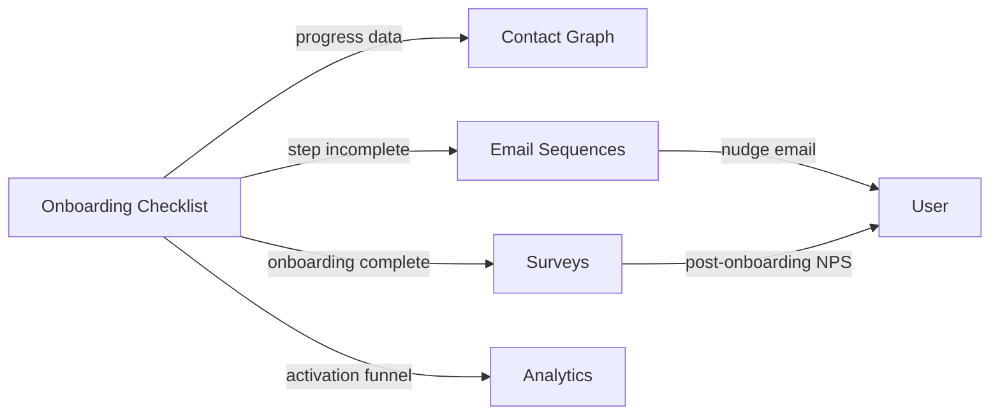

import { Card, CardGrid, LinkCard, Badge, Tabs, TabItem, Steps, Aside } from '@astrojs/starlight/components';

**In-app checklist widget that guides users through key activation steps.**

---

## Scoring Card

| Dimension | Score | Rationale |
|-----------|:-----:|-----------|
| **Pain** | 3 / 5 | Appcues costs $249/mo+. Most teams build fragile custom onboarding. |
| **Revenue** | 3 / 5 | Activation improvement drives retention and expansion revenue |
| **Build** | 4 / 5 | Web Component + dashboard config + event tracking |
| **Moat** | 3 / 5 | Value from integration with sequences, surveys, and analytics |
| **Total** | **13 / 20** | |

---

## Classification

<Badge text="Painkiller" variant="tip" />

<Aside type="tip" title="Activate — Onboarding">
The Onboarding Checklist directly addresses the activation gap. Users who complete key steps in their first session are 3-5x more likely to convert to paid.
</Aside>

---

## The Pain It Kills

Onboarding is the highest-leverage growth lever, yet most teams handle it poorly:

1. **Appcues / Pendo are expensive** — $249/mo+ for Appcues, $5K+/yr for Pendo. Overkill for a simple checklist.
2. **Custom-built onboarding is fragile** — Engineering builds a checklist component, hardcodes the steps, and never updates it. No analytics on completion rates.
3. **No connection to lifecycle** — When a user stalls on step 3, there is no automated email nudge. The user just churns silently.
4. **No per-contact tracking** — Teams know aggregate completion rates but can't see which specific users are stuck.

**Real scenarios:**
- A project management SaaS has five key activation steps (create project, invite teammate, create first task, set deadline, enable notifications). They built a custom checklist in React. When they added a sixth step, it took 2 weeks of engineering time and a deploy.
- A dev tools startup uses Appcues for onboarding. It costs $3K/yr and the data lives in Appcues — disconnected from their email sequences and NPS surveys.

---

## What It Does

GrowthOS ships a **`<growthOS-checklist>`** Web Component that renders an onboarding checklist inside the customer's app.

- **Dashboard-configured steps** — add, remove, reorder steps without code changes or deploys.
- **Progress tracked per contact** — each user's checklist state is stored on their Contact Graph record.
- **Completion events** — each step completion fires a GrowthOS event, enabling sequence triggers ("if step 3 not completed after 24h → send nudge email").
- **Auto-dismiss** — checklist collapses/hides once all steps are complete.
- **Customizable appearance** — matches the host app's theme via CSS custom properties.

---

## Competition & What We Replace

| Tool | Price | Limitation |
|------|-------|------------|
| **Appcues** | $249/mo+ | Expensive. Data siloed in Appcues. |
| **UserGuiding** | $69-299/mo | Cheaper but still disconnected from growth stack. |
| **Pendo** | $5K+/yr | Enterprise pricing. Analytics-first, not growth-first. |
| **Custom-built** | Engineering time | Fragile, no analytics, no lifecycle integration. |
| **GrowthOS Checklist** | **Included** | **Dashboard-configured, per-contact tracking, sequence integration** |

---

## Moat & Defensibility

The checklist alone is simple. The moat is what happens when a user stalls:

- **Step incomplete after 24h?** → Auto-trigger a helpful email via Sequences.
- **All steps complete?** → Trigger a post-onboarding NPS survey.
- **Activation rate by cohort?** → Visible in Analytics.
- **High-scoring contacts who didn't complete?** → Surface in Segments for manual outreach.

This closed-loop onboarding is impossible when the checklist lives in a disconnected tool.

---

## Interoperability Advantage

The checklist is an activation sensor. It generates events that power the entire lifecycle engine.

---

## What Ships

<Steps>
1. **`<growthOS-checklist>` Web Component** — embed in any app with a single HTML tag
2. **Dashboard step configuration** — add/remove/reorder steps without code
3. **Per-contact progress tracking** — see exactly where each user is stuck
4. **Completion events** — each step fires a GrowthOS event for automation
5. **Auto-dismiss on complete** — checklist hides once all steps are done
6. **Theming via CSS custom properties** — match the host app's look and feel
</Steps>

---

## What Does NOT Ship

- **Interactive product tours** — step-by-step guided tours with hotspots and tooltips are a killed feature. Too complex, too fragile across customer UIs.
- **Branching paths** — no conditional step logic (e.g., "if admin, show step X"). Keep it linear.
- **Custom UI beyond checklist** — no progress bars, modals, or custom widgets. The checklist is the checklist.

---

## Build vs Buy

<Tabs>
  <TabItem label="Build (chosen)">
    - Web Component is straightforward (~1.5 weeks)
    - Deep integration with Contact Graph and Event Bus is essential
    - Dashboard config requires admin UI work
    - Estimated: **2 weeks**
  </TabItem>
  <TabItem label="Buy">
    - Appcues/UserGuiding provide UI but not lifecycle integration
    - Would still need to build event bridging, per-contact tracking, and sequence triggers
    - Cost: $3K+/yr for Appcues vs ~2 weeks of engineering
  </TabItem>
</Tabs>

---

## Dependencies

| Dependency | Phase | Status | Notes |
|------------|-------|--------|-------|
| [SDK](/growthos/platform/developer-experience/) | P1 | Required | Web Component delivery and event tracking |
| [Email Sequences](/growthos/phase-1/lifecycle-emails/) | P1 | Required | Trigger nudge emails on incomplete steps |
| [Contact Graph](/growthos/phase-1/unified-contact-graph/) | P1 | Required | Store per-contact progress |
| [Surveys](/growthos/phase-1/surveys-nps/) | P1 | Optional | Post-onboarding NPS survey trigger |
