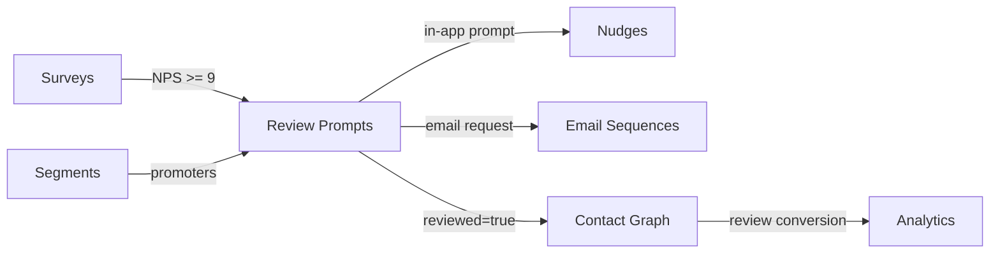

import { Card, CardGrid, LinkCard, Badge, Tabs, TabItem, Steps, Aside } from '@astrojs/starlight/components';

**Prompt happy users to leave reviews on G2, Capterra, Product Hunt — at the right moment.**

---

## Scoring Card

| Dimension | Score | Rationale |
|-----------|:-----:|-----------|
| **Pain** | 3 / 5 | Teams send manual review requests. No targeting — detractors get asked too. |
| **Revenue** | 4 / 5 | Reviews drive organic acquisition. G2 badges are conversion multipliers. |
| **Build** | 4 / 5 | Orchestration logic + nudge/email integration + suppression |
| **Moat** | 3 / 5 | Unique in PLG tools — nobody connects NPS to review orchestration |
| **Total** | **14 / 20** | |

---

## Classification

<Badge text="Vitamin" variant="caution" />

<Aside type="caution" title="Advocate — Organic Acquisition Multiplier">
Review Prompts turn your happiest users into a public acquisition channel. G2 badges, Capterra ratings, and Product Hunt upvotes drive high-intent organic traffic.
</Aside>

---

## The Pain It Kills

Social proof is one of the most powerful acquisition channels for SaaS, but review collection is manual and poorly targeted:

1. **Manual email blasts** — growth teams send "Please review us on G2" emails to their entire user base. Detractors get asked and leave negative reviews.
2. **No targeting** — there's no connection between NPS data and review asks. The happiest users are not specifically targeted.
3. **Wrong timing** — review requests are sent on an arbitrary schedule, not after moments of peak satisfaction (just completed onboarding, just had a great support interaction).
4. **No suppression** — users who already reviewed get asked again. Users who just received a different ask (upgrade, referral) get review fatigue.
5. **No tracking** — did the user actually leave a review? No way to close the loop.

**Real scenarios:**
- A SaaS startup has 200 users. They send a mass email asking for G2 reviews. 5 users respond: 2 promoters leave great reviews, 3 detractors leave bad ones. Net result: damage to G2 profile.
- A product team knows their NPS is 65, meaning ~65% of respondents are promoters. But they can't programmatically identify and target those promoters with a review request.
- A growth lead asks: "Of the 50 users we asked for reviews last month, how many actually left one?" Nobody knows.

---

## What It Does

Review Prompt Orchestration identifies the right users at the right time and routes them to the right review platform:

- **Identify promoters** — use NPS survey data (score >= 9) or high engagement scores from Contact Scoring.
- **Trigger at the right moment** — after completing onboarding, after a positive support interaction, after a usage milestone.
- **Multi-channel delivery** — show an in-app nudge OR send an email with review platform links.
- **Multi-platform links** — include links to G2, Capterra, Product Hunt, App Store, and any custom platform.
- **Track reviews** — mark contacts who clicked review links. Suppress future asks.
- **Suppression logic** — don't ask users who reviewed already, who received a review ask recently, or who are in an active sales conversation.

---

## Competition & What We Replace

| Tool | Price | Limitation |
|------|-------|------------|
| **G2 review collection** | Free (basic) | Basic email templates. No targeting, no NPS gating. |
| **Trustpilot invitations** | $199+/mo | Review platform, not growth tool. No product data. |
| **Manual outreach** | Free | Time-consuming, no targeting, no tracking. |
| **GrowthOS Review Prompts** | **Included** | **NPS-gated, segment-targeted, multi-platform, tracked** |

---

## Moat & Defensibility

The moat is **NPS-gated targeting**:

- Only GrowthOS has NPS data AND review orchestration in the same platform.
- The connection between "this user gave us an NPS of 10" and "ask them for a G2 review via an in-app nudge" is unique.
- Standalone review tools (G2, Trustpilot) have no access to product engagement data or NPS scores.
- The feedback loop — survey → identify promoter → ask for review → track review — is a closed loop that only an integrated platform can provide.

---

## Interoperability Advantage

Review Prompts sit at the intersection of surveys (satisfaction data), segments (targeting), nudges (in-app delivery), and email (outbound delivery).

---

## What Ships

<Steps>
1. **Review prompt rules** — configurable triggers (NPS threshold, engagement score, event-based)
2. **Multi-platform links** — G2, Capterra, Product Hunt, App Store, custom URLs
3. **NPS-gated triggering** — only ask contacts with NPS >= 9 (configurable threshold)
4. **Delivery via nudge or email** — choose in-app nudge, email, or both
5. **Suppression after review** — mark contacts as reviewed, suppress future asks
6. **Review conversion tracking** — track click-through to review platforms
</Steps>

---

## What Does NOT Ship

- **Review aggregation dashboard** — GrowthOS does not scrape or display reviews from external platforms.
- **Sentiment analysis** — no NLP analysis of review text.
- **Automated responses to reviews** — no auto-reply to G2/Capterra reviews.
- **Review incentives** — no "leave a review and get a discount." This risks violating review platform policies.

---

## Build vs Buy

<Tabs>
  <TabItem label="Build (chosen)">
    - Orchestration logic is moderate complexity (rules + suppression + tracking)
    - Leverages existing Nudges and Email Sequences for delivery
    - Leverages existing Surveys for NPS data
    - Estimated: **1.5 weeks**
  </TabItem>
  <TabItem label="Buy">
    - No standalone tool provides NPS-gated review orchestration
    - G2/Trustpilot offer basic collection but no product data integration
    - Building on top of existing GrowthOS modules is faster than integrating external tools
  </TabItem>
</Tabs>

---

## Dependencies

| Dependency | Phase | Status | Notes |
|------------|-------|--------|-------|
| [Surveys](/growthos/phase-1/surveys-nps/) | P1 | Required | NPS data to identify promoters |
| [Nudges](/growthos/phase-2/in-app-nudges/) | P2 | Required | In-app delivery of review prompts |
| [Email Sequences](/growthos/phase-1/lifecycle-emails/) | P1 | Optional | Email delivery of review requests |
| [Segment Builder](/growthos/phase-2/segment-builder/) | P2 | Optional | Advanced targeting (e.g., promoters on paid plans) |
| [Contact Graph](/growthos/phase-1/unified-contact-graph/) | P1 | Required | Track review status per contact |
