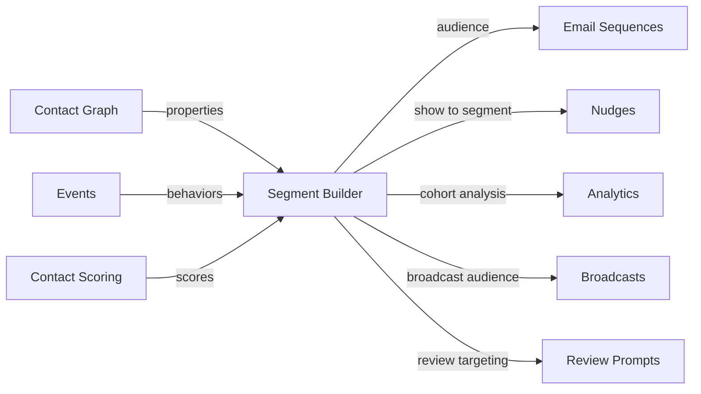

import { Card, CardGrid, LinkCard, Badge, Tabs, TabItem, Steps, Aside } from '@astrojs/starlight/components';

**Dynamic audience segments based on contact properties, events, and scores.**

---

## Scoring Card

| Dimension | Score | Rationale |
|-----------|:-----:|-----------|
| **Pain** | 4 / 5 | Growth teams export CSV from analytics, upload to email tools — stale within hours |
| **Revenue** | 3 / 5 | Platform primitive that makes every outreach module more effective |
| **Build** | 4 / 5 | Rule engine is well-understood; real-time eval is the main challenge |
| **Moat** | 3 / 5 | Value compounds as more modules feed data into segments |
| **Total** | **14 / 20** | |

---

## Classification

<Badge text="Platform" variant="note" />

<Aside type="note" title="Platform Primitive">
Segment Builder is a cross-cutting platform capability. It does not generate revenue directly but amplifies every module that targets users — emails, nudges, broadcasts, review prompts, and more.
</Aside>

---

## The Pain It Kills

Growth teams today live in a painful loop:

1. Export a CSV of users matching certain criteria from their analytics tool.
2. Upload that CSV to their email platform.
3. Send the campaign.
4. By the time the email goes out, the segment is already stale — new signups missed, churned users included.

There is no real-time segmentation layer that spans all modules. Every tool has its own siloed audience concept, and none of them talk to each other.

**Real scenarios:**
- A growth marketer wants to email "users who signed up in the last 7 days AND completed onboarding AND have an NPS score ≥ 8." This requires exporting from three different tools and manually intersecting the lists.
- A product team wants to show a nudge only to "free-plan users who referred at least one friend." Impossible without custom code.
- A lifecycle marketer wants to suppress broadcast emails for users already in an active drip sequence. No way to do this across disconnected tools.

---

## What It Does

Segment Builder provides a **visual rule builder** in the GrowthOS dashboard that lets teams create dynamic audience segments by combining:

- **Contact properties** — plan, signup_date, company_size, role
- **Events** — completed_onboarding, viewed_pricing_page, submitted_support_ticket
- **Scores** — nps_score ≥ 9, engagement_score ≥ 75
- **Module data** — referred_3_friends, opened_last_broadcast, dismissed_nudge_X

Rules support **AND/OR** logic with nested groups. Segments are **auto-updating** — membership recalculates in real-time as contacts change, events fire, and scores update.

Every outreach module in GrowthOS can target a segment: Email Sequences, Broadcasts, Nudges, Review Prompts, and more.

---

## Competition & What We Replace

| Tool | Price | Limitation |
|------|-------|------------|
| **Customer.io segments** | $100+/mo | Good segments, but locked inside Customer.io — can't power nudges, referrals, etc. |
| **HubSpot lists** | Free (limited) | Static or basic active lists. No event-based rules. Enterprise for advanced. |
| **Amplitude cohorts** | Analytics plan | Analytics-only — can't use cohorts to trigger emails or nudges natively |
| **Mailchimp segments** | Included | Email-only. No cross-module targeting. |
| **GrowthOS Segment Builder** | **Included** | **Cross-module, real-time, event + property + score rules** |

---

## Moat & Defensibility

The moat grows with **data density**. The more modules a tenant activates, the richer the data feeding into segments:

- P1 Contact Graph provides properties
- P1 Email Sequences provide engagement events
- P2 Surveys provide NPS scores
- P2 Nudges provide interaction data
- P2 Referrals provide referral counts

No single-purpose tool can match this breadth. Each new module makes segments more powerful, creating a compounding network effect within the tenant's data.

---

## Interoperability Advantage

Segment Builder sits at the center of the GrowthOS data model. It consumes data from every module and powers every outreach module.

---

## What Ships

<Steps>
1. **Visual rule builder** — drag-and-drop conditions with AND/OR logic and nested groups
2. **Real-time evaluation** — segment membership updates as contact data changes
3. **Segment size estimation** — live count preview while building rules
4. **Pre-built templates** — common segments (new signups, power users, at-risk, promoters)
5. **API access** — query segment membership programmatically via REST API
6. **Module integration** — all outreach modules accept a segment as targeting input
</Steps>

---

## What Does NOT Ship

- **Predictive segments** — ML-based "likely to churn" or "likely to upgrade" segments are planned for P4.
- **Lookalike audiences** — ML-based lookalike modeling is out of scope for rule-based segments.
- **External ad platform sync** — no syncing segments to Facebook/Google ad audiences in this phase.

---

## Build vs Buy

<Tabs>
  <TabItem label="Build (chosen)">
    - Rule engine is well-understood (JSON-based rule trees)
    - Must integrate deeply with Contact Graph and Event Bus — no off-the-shelf tool plugs in
    - Real-time evaluation is a scaling challenge but solvable with materialized views
    - Estimated: **2 weeks**
  </TabItem>
  <TabItem label="Buy">
    - No standalone segment builder exists that integrates across all GrowthOS modules
    - Customer.io / HubSpot segments are locked inside their ecosystems
    - Buying would mean adopting an entire platform, defeating the purpose of GrowthOS
  </TabItem>
</Tabs>

---

## Dependencies

| Dependency | Phase | Status | Notes |
|------------|-------|--------|-------|
| [Contact Graph](/growthos/phase-1/unified-contact-graph/) | P1 | Required | Provides contact properties for segment rules |
| [Event Bus](/growthos/platform/architecture/) | P1 | Required | Provides behavioral events for segment rules |
| [Contact Scoring](/growthos/phase-2/contact-scoring/) | P2 | Optional | Enables score-based segment rules |
