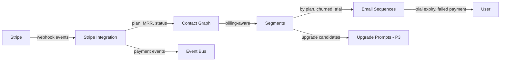

import { Card, CardGrid, LinkCard, Badge, Tabs, TabItem, Steps, Aside } from '@astrojs/starlight/components';

**Sync Stripe billing events into the contact graph — enable billing-aware growth campaigns.**

---

## Scoring Card

| Dimension | Score | Rationale |
|-----------|:-----:|-----------|
| **Pain** | 4 / 5 | Growth team can't see billing data alongside engagement data |
| **Revenue** | 4 / 5 | Enables billing-aware sequences (trial expiry, failed payment, upgrade) |
| **Build** | 3 / 5 | Stripe webhook ingestion + event mapping + contact enrichment |
| **Moat** | 3 / 5 | Billing + engagement data in one graph is unique to integrated platforms |
| **Total** | **14 / 20** | |

---

## Classification

<Badge text="Foundation" variant="note" />

<Aside type="note" title="Foundation — Infrastructure Dependency">
Stripe Integration is a foundation module. It does not have its own UI for end users — it enriches the Contact Graph and Event Bus with billing data that powers sequences, segments, and analytics.
</Aside>

---

## The Pain It Kills

The biggest blind spot in most growth stacks is billing data. Growth teams can see engagement but not revenue context:

1. **Billing data is siloed in Stripe** — the growth team can see who logged in today but not who is on a trial that expires tomorrow.
2. **No failed payment recovery** — when a payment fails, Stripe sends a generic dunning email. There's no way to trigger an in-app nudge, a personal email from the founder, or a segment-targeted win-back sequence.
3. **Manual webhook handling** — teams that want billing events in their growth tools build custom webhook handlers. Each event type (payment_succeeded, subscription_canceled, invoice.payment_failed) requires custom code.
4. **Can't answer critical questions** — "Which acquisition channel produces the highest-LTV customers?" requires joining Stripe data with analytics data manually.

**Real scenarios:**
- A SaaS product has a 14-day trial. They want to send a "Your trial expires in 3 days" email with a personalized discount for high-engagement trial users. Today: impossible without a custom cron job that queries both Stripe and the product database.
- A payment fails for a $200/mo customer. Stripe sends a generic email. Meanwhile, the growth team's engagement data shows this user has been very active. A personal outreach could save the account, but nobody knows the payment failed until the subscription is canceled.
- A growth team wants to celebrate plan upgrades with an in-app confetti animation and a "Welcome to Pro!" email. Today: they'd need to poll the Stripe API or build a custom webhook handler.

---

## What It Does

Stripe Integration syncs billing events and data into the GrowthOS Contact Graph and Event Bus:

**Events synced:**
- `payment_succeeded` — successful payment
- `subscription_created` — new subscription
- `subscription_updated` — plan change (upgrade/downgrade)
- `subscription_canceled` — cancellation
- `invoice.payment_failed` — failed payment
- `customer.subscription.trial_will_end` — trial expiring soon

**Contact enrichment:**
- `plan` — current Stripe plan/price ID
- `mrr` — monthly recurring revenue for this contact
- `billing_status` — active, trialing, past_due, canceled
- `trial_end_date` — when the trial expires
- `subscription_start_date` — when the subscription started
- `payment_method` — whether a payment method is on file

All Stripe events flow into the Event Bus, triggering segments, sequences, and analytics just like any other GrowthOS event.

---

## Competition & What We Replace

| Tool | Price | Limitation |
|------|-------|------------|
| **Stripe webhooks (raw)** | Free | Requires custom code for every event type. No contact enrichment. |
| **ChartMogul** | $100+/mo | Revenue analytics only. No lifecycle integration. |
| **Baremetrics** | $108+/mo | Revenue analytics only. No email/nudge triggers. |
| **ProfitWell** | Free (limited) | Analytics + dunning. No product engagement data. |
| **GrowthOS Stripe Integration** | **Included** | **Billing events + contact enrichment + lifecycle triggers** |

---

## Moat & Defensibility

The moat is **billing + engagement in one data model**:

- ChartMogul shows MRR trends. GrowthOS shows "users on the Pro plan who haven't logged in for 7 days" — the kind of insight that prevents churn.
- Stripe webhooks give you raw events. GrowthOS gives you billing-aware segments: "trial users with high engagement score," "paying users with failed payment," "users who downgraded in the last 30 days."
- The combination of billing status + engagement score + NPS data enables segments and sequences that no standalone tool can match.

---

## Interoperability Advantage

Stripe Integration feeds billing data into the Contact Graph and Event Bus, enabling billing-aware segments and sequences across all modules.

---

## What Ships

<Steps>
1. **Stripe webhook ingestion** — one-click Stripe Connect setup with automatic webhook endpoint registration
2. **Event mapping** — Stripe events automatically mapped to GrowthOS events
3. **Contact enrichment** — plan, MRR, billing status, trial dates stored on contact records
4. **Billing-aware segments** — pre-built segment templates: trial expiring, failed payment, churned, by plan tier
5. **Pre-built sequence triggers** — template sequences for trial expiry, failed payment recovery, upgrade celebration, cancellation win-back
6. **Dashboard billing overview** — per-contact billing status visible in the contact detail page
</Steps>

---

## What Does NOT Ship

- **Stripe billing management** — GrowthOS does not create, modify, or cancel Stripe subscriptions. It is read-only.
- **Invoice generation** — no invoice creation or management.
- **Payment processing** — no checkout flows or payment forms.
- **Revenue analytics dashboard** — MRR charts, cohort revenue analysis, and financial reporting are not in scope. Use ChartMogul or Baremetrics for that.
- **Non-Stripe payment providers** — Paddle, Braintree, and other providers are not supported in P2.

---

## Build vs Buy

<Tabs>
  <TabItem label="Build (chosen)">
    - Stripe webhook API is well-documented and stable
    - Event mapping to GrowthOS schema is straightforward
    - Contact enrichment leverages existing Contact Graph infrastructure
    - Pre-built segments and sequences are configuration, not code
    - Estimated: **2 weeks**
  </TabItem>
  <TabItem label="Buy">
    - ChartMogul/Baremetrics provide analytics but not lifecycle integration
    - No off-the-shelf tool maps Stripe events into a growth platform's event bus
    - Building is faster and provides deeper integration
  </TabItem>
</Tabs>

---

## Dependencies

| Dependency | Phase | Status | Notes |
|------------|-------|--------|-------|
| [Contact Graph](/growthos/phase-1/unified-contact-graph/) | P1 | Required | Store billing properties on contact records |
| [Event Bus](/growthos/platform/architecture/) | P1 | Required | Route Stripe events to all modules |
| [Segment Builder](/growthos/phase-2/segment-builder/) | P2 | Optional | Billing-aware segments |
| [Email Sequences](/growthos/phase-1/lifecycle-emails/) | P1 | Optional | Billing-triggered sequences |
| Stripe account | External | Required | Tenant must have a Stripe account |
