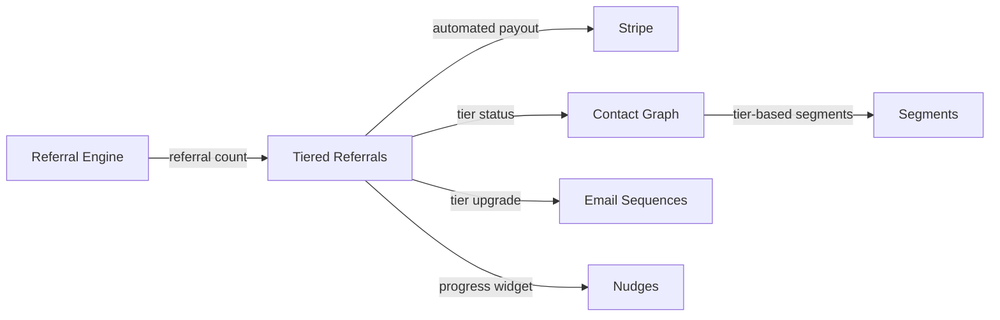

import { Card, CardGrid, LinkCard, Badge, Tabs, TabItem, Steps, Aside } from '@astrojs/starlight/components';

**Graduated reward tiers — the more friends you refer, the better the rewards.**

---

## Scoring Card

| Dimension | Score | Rationale |
|-----------|:-----:|-----------|
| **Pain** | 4 / 5 | Basic referral programs plateau. Top referrers need escalating incentives. |
| **Revenue** | 5 / 5 | Referrals have the lowest CAC and highest LTV — tiered rewards amplify this |
| **Build** | 4 / 5 | State machine + Stripe integration + leaderboard + notifications |
| **Moat** | 3 / 5 | Building on P1 referral engine creates compounding value |
| **Total** | **16 / 20** | |

---

## Classification

<Badge text="Painkiller" variant="tip" />

<Aside type="tip" title="Advocate — Highest-Scoring Feature in P2">
At 16/20, Tiered Referral Rewards is the highest-scoring feature in Phase 2. Referrals are the lowest-CAC acquisition channel, and tiered rewards unlock exponential growth from power referrers.
</Aside>

---

## The Pain It Kills

Basic referral programs (P1) work, but they plateau:

1. **Flat rewards cap motivation** — "Get $10 for every referral" works for the first few, but power referrers (who drive 80% of referral volume) need escalating incentives.
2. **Building tiers is complex** — implementing a state machine that tracks referral count, determines tier, applies the correct reward, and handles edge cases (refunds, chargebacks) is 4-6 weeks of custom engineering.
3. **Stripe integration is tricky** — automatically applying variable discounts or credits based on tier requires careful Stripe Coupon/Credit API integration.
4. **No visibility for referrers** — users don't know how close they are to the next tier. No progress tracking, no leaderboard, no motivation to push for one more referral.

**Real scenarios:**
- A SaaS product's top referrer has sent 25 friends. They get the same $10 credit as someone who referred one person. The top referrer feels undervalued and stops sharing.
- A growth team wants to offer: 1 referral = 10% off, 3 referrals = free month, 10 referrals = lifetime discount. Building this requires a state machine, Stripe integration, notification system, and progress UI. It takes 6 weeks and is fragile.
- A company's referral program has strong initial adoption but participation drops after 2 months. There's no escalating incentive to keep referrers engaged.

---

## What It Does

Tiered Referral Rewards adds graduated reward structures on top of the P1 Referral Engine:

- **Configurable tiers** — define any number of tiers with custom thresholds and rewards:
  - 1 referral → 10% off next month
  - 3 referrals → 1 free month
  - 10 referrals → 50% off for life
  - 25 referrals → lifetime free
- **Automated Stripe payout** — when a referrer reaches a tier threshold, the reward is automatically applied via the Stripe API (coupon, credit, or subscription modification).
- **Referral leaderboard** — public or private leaderboard showing top referrers. Gamification without complexity.
- **Progress tracking widget** — embeddable widget showing "You've referred 7 friends. 3 more to unlock: 50% off for life!"
- **Tier upgrade notifications** — automated email when a referrer reaches a new tier.

---

## Competition & What We Replace

| Tool | Price | Limitation |
|------|-------|------------|
| **Cello** | Startup-friendly | Basic tiers. Limited Stripe integration. |
| **ReferralHero** | $49+/mo | Manual tier management. No automated payout. |
| **Custom-built** | 4-6 weeks eng | Complex state machine. High maintenance. |
| **GrowthOS Tiered Referrals** | **Included** | **Automated tiers + Stripe payout + progress widget + leaderboard** |

---

## Moat & Defensibility

The moat is **compounding referral data**:

- The P1 Referral Engine tracks every referral. Tiered Referrals builds on that data with tier state, reward history, and payout records.
- Switching away from GrowthOS means losing the referral graph AND the tier state for every user. Users who are 2 referrals away from a lifetime discount will not tolerate a reset.
- The progress widget creates ongoing engagement with the referral program — users come back to check their progress, creating a retention loop.

---

## Interoperability Advantage

Tiered Referrals builds on the P1 Referral Engine and connects to Stripe, Email, Nudges, and Segments for a complete referral growth loop.

---

## What Ships

<Steps>
1. **Configurable tiers** — define thresholds and rewards in the dashboard (no code)
2. **Automated Stripe payout** — coupons, credits, or subscription modifications applied automatically
3. **Referral leaderboard** — public or private rankings of top referrers
4. **Progress tracking widget** — embeddable component showing tier progress
5. **Tier upgrade notifications** — automated emails on tier advancement
6. **Dashboard analytics** — tier distribution, reward costs, referral velocity by tier
</Steps>

---

## What Does NOT Ship

- **Non-monetary rewards** — no swag fulfillment, physical prizes, or gift cards.
- **Partner co-branded programs** — no white-label referral programs for partners.
- **Affiliate commissions** — no percentage-of-revenue payouts. Tiered rewards are fixed discounts/credits.
- **Multi-program support** — one referral program per tenant in P2.

---

## Build vs Buy

<Tabs>
  <TabItem label="Build (chosen)">
    - Builds directly on the P1 Referral Engine (referral tracking already exists)
    - State machine for tier progression is well-defined
    - Stripe Coupon/Credit API is well-documented
    - Progress widget is a lightweight Web Component
    - Estimated: **2.5 weeks**
  </TabItem>
  <TabItem label="Buy">
    - Cello/ReferralHero provide basic tiers but no automated Stripe payout
    - No off-the-shelf tool integrates with the existing P1 referral graph
    - Migrating referral data to an external tool would break the referral chain
  </TabItem>
</Tabs>

---

## Dependencies

| Dependency | Phase | Status | Notes |
|------------|-------|--------|-------|
| [Referral Engine](/growthos/phase-1/referral-engine/) | P1 | Required | Provides referral tracking and count data |
| [Stripe Integration](/growthos/phase-2/stripe-integration/) | P2 | Required | Automated reward payout via Stripe API |
| [Contact Graph](/growthos/phase-1/unified-contact-graph/) | P1 | Required | Store tier status per contact |
| [Email Sequences](/growthos/phase-1/lifecycle-emails/) | P1 | Optional | Tier upgrade notification emails |
| Usage data | Runtime | Required | Track qualifying referrals (signup, activation, payment) |
