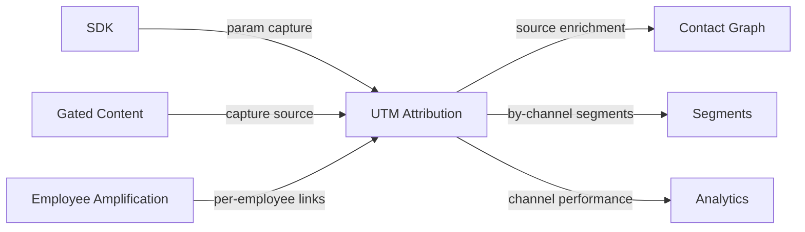

import { Card, CardGrid, LinkCard, Badge, Tabs, TabItem, Steps, Aside } from '@astrojs/starlight/components';

**Capture UTM parameters on every touchpoint and see which channels drive real conversions.**

---

## Scoring Card

| Dimension | Score | Rationale |
|-----------|:-----:|-----------|
| **Pain** | 4 / 5 | UTM data captured in analytics but never connected to individual contacts |
| **Revenue** | 3 / 5 | Enables channel ROI analysis — informs budget allocation |
| **Build** | 4 / 5 | SDK param capture + contact enrichment + dashboard |
| **Moat** | 3 / 5 | Per-contact attribution is unique when combined with lifecycle data |
| **Total** | **14 / 20** | |

---

## Classification

<Badge text="Platform" variant="note" />

<Aside type="note" title="Platform Primitive">
UTM Attribution is infrastructure. It enriches every contact with source data, enabling channel-aware segments, sequences, and analytics across all modules.
</Aside>

---

## The Pain It Kills

Every marketing team uses UTM parameters. Almost none can answer the question that matters:

**"Which channel drives our best users?"**

The problem:

1. **Google Analytics captures UTMs** — but only at the aggregate level. You know 500 people came from a LinkedIn ad, but not which of those 500 became paying customers.
2. **Analytics tools are session-based** — they track pageviews, not people. When a user returns without UTM params, the attribution chain breaks.
3. **No connection to product data** — you can see channel → signup, but not channel → signup → activation → revenue. The most important part of the funnel is invisible.
4. **Enterprise solutions are expensive** — HubSpot attribution requires Marketing Hub Enterprise ($3,600/mo). Mixpanel attribution is limited to analytics.

**Real scenarios:**
- A SaaS startup spends $5K/mo on LinkedIn ads and $2K/mo on content marketing. Google Analytics shows LinkedIn drives more signups. But content marketing leads have 3x better activation rates and 2x higher LTV. Without per-contact attribution, they'd over-invest in LinkedIn.
- A dev tools company gets traffic from Hacker News, Reddit, and Twitter. They can't tell which source produces users who actually invite teammates (the key activation metric).

---

## What It Does

UTM Attribution automatically captures UTM parameters on every entry point and stores them on the individual contact record:

- **Auto-capture** — the SDK reads `utm_source`, `utm_medium`, `utm_campaign`, `utm_term`, `utm_content` from the URL on every page load.
- **Contact enrichment** — first-touch and last-touch UTM data are stored on the contact record in the Contact Graph.
- **Attribution dashboard** — a dedicated view showing: channel → signup → activation → revenue funnel per UTM source.
- **Per-contact history** — every touchpoint with UTM data is recorded, enabling full journey analysis.

---

## Competition & What We Replace

| Tool | Price | Limitation |
|------|-------|------------|
| **Google Analytics** | Free | Aggregate-only. No per-contact data. Session-based. |
| **Mixpanel attribution** | Analytics plan | Analytics-only. Can't trigger emails or nudges based on source. |
| **HubSpot attribution** | Enterprise ($3,600/mo) | Powerful but enterprise pricing. |
| **Segment** | $120+/mo | Data routing, not attribution. |
| **GrowthOS UTM Attribution** | **Included** | **Per-contact, full-funnel, connected to lifecycle** |

---

## Moat & Defensibility

The moat is **per-contact, full-funnel attribution** that connects source to revenue:

- Google Analytics shows aggregate channel performance.
- GrowthOS shows "users from ProductHunt have 40% higher activation but 20% lower expansion revenue than users from Google Ads."

This is only possible because UTM data lives on the same contact record as engagement data, activation events, billing status, and NPS scores. No standalone attribution tool has access to all of this.

---

## Interoperability Advantage

UTM Attribution enriches the Contact Graph with source data that flows into every downstream module.

---

## What Ships

<Steps>
1. **Auto UTM capture** — SDK reads UTM params from URL on every page load, no configuration needed
2. **First-touch + last-touch attribution** — both models stored per contact
3. **Channel performance dashboard** — funnel view: channel → signup → activation → revenue
4. **Per-contact attribution history** — full touchpoint timeline on the contact detail page
5. **Segment integration** — create segments based on UTM source, medium, or campaign
6. **API access** — query attribution data programmatically
</Steps>

---

## What Does NOT Ship

- **Multi-touch attribution modeling** — no weighted models (linear, time-decay, position-based). First-touch and last-touch only in P2.
- **Ad spend integration** — no pulling cost data from Google Ads, Facebook Ads, etc. ROI must be calculated manually.
- **Custom attribution models** — no user-defined attribution logic.

---

## Build vs Buy

<Tabs>
  <TabItem label="Build (chosen)">
    - SDK already intercepts page loads — adding UTM capture is minimal incremental work
    - Contact Graph enrichment is a natural extension
    - Dashboard is the main build effort
    - Estimated: **2 weeks**
  </TabItem>
  <TabItem label="Buy">
    - Segment provides data routing but not attribution dashboards
    - Attribution tools (Rockerbox, Attribution) are enterprise-priced and don't integrate with lifecycle data
    - No off-the-shelf solution connects UTM data to email sequences and nudges
  </TabItem>
</Tabs>

---

## Dependencies

| Dependency | Phase | Status | Notes |
|------------|-------|--------|-------|
| [SDK](/growthos/platform/developer-experience/) | P1 | Required | Captures UTM params from the browser URL |
| [Contact Graph](/growthos/phase-1/unified-contact-graph/) | P1 | Required | Stores attribution data on contact records |
| [Segment Builder](/growthos/phase-2/segment-builder/) | P2 | Optional | Enables channel-based segments |
