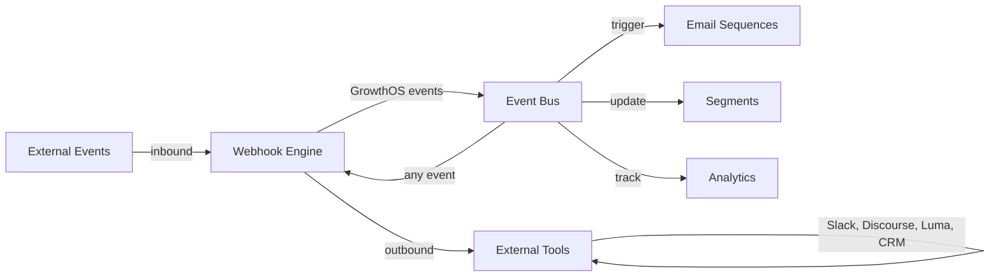

import { Card, CardGrid, LinkCard, Badge, Tabs, TabItem, Steps, Aside } from '@astrojs/starlight/components';

**Send and receive webhooks — connect GrowthOS to any external tool.**

---

## Scoring Card

| Dimension | Score | Rationale |
|-----------|:-----:|-----------|
| **Pain** | 3 / 5 | Every integration is custom code; no standard extension mechanism |
| **Revenue** | 3 / 5 | Unlocks integrations that close deals — "does it work with X?" |
| **Build** | 4 / 5 | Inbound endpoints + outbound delivery + retry logic |
| **Moat** | 3 / 5 | Extensibility reduces churn — harder to rip out when integrated |
| **Total** | **13 / 20** | |

---

## Classification

<Badge text="Platform" variant="note" />

<Aside type="note" title="Platform Primitive">
The Webhook Engine is infrastructure that makes GrowthOS extensible. It enables integrations with any external tool without requiring GrowthOS to build native connectors for each one.
</Aside>

---

## The Pain It Kills

Every SaaS growth stack includes tools that need to talk to each other. Without webhooks, every integration is a custom engineering project:

1. **Custom code for every integration** — want to post a Slack message when a referral converts? Write a Lambda function. Want to create a Discourse topic when a user reaches a milestone? More custom code.
2. **No standard extension point** — GrowthOS events fire internally, but there is no way for external systems to listen or respond.
3. **Inbound events are impossible** — when a support ticket is resolved in Zendesk, there's no way to trigger a GrowthOS event without custom code.
4. **Teams spend weeks on plumbing** — engineering time goes to integration code instead of product features.

**Real scenarios:**
- A SaaS company wants to send a Slack notification when a high-value lead submits a gated content form. Today: no way to do this without a custom webhook handler.
- A community-driven product wants to create a GrowthOS event when a user posts in Discourse. Today: requires a custom Discourse plugin + webhook endpoint + event mapping.
- A team uses Luma for events and wants to trigger an email sequence when someone RSVPs. Today: manual CSV export from Luma, upload to GrowthOS.

---

## What It Does

The Webhook Engine provides bidirectional webhook support:

**Inbound webhooks:**
- GrowthOS provides unique webhook endpoint URLs per tenant.
- External tools (Stripe, Zendesk, Discourse, Luma, etc.) send events to these endpoints.
- Incoming payloads are transformed into GrowthOS events via configurable mapping rules.
- Events flow into the Event Bus and trigger all downstream modules (sequences, segments, analytics).

**Outbound webhooks:**
- Any GrowthOS event can trigger an outbound webhook to an external URL.
- Configurable in the dashboard: select event → set destination URL → configure payload.
- Retry logic with exponential backoff for failed deliveries.
- Delivery logs for debugging.

---

## Competition & What We Replace

| Tool | Price | Limitation |
|------|-------|------------|
| **Zapier** | $19-69/mo | Per-zap pricing. Slow (polling). Limited transformation. |
| **n8n** | Free (self-hosted) | Powerful but requires self-hosting and maintenance. |
| **Custom code** | Engineering time | One-off, fragile, no monitoring or retry logic. |
| **GrowthOS Webhook Engine** | **Included** | **Native event bus integration, dashboard config, retry logic** |

---

## Moat & Defensibility

The moat is **integration stickiness**:

- Every webhook a tenant configures is an integration that would break if they left GrowthOS.
- The more external tools connected via webhooks, the harder it is to rip out GrowthOS.
- Inbound webhooks create data flows that feed segments, sequences, and analytics — removing GrowthOS means rebuilding all of those flows.

---

## Interoperability Advantage

The Webhook Engine is the bridge between GrowthOS and the outside world. Every internal event can go out; every external event can come in.

---

## What Ships

<Steps>
1. **Inbound webhook endpoints** — unique URLs per tenant with configurable event mapping
2. **Outbound webhook configuration** — dashboard UI to select events and set destination URLs
3. **Retry logic** — exponential backoff with configurable retry count (default: 5 attempts)
4. **Delivery logs** — full log of inbound and outbound webhook deliveries with status codes
5. **Payload transformation** — JSONPath-based mapping from external payloads to GrowthOS event schema
6. **Secret verification** — HMAC signature verification for inbound webhooks
</Steps>

---

## What Does NOT Ship

- **Visual workflow builder** — for complex multi-step workflows, use n8n or Zapier connected via webhooks.
- **Pre-built integrations marketplace** — no one-click "connect to Slack" buttons. Webhooks are the primitive; marketplace is a future phase.
- **iPaaS functionality** — GrowthOS is not an integration platform. Webhooks are the extension point, not a replacement for Zapier/n8n.

---

## Build vs Buy

<Tabs>
  <TabItem label="Build (chosen)">
    - Webhook infrastructure is well-understood (HTTP endpoints + queue + retry)
    - Must integrate natively with the Event Bus — no off-the-shelf tool does this
    - Dashboard configuration is the main UI effort
    - Estimated: **2 weeks**
  </TabItem>
  <TabItem label="Buy">
    - Zapier/n8n can handle some outbound use cases but add per-tenant cost
    - Neither provides inbound webhook → Event Bus integration
    - Building the native integration is cheaper than maintaining a Zapier bridge
  </TabItem>
</Tabs>

---

## Dependencies

| Dependency | Phase | Status | Notes |
|------------|-------|--------|-------|
| [Event Bus](/growthos/platform/architecture/) | P1 | Required | All inbound webhooks become events; all events can trigger outbound webhooks |
| [Contact Graph](/growthos/phase-1/unified-contact-graph/) | P1 | Optional | Inbound events can enrich contact records |
