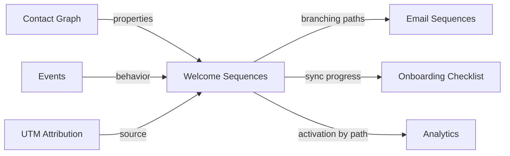

import { Card, CardGrid, LinkCard, Badge, Tabs, TabItem, Steps, Aside } from '@astrojs/starlight/components';

**Welcome email sequences that branch based on user attributes and behavior.**

---

## Scoring Card

| Dimension | Score | Rationale |
|-----------|:-----:|-----------|
| **Pain** | 3 / 5 | Generic welcome emails for everyone. Different personas get the same flow. |
| **Revenue** | 3 / 5 | Persona-matched onboarding improves activation → conversion |
| **Build** | 4 / 5 | Branching logic on top of P1 email sequences |
| **Moat** | 3 / 5 | Data-driven branching is unique when powered by full Contact Graph |
| **Total** | **13 / 20** | |

---

## Classification

<Badge text="Vitamin" variant="caution" />

<Aside type="caution" title="Activate — Persona-Driven Onboarding">
Personalised Welcome Sequences move onboarding from one-size-fits-all to persona-matched. A developer signing up for a dev tools product should get a different email flow than a product manager.
</Aside>

---

## The Pain It Kills

Most SaaS products send the same welcome email sequence to every user, regardless of who they are or what they're trying to do:

1. **One sequence for all personas** — a dev tools product serves developers, product managers, and engineering leaders. Each has different activation criteria, but all receive the same "Welcome! Here's how to create your first project" email.
2. **No behavior-reactive branching** — if a user completes step 1 immediately, they still get the "Don't forget step 1!" nudge email 24 hours later.
3. **Customer.io branching costs $100+/mo** — and even then, branching logic is disconnected from product data like plan type, referral source, or onboarding checklist progress.
4. **Custom-built branching is a nightmare** — engineering builds if/else logic into a cron job. It breaks, sends wrong emails, and nobody wants to touch the code.

**Real scenarios:**
- A project management SaaS has three personas: solo founders, small team leads, and enterprise admins. Solo founders need "create your first project" guidance. Team leads need "invite your team" guidance. Enterprise admins need "configure SSO" guidance. All three get the same generic welcome flow.
- A user signs up via a Product Hunt launch (high intent, already knows the product) vs. a Google ad (low context, needs education). Both get the same 7-email sequence, and the Product Hunt user unsubscribes by email 3.
- A user completes onboarding in their first session. They still receive 4 more "complete your onboarding" emails over the next week.

---

## What It Does

Personalised Welcome Sequences add branching logic to P1 Email Sequences, enabling different paths for different users:

- **Property-based branching** — if role = developer → Path A (API docs, CLI setup); if role = marketer → Path B (dashboard tour, integration guide).
- **Behavior-reactive branching** — if user completed onboarding step 3 → skip emails about step 3; if user hasn't logged in for 48h → send re-engagement email.
- **Source-based branching** — if utm_source = producthunt → fast-track sequence (skip education); if utm_source = google_ads → full education sequence.
- **Persona templates** — pre-built branching templates for common SaaS personas (technical vs. non-technical, individual vs. team, free vs. paid).
- **Path analytics** — see activation rates per branch to understand which personas convert best.

---

## Competition & What We Replace

| Tool | Price | Limitation |
|------|-------|------------|
| **Customer.io branching** | $100+/mo | Good branching, but disconnected from product data |
| **Intercom series** | $74+/mo | Basic branching. Part of a larger suite. |
| **Custom-built** | Engineering time | Fragile, hard to maintain, no analytics |
| **GrowthOS Welcome Sequences** | **Included** | **Full Contact Graph data for branching + behavior-reactive + path analytics** |

---

## Moat & Defensibility

The moat is **data richness for branching decisions**:

- Customer.io branching can only use data you send to Customer.io. GrowthOS branching uses the full Contact Graph: plan, UTM source, onboarding progress, NPS score, referral count, nudge interactions, and more.
- Every new module adds more data points for branching decisions. A P4 predictive model could auto-assign personas, making branching fully automated.
- Path analytics create a feedback loop: see which branches have the best activation rates, then optimize.

---

## Interoperability Advantage

Welcome Sequences consume data from the Contact Graph, Events, and UTM Attribution to make intelligent branching decisions, then feed activation data into Analytics.

---

## What Ships

<Steps>
1. **Branching conditions** — if/else rules based on contact properties, events, and scores
2. **Persona-based templates** — pre-built branching for common patterns (role, plan, source)
3. **Behavior-reactive branching** — skip or redirect based on real-time user actions
4. **Path analytics** — activation rate, open rate, and conversion rate per branch
5. **Visual branch preview** — see the branching tree in the dashboard before activating
6. **Graceful fallback** — default path for contacts that don't match any branch condition
</Steps>

---

## What Does NOT Ship

- **Visual canvas builder** — drag-and-drop visual sequence builder is planned for P3. Branching is configured via rules UI in P2.
- **AI-generated branches** — no automatic persona detection or branch generation. Manual configuration only.
- **Unlimited nesting depth** — branching supports up to 3 levels of nesting to keep sequences manageable.
- **Multi-language sequences** — no automatic translation or language-based branching.

---

## Build vs Buy

<Tabs>
  <TabItem label="Build (chosen)">
    - Builds on P1 Email Sequences infrastructure
    - Branching logic is a rules engine extension (similar to Segment Builder)
    - Path analytics leverages existing Analytics module
    - Estimated: **2 weeks**
  </TabItem>
  <TabItem label="Buy">
    - Customer.io provides branching but at $100+/mo and disconnected from product data
    - Would need to sync full Contact Graph data to Customer.io — expensive and lossy
    - Building natively preserves the data advantage
  </TabItem>
</Tabs>

---

## Dependencies

| Dependency | Phase | Status | Notes |
|------------|-------|--------|-------|
| [Email Sequences](/growthos/phase-1/lifecycle-emails/) | P1 | Required | Base email sending infrastructure |
| [Contact Graph](/growthos/phase-1/unified-contact-graph/) | P1 | Required | Properties for branching conditions |
| [Event Bus](/growthos/platform/architecture/) | P1 | Required | Behavior-reactive branching triggers |
| [UTM Attribution](/growthos/phase-2/utm-attribution/) | P2 | Optional | Source-based branching |
| [Onboarding Checklist](/growthos/phase-2/onboarding-checklist/) | P2 | Optional | Sync onboarding progress with email path |
