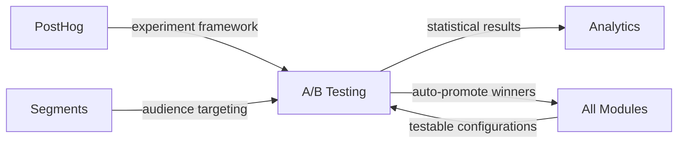

import { Card, CardGrid, LinkCard, Badge, Tabs, TabItem, Steps, Aside } from '@astrojs/starlight/components';

**Test email subjects, nudge copy, referral rewards, and more — with statistical significance.**

---

## Scoring Card

| Dimension | Score | Rationale |
|-----------|-------|-----------|
| Pain | 3/5 | Teams want to experiment but standalone A/B tools are analytics-only or code-focused |
| Revenue | 3/5 | Enables data-driven optimization that justifies premium pricing |
| Build | 3/5 | Leverage PostHog experiment framework, add cross-module integration |
| Moat | 3/5 | Cross-module experimentation is unique — test growth workflows, not just UI elements |
| **Total** | **12/20** | |

---

## Classification

<Badge text="Vitamin" variant="caution" />

<Aside type="caution" title="Vitamin">
A/B testing is a sophistication feature that appeals to data-driven teams. The cross-module capability — testing combinations of email subjects, nudge copy, and referral rewards together — is unique to an integrated platform like GrowthOS.
</Aside>

---

## The Pain It Kills

> *"We use PostHog for feature flags and Optimizely for landing page tests. Neither lets us A/B test our referral reward amount or email send time."*

- Standalone A/B testing tools (Optimizely, VWO) focus on **UI experiments** — button colors, headline copy.
- PostHog experiments are analytics-focused — no native way to test growth module configurations.
- Testing a **cross-module hypothesis** (e.g., "higher referral reward + different welcome sequence = better activation") requires manual coordination across tools.
- LaunchDarkly charges **$10+/seat/mo** and is developer-focused, not growth-team-friendly.

---

## What It Does

- **Experiment creation** — define variants for any module configuration (email subject, nudge copy, referral reward amount, survey question).
- **Variant allocation** — automatically assign contacts to experiment groups using PostHog's proven randomization.
- **Statistical significance calculator** — real-time p-value and confidence interval calculation.
- **Cross-module experiments** — test combinations: "Variant A: $10 referral reward + short welcome sequence" vs "Variant B: $20 reward + long sequence."
- **Auto-promote winners** — when significance threshold is reached, automatically deploy the winning variant.

---

## Competition & What We Replace

| Tool | Pricing | Limitation |
|------|---------|------------|
| PostHog Experiments | Free-$450+/mo | Analytics-only, no native growth module testing |
| Optimizely | $50K+/yr | UI experiments only, no growth workflow testing |
| LaunchDarkly | $10+/seat/mo | Developer-focused feature flags, not growth experiments |
| VWO | $199+/mo | Website testing only, disconnected from growth stack |

GrowthOS A/B testing operates at the **growth workflow level** — not the UI level. Test configurations, sequences, rewards, and multi-step flows.

---

## Moat & Defensibility

**Cross-module experimentation (3/5).**

- Every GrowthOS module exposes **testable configurations** — the A/B framework can test any of them.
- Combined with [Segments](/growthos/phase-2/segment-builder/), experiments can target specific audiences.
- Results flow into [Cohort Analytics](/growthos/phase-3/cohort-analytics/) for deeper analysis.
- Auto-promote ensures winning variants are deployed without manual intervention.

This level of cross-module experimentation is impossible without an integrated platform.

---

## Interoperability Advantage

---

## What Ships

- **Experiment creation UI** — select module, define variants, set audience
- **Variant allocation** — powered by PostHog randomization
- **Statistical significance calculator** — real-time p-value, confidence intervals, sample size recommendations
- **Cross-module experiments** — test combinations of module configurations
- **Auto-promote winners** — deploy winning variant when significance threshold is met
- **Experiment history** — full audit trail of experiments, results, and promoted variants

---

## What Does NOT Ship

- Visual editor for testing UI elements (test configurations, not code)
- Multi-armed bandit allocation (standard A/B split only)
- Custom statistical models (uses standard frequentist approach)
- Real-time experiment monitoring dashboards (results update on intervals)

---

## Build vs Buy

**BUILD on PostHog.**

Leverage PostHog's proven experiment framework for randomization, allocation, and event tracking. GrowthOS adds the cross-module configuration layer and auto-promote logic.

**Estimated effort:** 4-5 weeks.

---

## Dependencies

| Dependency | Why |
|-----------|-----|
| PostHog | Underlying experiment framework for randomization and event tracking. |
| [Segments (P2-06)](/growthos/phase-2/segment-builder/) | Audience targeting for experiments. |
