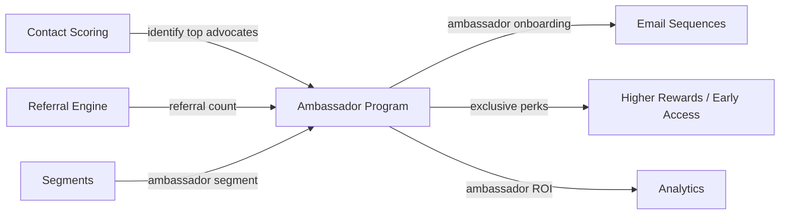

import { Card, CardGrid, LinkCard, Badge, Tabs, TabItem, Steps, Aside } from '@astrojs/starlight/components';

**Identify top advocates and manage them as formal ambassadors with exclusive perks.**

---

## Scoring Card

| Dimension | Score | Rationale |
|-----------|-------|-----------|
| Pain | 3/5 | Identifying and managing ambassadors is manual and ad-hoc for most teams |
| Revenue | 4/5 | Ambassadors drive 3-5x more referrals and reduce CAC significantly |
| Build | 3/5 | Moderate — identification logic, invitation workflow, perk management, dashboard |
| Moat | 2/5 | Unique combination of scoring + referral data for automatic ambassador identification |
| **Total** | **12/20** | |

---

## Classification

<Badge text="Vitamin" variant="caution" />

<Aside type="caution" title="Vitamin">
Ambassador programs formalize what already happens organically — top users advocating for your product. GrowthOS automates identification, invitation, and perk management, turning ad-hoc advocacy into a structured growth channel.
</Aside>

---

## The Pain It Kills

> *"We know we have power users who refer others, but we have no system to identify them, reward them differently, or give them a formal ambassador role."*

- Most SaaS companies manage ambassador programs in **spreadsheets and Notion docs**.
- Identifying top advocates requires manually cross-referencing referral data, NPS scores, and usage patterns.
- Employee advocacy tools like GaggleAMP cost **$500-2K/mo** and focus on employees, not customers.
- Without a formal program, top advocates feel unrecognized and may reduce their advocacy over time.

---

## What It Does

- **Ambassador identification rules** — auto-identify top referrers and promoters using contact scores, referral counts, and NPS data.
- **Invitation workflow** — automated email invitation to join the ambassador program when users meet qualification criteria.
- **Ambassador dashboard** — dedicated view for ambassadors showing their performance, rewards earned, and exclusive content.
- **Exclusive perk management** — early access to features, higher referral rewards, branded assets (logos, social templates).
- **Performance tracking** — per-ambassador metrics: referrals generated, revenue attributed, content shared.

---

## Competition & What We Replace

| Tool | Pricing | Limitation |
|------|---------|------------|
| GaggleAMP | $500-2K/mo | Employee advocacy only, not customer ambassadors |
| Custom-built programs | Weeks of engineering | Manual, fragile, not connected to growth data |
| Influitive | Enterprise pricing | Over-engineered for SMB, expensive |

GrowthOS ambassador management is **automated and data-driven** — the platform identifies ambassadors using scoring and referral data, not manual selection.

---

## Moat & Defensibility

**Automated identification (2/5).**

- Ambassador identification uses [Contact Scoring](/growthos/phase-2/contact-scoring/) — engagement score, advocacy signals, and usage patterns.
- Referral performance data comes from the [Referral Engine](/growthos/phase-1/referral-engine/) — real attribution, not self-reported.
- Ambassador segments are powered by the [Segment Builder](/growthos/phase-2/segment-builder/) — dynamic qualification.
- Onboarding sequences use [Email Sequences](/growthos/phase-1/lifecycle-emails/) — automated ambassador welcome and education.

---

## Interoperability Advantage

---

## What Ships

- **Ambassador identification rules** — configurable scoring thresholds and qualification criteria
- **Invitation workflow** — automated email invitation with acceptance flow
- **Ambassador dashboard** — performance metrics, earned rewards, exclusive content
- **Exclusive perk management** — higher referral rewards, early access flags, branded asset library
- **Performance tracking** — per-ambassador referrals, revenue, and content sharing metrics
- **Ambassador segment** — auto-maintained segment for targeting and reporting

---

## What Does NOT Ship

- Affiliate commission tracking (percentage-based payouts)
- Partner portal (multi-company partnership management)
- Co-marketing tools (joint campaigns, shared content creation)
- Ambassador tiers (v1 is a single tier — tiering is a future enhancement)

---

## Build vs Buy

**BUILD.**

No open-source ambassador management tool exists with multi-tenant support and integrated scoring/referral data. The build leverages existing scoring, segments, and email infrastructure.

**Estimated effort:** 3-4 weeks.

---

## Dependencies

| Dependency | Why |
|-----------|-----|
| [Contact Scoring (P2-18)](/growthos/phase-2/contact-scoring/) | Identifies top advocates based on engagement and advocacy scores. |
| [Segments (P2-06)](/growthos/phase-2/segment-builder/) | Dynamic ambassador segment for qualification and targeting. |
| [Referral Engine (P1-02)](/growthos/phase-1/referral-engine/) | Referral performance data for ambassador identification and tracking. |
