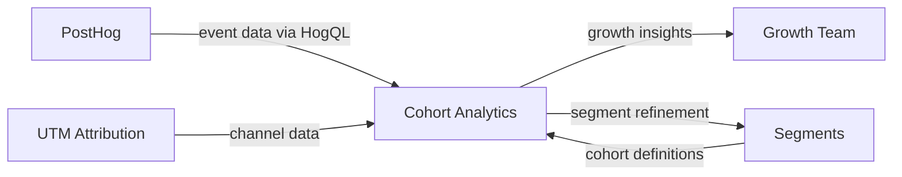

import { Card, CardGrid, LinkCard, Badge, Tabs, TabItem, Steps, Aside } from '@astrojs/starlight/components';

**Retention curves, activation funnels, and cohort comparison — built on PostHog data.**

---

## Scoring Card

| Dimension | Score | Rationale |
|-----------|-------|-----------|
| Pain | 3/5 | Data exists in PostHog but building actionable dashboards requires expertise |
| Revenue | 3/5 | Justifies higher-tier pricing for data-driven teams |
| Build | 3/5 | Pre-built dashboards on top of PostHog HogQL — moderate effort |
| Moat | 3/5 | Integration with GrowthOS segments and attribution creates unique views |
| **Total** | **12/20** | |

---

## Classification

<Badge text="Vitamin" variant="caution" />

<Aside type="caution" title="Vitamin">
Cohort analytics is valuable but not urgent for most teams. However, when combined with GrowthOS segments and attribution data, it provides insights impossible to get from standalone analytics tools.
</Aside>

---

## The Pain It Kills

> *"We have PostHog set up but nobody on the team knows how to build a retention matrix. We just look at daily active users and hope for the best."*

- PostHog and Mixpanel have raw analytics power, but building **actionable growth dashboards** requires a dedicated analyst.
- Amplitude charges **$49K+/yr** for advanced cohort analysis features.
- Most teams never build retention matrices, activation funnels, or channel performance views — they lack the expertise.
- Growth-specific views (activation by referral source, retention by onboarding completion) require joining data across multiple systems.

---

## What It Does

- **Retention matrix** — classic cohort retention table showing week-over-week or month-over-month retention by signup cohort.
- **Activation funnel** — pre-built funnel showing signup → key activation events → conversion, filterable by segment.
- **Cohort comparison** — compare retention and activation rates across any two segments or time periods.
- **Channel performance** — which acquisition channels (from UTM Attribution) produce the highest-retention users.
- **Exportable reports** — PNG, CSV, and scheduled email delivery of key dashboards.

All built on PostHog's HogQL query engine, using GrowthOS segment definitions for cohort slicing.

---

## Competition & What We Replace

| Tool | Pricing | Limitation |
|------|---------|------------|
| PostHog | Free-$450+/mo | Has raw capability but requires building dashboards from scratch |
| Amplitude | $49K+/yr (advanced) | Expensive, separate tool with no growth module integration |
| Mixpanel | $20-833/mo | Analytics-only, no connection to growth actions |

GrowthOS cohort analytics is **pre-built and pre-connected**. Segments, attribution, and contact data are already there — no data engineering required.

---

## Moat & Defensibility

**Pre-built + pre-connected (3/5).**

- Cohort definitions come from the [Segment Builder](/growthos/phase-2/segment-builder/) — no need to recreate audiences in an analytics tool.
- Channel data comes from [UTM Attribution](/growthos/phase-2/utm-attribution/) — first-touch and multi-touch models already computed.
- Growth-specific dashboards (referral cohort retention, onboarding completion correlation) are unique to GrowthOS.

---

## Interoperability Advantage

---

## What Ships

- **Retention matrix** — week/month cohorts, configurable retention events
- **Activation funnel** — multi-step with segment filtering
- **Cohort comparison** — side-by-side any two cohorts or time periods
- **Channel performance view** — retention and activation by acquisition source
- **Exportable reports** — PNG, CSV, scheduled email delivery

---

## What Does NOT Ship

- Custom SQL queries (use PostHog directly for ad-hoc analysis)
- Predictive analytics or ML-based forecasting (Phase 4 consideration)
- Real-time streaming dashboards (dashboards refresh on configurable intervals)
- Custom visualization types beyond pre-built templates

---

## Build vs Buy

**BUILD on PostHog.**

Leverage PostHog's HogQL engine for data queries. GrowthOS adds the pre-built dashboard layer, segment integration, and growth-specific views. No need to build an analytics engine from scratch.

**Estimated effort:** 4-5 weeks.

---

## Dependencies

| Dependency | Why |
|-----------|-----|
| [Segments (P2-06)](/growthos/phase-2/segment-builder/) | Cohort definitions for slicing retention and activation data. |
| [UTM Attribution (P2-09)](/growthos/phase-2/utm-attribution/) | Channel data for acquisition source performance views. |
| PostHog | Underlying event data and HogQL query engine. |
