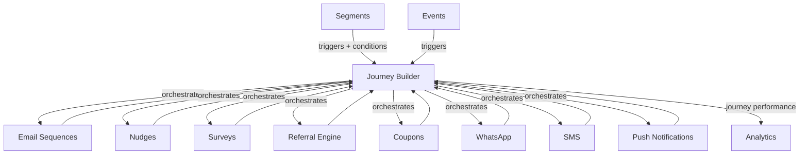

import { Card, CardGrid, LinkCard, Badge, Tabs, TabItem, Steps, Aside } from '@astrojs/starlight/components';

**Drag-and-drop visual canvas for multi-step, multi-channel growth journeys.**

---

## Scoring Card

| Dimension | Score | Rationale |
|-----------|-------|-----------|
| Pain | 4/5 | Complex growth flows require manual wiring of sequences, nudges, surveys, and channels |
| Revenue | 4/5 | Flagship feature that justifies $149-299/mo pricing and attracts enterprise buyers |
| Build | 2/5 | High complexity — visual editor, Temporal.io compilation, multi-channel orchestration |
| Moat | 3/5 | Orchestrates every GrowthOS module — impossible to replicate without the full platform |
| **Total** | **13/20** | |

---

## Classification

<Badge text="Painkiller" variant="tip" />

<Aside type="tip" title="Painkiller">
The Journey Builder is the **flagship feature moment** for Phase 3. It transforms GrowthOS from a collection of modules into a visual orchestration platform. This is the feature that makes enterprise buyers say "yes" and justifies premium pricing.
</Aside>

---

## The Pain It Kills

> *"We have email sequences, in-app nudges, and a referral program — but connecting them into a coherent user journey requires a full-time growth engineer and a whiteboard."*

> *"Customer.io's journey builder is great, but it only knows about emails. It can't trigger a nudge, create a coupon, or send a WhatsApp message."*

- Complex growth flows require connecting **sequences, nudges, surveys, and channels** manually.
- Customer.io and Braze have journey builders but cost **$100-60K/yr** and lack growth modules.
- Without visual orchestration, growth teams operate in silos — email team, product team, and support team each run their own flows with no coordination.
- Multi-channel journeys (email → wait → WhatsApp → nudge → survey) are impossible without a unified canvas.

---

## What It Does

- **Visual canvas editor** — drag-and-drop interface for building multi-step journeys.
- **Trigger nodes** — start journeys on events (signup, purchase), segment entry, or schedule.
- **Action nodes** — send email, show nudge, send WhatsApp, send SMS, send push notification, create coupon, add to segment.
- **Condition nodes** — if/else branching on contact properties, events, scores, or experiment variants.
- **Delay nodes** — wait for a duration or until a condition is met (e.g., "wait until user activates or 3 days pass").
- **Journey analytics** — per-node conversion rates, drop-off analysis, journey completion metrics.
- **Template library** — pre-built journeys for common flows (onboarding, re-engagement, upgrade, referral).

Under the hood, journeys compile to **Temporal.io workflows** for reliable, durable execution with retry logic and observability.

---

## Competition & What We Replace

| Tool | Pricing | Limitation |
|------|---------|------------|
| Customer.io Journeys | $100+/mo | Email and push only, no growth modules (nudges, coupons, referrals) |
| Braze Canvas | $60K+/yr | Enterprise-only, no native growth modules |
| Iterable Journeys | Enterprise pricing | Email/push focused, no in-app or growth module actions |
| ActiveCampaign | $49-149/mo | Email automation only, no multi-channel or product actions |

GrowthOS Journey Builder orchestrates **every module in the platform** — not just email. A single journey can combine email, WhatsApp, nudges, coupons, surveys, and referral invites.

---

## Moat & Defensibility

**Full-stack orchestration (3/5).**

- The Journey Builder is the **connective tissue** of GrowthOS — it orchestrates every other module.
- Each new module added to GrowthOS becomes a new node type in the Journey Builder, increasing platform value.
- Temporal.io provides enterprise-grade durability — journeys survive server restarts and can run for months.
- The combination of visual editing + growth module integration + multi-channel delivery is unique.

Competitors would need to build the entire GrowthOS module ecosystem to replicate this.

---

## Interoperability Advantage

---

## What Ships

- **Visual canvas editor** — drag-and-drop with zoom, pan, and snap-to-grid
- **Trigger nodes** — event-based, segment-entry, scheduled
- **Action nodes** — email, nudge, WhatsApp, SMS, push, coupon, segment update
- **Condition nodes** — if/else on properties, events, scores, experiment variants
- **Delay nodes** — fixed duration or conditional wait
- **Journey analytics** — per-node metrics, drop-off, completion rates
- **Template library** — 10+ pre-built journey templates
- **Temporal.io compilation** — durable, observable workflow execution

---

## What Does NOT Ship

- Code-based custom action nodes (actions limited to GrowthOS modules)
- Real-time streaming canvas (journeys execute asynchronously via Temporal.io)
- AI-suggested journey paths (Phase 4 consideration)
- Journey versioning with rollback (v1 ships with replace-only)

---

## Build vs Buy

**BUILD.**

No open-source journey builder exists that compiles to Temporal.io and integrates with a multi-tenant growth module ecosystem. The visual editor uses React Flow. The execution engine uses Temporal.io. Both are proven foundations.

**Estimated effort:** 6-8 weeks.

---

## Dependencies

| Dependency | Why |
|-----------|-----|
| All P1 modules | Journey actions include email, surveys, referral invites. |
| All P2 modules | Journey actions include nudges, coupons, segments, scoring. |
| Temporal.io | Durable workflow execution engine for journey orchestration. |
