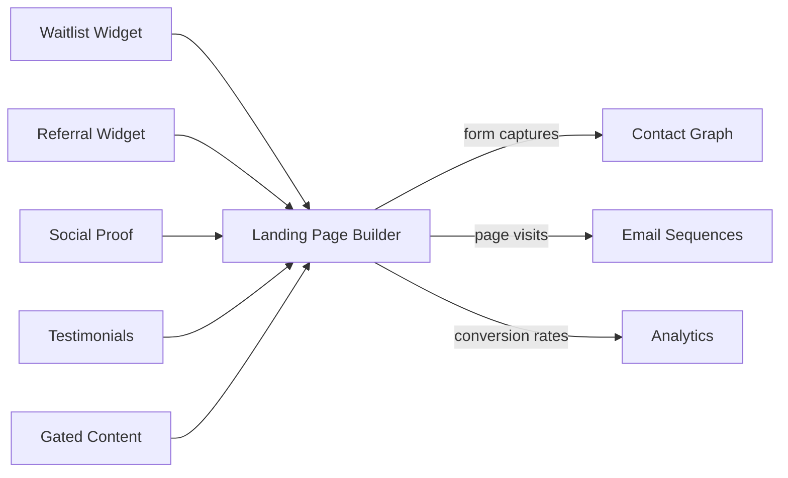

import { Card, CardGrid, LinkCard, Badge, Tabs, TabItem, Steps, Aside } from '@astrojs/starlight/components';

**Build conversion-optimized landing pages with embedded GrowthOS components.**

---

## Scoring Card

| Dimension | Score | Rationale |
|-----------|-------|-----------|
| Pain | 2/5 | Landing page builders exist but are disconnected from the growth stack |
| Revenue | 3/5 | Reduces tool sprawl and increases platform stickiness |
| Build | 2/5 | Drag-and-drop page builder is high effort — template-based approach reduces scope |
| Moat | 3/5 | Native GrowthOS component embedding is unique — no other builder has it |
| **Total** | **10/20** | |

---

## Classification

<Badge text="Vitamin" variant="caution" />

<Aside type="caution" title="Vitamin">
Landing pages are a conditional feature — only built if demand is validated by customer requests. The unique value proposition is **native GrowthOS component embedding** — waitlist forms, referral widgets, gated content, social proof, and testimonials all drop into landing pages with zero integration effort.
</Aside>

---

## The Pain It Kills

> *"We use Carrd for landing pages and then manually embed our waitlist form with custom JavaScript. Every new page requires an engineer."*

- Landing pages from Webflow, Carrd, and Unbounce are **disconnected from the growth stack**.
- Embedding a waitlist form, referral widget, or social proof notification requires custom JavaScript integration per page.
- Form submissions go into the landing page tool's database — not the growth platform's Contact Graph.
- A/B testing landing pages requires yet another tool (Optimizely, VWO).

---

## What It Does

- **Template library** — pre-designed, conversion-optimized landing page templates for common use cases (product launch, waitlist, referral campaign, webinar registration).
- **Drag-and-drop sections** — header, hero, features, testimonials, CTA, footer — rearrange and customize.
- **Native GrowthOS component embedding** — drop in `<growthOS-waitlist>`, `<growthOS-referral>`, `<growthOS-social-proof>`, `<growthOS-testimonials>`, `<growthOS-gated-content>` with zero configuration.
- **Custom domains** — publish landing pages on your own domain or a GrowthOS subdomain.
- **A/B testing** — test page variants using the [A/B Testing Framework](/growthos/phase-3/ab-testing/).

All form submissions and interactions automatically flow into the Contact Graph — no integration required.

---

## Competition & What We Replace

| Tool | Pricing | Limitation |
|------|---------|------------|
| Carrd | $19-49/yr | Simple but no growth component integration |
| Webflow | $14-39/mo | Powerful but requires manual growth tool integration |
| Unbounce | $74-187/mo | Expensive, no native growth module embedding |
| Leadpages | $37-74/mo | Template-focused, disconnected from growth stack |

GrowthOS landing pages are **natively connected** to the entire growth platform. Every form, widget, and interaction feeds data directly into the Contact Graph and triggers downstream automations.

---

## Moat & Defensibility

**Native component ecosystem (3/5).**

- Every embeddable GrowthOS component works natively in landing pages — no JavaScript snippets or iframes.
- Form submissions create contacts in the [Contact Graph](/growthos/phase-1/unified-contact-graph/) automatically.
- Landing page visits trigger [Email Sequences](/growthos/phase-1/lifecycle-emails/) and [Journey Builder](/growthos/phase-3/journey-builder/) workflows.
- Conversion rates tracked in [Analytics](/growthos/phase-3/cohort-analytics/) by UTM source, segment, and experiment variant.

No standalone landing page builder can offer this level of integration.

---

## Interoperability Advantage

---

## What Ships

- **Template library** — 8+ pre-designed landing page templates
- **Drag-and-drop sections** — rearrange, customize, and style sections
- **Native GrowthOS component embedding** — waitlist, referral, social proof, testimonials, gated content
- **Custom domains** — publish on your domain or GrowthOS subdomain
- **A/B testing** — page-level variant testing via the A/B framework
- **Mobile-responsive** — all templates are mobile-first

---

## What Does NOT Ship

- Full website builder (landing pages only, not multi-page sites)
- CMS or blog hosting
- E-commerce pages (product listings, cart, checkout)
- Custom code injection (HTML/CSS/JS) — use templates and components only

---

## Build vs Buy

**BUILD (conditional).**

Only build if customer demand is validated. Use a template-based approach (not a full visual editor) to reduce scope. The unique value is in native component embedding, not in building yet another page builder.

**Estimated effort:** 5-6 weeks.

---

## Dependencies

| Dependency | Why |
|-----------|-----|
| Conditional | Only built if demand validated by customer requests. |
| All embeddable components | Waitlist, referral, social proof, testimonials, gated content components must exist. |
| [Contact Graph (P1-01)](/growthos/phase-1/unified-contact-graph/) | Landing page form captures create contacts automatically. |
