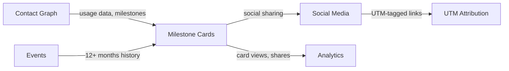

import { Card, CardGrid, LinkCard, Badge, Tabs, TabItem, Steps, Aside } from '@astrojs/starlight/components';

**Personalized 'year in review' or milestone cards users share on social media.**

---

## Scoring Card

| Dimension | Score | Rationale |
|-----------|-------|-----------|
| Pain | 2/5 | Not a burning pain — but every SaaS envies Spotify Wrapped and has no way to replicate it |
| Revenue | 3/5 | Drives organic viral reach that reduces CAC and increases brand awareness |
| Build | 4/5 | Straightforward — data aggregation, template rendering, shareable image generation |
| Moat | 2/5 | Concept is replicable but pre-built templates + data pipeline integration saves weeks |
| **Total** | **11/20** | |

---

## Classification

<Badge text="Vitamin" variant="caution" />

<Aside type="caution" title="Vitamin">
Milestone cards are a delight feature that drives organic viral reach. Spotify Wrapped generates billions of impressions annually. GrowthOS makes this capability accessible to any SaaS — no custom engineering required.
</Aside>

---

## The Pain It Kills

> *"We wanted to do a 'Year in Review' for our users like Spotify Wrapped. It took 3 engineers 6 weeks to build, and we could only run it once."*

- Spotify Wrapped generates **billions of social impressions** annually. Every SaaS wants this.
- Building it requires complex **data aggregation** (12+ months of user activity), **design** (shareable card templates), and **image generation** (server-side rendering for social sharing).
- Most teams build it once as a one-off project and never iterate. The engineering cost is too high for a feature that runs annually.
- No existing tool provides "Wrapped-style" milestone cards as a configurable, reusable feature.

---

## What It Does

- **Milestone detection rules** — configurable triggers for card generation (1 year anniversary, 1000th action, top 10% user, first referral).
- **Card template designer** — visual template editor with dynamic data fields (usage stats, rank, achievements).
- **Shareable image generation** — server-side rendering of cards as PNG/JPG images optimized for social media sharing.
- **Social sharing buttons** — one-click share to Twitter, LinkedIn, Facebook with pre-filled text.
- **UTM-tagged share links** — every shared card carries UTM parameters for attribution tracking.

---

## Competition & What We Replace

| Tool | Pricing | Limitation |
|------|---------|------------|
| Custom-built (Spotify, GitHub, Duolingo) | 3-6 engineer-weeks | One-off projects, not reusable, huge engineering investment |
| No direct competitor | — | No product offers this as a configurable module |

GrowthOS is the first platform to offer **Wrapped-style milestone cards as a configurable module** — no custom engineering required.

---

## Moat & Defensibility

**Data pipeline + templates (2/5).**

- Milestone detection uses 12+ months of data from the [Contact Graph](/growthos/phase-1/unified-contact-graph/) and event history.
- Shareable links carry UTM parameters tracked by [UTM Attribution](/growthos/phase-2/utm-attribution/).
- Social impressions and click-through data flow into [Analytics](/growthos/phase-3/cohort-analytics/).
- The feature is conceptually simple but the data aggregation pipeline is unique to GrowthOS.

---

## Interoperability Advantage

---

## What Ships

- **Milestone detection rules** — configurable triggers for card generation
- **Card template designer** — visual editor with dynamic data fields
- **Shareable image generation** — server-side PNG/JPG rendering
- **Social sharing buttons** — Twitter, LinkedIn, Facebook with pre-filled text
- **UTM-tagged share links** — automatic attribution tracking on shared cards
- **Milestone notification** — email or nudge when a card is ready

---

## What Does NOT Ship

- Video milestones (animated video generation)
- Animated cards (GIF or motion graphics)
- Real-time milestone detection (cards generated on schedule, not real-time)
- Custom illustration generation (use provided templates)

---

## Build vs Buy

**BUILD.**

No existing tool offers configurable milestone cards with multi-tenant support and integrated data pipelines. The build is moderate — data aggregation queries, a template engine, and server-side image rendering.

**Estimated effort:** 3-4 weeks.

---

## Dependencies

| Dependency | Why |
|-----------|-----|
| [Contact Graph (P1-01)](/growthos/phase-1/unified-contact-graph/) | Usage data and milestone tracking for card content. |
| Event history (12+ months) | Meaningful milestones require sufficient historical data. |
| [UTM Attribution (P2-09)](/growthos/phase-2/utm-attribution/) | Track viral reach from shared milestone cards. |
