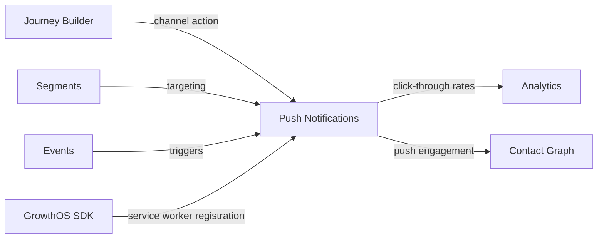

import { Card, CardGrid, LinkCard, Badge, Tabs, TabItem, Steps, Aside } from '@astrojs/starlight/components';

**Browser and mobile push notifications for real-time engagement.**

---

## Scoring Card

| Dimension | Score | Rationale |
|-----------|-------|-----------|
| Pain | 3/5 | Push is expected in a multi-channel platform — free alternatives exist but lack orchestration |
| Revenue | 3/5 | Completes the channel mix for higher-tier pricing |
| Build | 3/5 | FCM/APNs integration is well-documented, moderate effort for SDK changes |
| Moat | 2/5 | Push delivery is commodity — value is in segment-targeted, journey-integrated delivery |
| **Total** | **11/20** | |

---

## Classification

<Badge text="Vitamin" variant="caution" />

<Aside type="caution" title="Vitamin">
Push notifications complete the multi-channel delivery suite. While OneSignal offers a free tier, it lacks the growth module integration and journey orchestration that makes push notifications part of a coordinated growth strategy.
</Aside>

---

## The Pain It Kills

> *"We use OneSignal for push but it's completely disconnected from our user segments and email sequences. We can't send a push notification only to users who didn't open the email."*

- Free push tools (OneSignal, Firebase) handle delivery but have **no connection to growth logic**.
- Segment-targeted push requires exporting audiences from one tool and importing into another.
- Cross-channel fallback (email → push → SMS) is impossible without a unified orchestration layer.
- Push opt-in tracking is siloed — no single view of a contact's channel preferences.

---

## What It Does

- **Browser push** — Web Push API via service worker registration from the GrowthOS SDK.
- **Mobile push** — FCM (Android) and APNs (iOS) integration for native mobile apps.
- **Segment targeting** — send push notifications to any GrowthOS segment.
- **Journey Builder integration** — push as a first-class action node in multi-step journeys.
- **Opt-in tracking** — per-contact push permission status in the Contact Graph.
- **Click-through tracking** — track push notification clicks as events in the analytics pipeline.

---

## Competition & What We Replace

| Tool | Pricing | Limitation |
|------|---------|------------|
| OneSignal | Free-$99+/mo | Delivery-focused, no growth module integration |
| Pushwoosh | $50+/mo | Standalone push, no journey orchestration |
| Firebase (FCM) | Free | Delivery only, no segmentation or orchestration |
| Braze | $60K+/yr | Full-featured but enterprise-priced |

GrowthOS uses FCM/APNs for delivery and adds segment targeting, journey integration, and cross-channel coordination.

---

## Moat & Defensibility

**Orchestration + targeting (2/5).**

- Push notifications triggered by [Journey Builder](/growthos/phase-3/journey-builder/) conditions — not just batch sends.
- Targeting powered by [Segments](/growthos/phase-2/segment-builder/) — same audience definitions across all channels.
- Event triggers from the GrowthOS event bus — send push when a user's score changes or a milestone is hit.
- Push engagement data flows back into the [Contact Graph](/growthos/phase-1/unified-contact-graph/) — enrich contact records with channel preference data.

---

## Interoperability Advantage

---

## What Ships

- **Browser push** — Web Push API via GrowthOS SDK service worker
- **Mobile push** — FCM (Android) and APNs (iOS) integration
- **Segment targeting** — send to any GrowthOS segment
- **Journey Builder integration** — push as a first-class action node
- **Opt-in tracking** — per-contact push permission status
- **Click-through tracking** — push clicks as GrowthOS events

---

## What Does NOT Ship

- Rich media push (images, action buttons) — v1 is text-only
- Push A/B testing (use [A/B Testing Framework](/growthos/phase-3/ab-testing/))
- In-app messages (use [Nudges](/growthos/phase-2/in-app-nudges/))
- Push notification scheduling UI (use Journey Builder or API)

---

## Build vs Buy

**BUILD integration layer, BUY delivery.**

Use FCM and APNs for push delivery. Build the integration layer that connects push to the GrowthOS SDK, event bus, segment engine, and journey builder.

**Estimated effort:** 3-4 weeks.

---

## Dependencies

| Dependency | Why |
|-----------|-----|
| [GrowthOS SDK (P1)](/growthos/phase-1/unified-contact-graph/) | Service worker registration for browser push. Device token collection for mobile push. |
| [Segments (P2-06)](/growthos/phase-2/segment-builder/) | Audience targeting for push notifications. |
| FCM / APNs | Push delivery infrastructure. |
