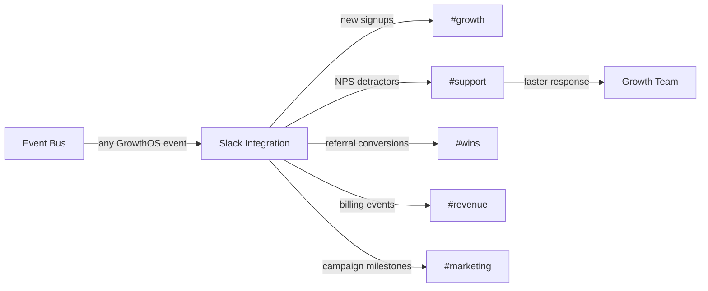

import { Card, CardGrid, LinkCard, Badge, Tabs, TabItem, Steps, Aside } from '@astrojs/starlight/components';

**Real-time growth alerts and campaign notifications in Slack.**

---

## Scoring Card

| Dimension | Score | Rationale |
|-----------|-------|-----------|
| Pain | 3/5 | Growth teams live in Slack — important events are buried in dashboards nobody checks |
| Revenue | 3/5 | Increases platform stickiness and perceived value for team-plan customers |
| Build | 4/5 | Straightforward Slack app with event routing — well-documented API |
| Moat | 2/5 | Slack integrations are common, but GrowthOS event bus makes routing richer |
| **Total** | **12/20** | |

---

## Classification

<Badge text="Vitamin" variant="caution" />

<Aside type="caution" title="Vitamin">
Slack integration is a quality-of-life feature that makes GrowthOS data visible where growth teams actually work. It reduces dashboard fatigue and enables faster response to critical events like NPS detractors and churn signals.
</Aside>

---

## The Pain It Kills

> *"A user gave us NPS 2 on Monday. We didn't see it until the weekly dashboard review on Friday. By then, they had churned."*

- Growth teams live in Slack — important events are buried in **dashboards nobody checks daily**.
- By the time someone notices a detractor NPS score, churn signal, or campaign failure, it is too late to act.
- Custom webhook integrations with Zapier are fragile and limited in formatting.
- No way to route different event types to different Slack channels without custom code.

---

## What It Does

- **Slack app installation** — standard OAuth-based Slack app with channel permissions.
- **Event-to-channel routing** — configurable rules: new signup → #growth, NPS detractor → #support, referral conversion → #wins, billing event → #revenue.
- **Configurable alert templates** — rich Slack message formatting with actionable context (contact name, score, event details, direct link to GrowthOS dashboard).
- **Channel management** — select which Slack channels receive which event types.
- **Notification preferences** — per-user and per-team notification settings to prevent alert fatigue.

---

## Competition & What We Replace

| Tool | Pricing | Limitation |
|------|---------|------------|
| Custom webhook + Zapier | $20-50/mo | Fragile, limited formatting, manual setup per event |
| Native tool integrations | Varies | Each tool (PostHog, Stripe, etc.) sends to Slack separately — no unified view |
| Datadog/PagerDuty | $15+/host/mo | Infrastructure-focused, not growth-event-focused |

GrowthOS Slack integration provides a **unified stream of growth events** — one app, one configuration, all events routed intelligently.

---

## Moat & Defensibility

**Event bus breadth (2/5).**

- Every GrowthOS module emits events to the event bus — Slack integration can route **any** of them.
- Unified event format means consistent, rich Slack messages regardless of source module.
- As new modules are added, they automatically become available for Slack routing.
- The combination of breadth (all growth events) and routing (per-channel configuration) is unique.

---

## Interoperability Advantage

---

## What Ships

- **Slack app installation** — OAuth-based with channel permissions
- **Event-to-channel routing** — configurable rules for event → channel mapping
- **Configurable alert templates** — rich message formatting with context and action links
- **Channel management** — UI for selecting channels and event types
- **Notification preferences** — per-user and per-team alert settings
- **Event filtering** — threshold-based alerts (e.g., only alert on NPS ≤ 3, not all NPS submissions)

---

## What Does NOT Ship

- Slack chatbot (no conversational AI in Slack)
- Slack-based workflows (no triggering GrowthOS actions from Slack)
- Bi-directional Slack commands (no `/growthos` slash commands)
- Microsoft Teams integration (Slack only in v1)

---

## Build vs Buy

**BUILD.**

Slack app development is well-documented and straightforward. The unique value is the connection to the GrowthOS event bus, which provides richer event data and more flexible routing than any generic webhook integration.

**Estimated effort:** 2-3 weeks.

---

## Dependencies

| Dependency | Why |
|-----------|-----|
| None | Standalone integration — connects to the GrowthOS event bus which exists from Phase 1. |
