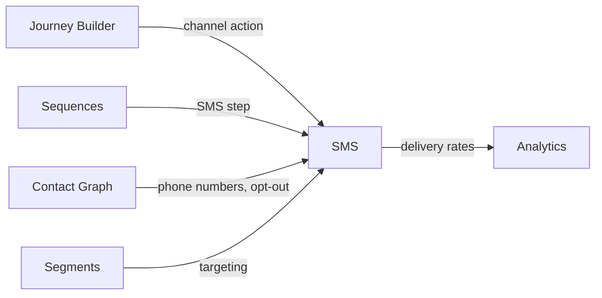

import { Card, CardGrid, LinkCard, Badge, Tabs, TabItem, Steps, Aside } from '@astrojs/starlight/components';

**SMS as a delivery channel for time-sensitive growth messages.**

---

## Scoring Card

| Dimension | Score | Rationale |
|-----------|-------|-----------|
| Pain | 3/5 | Some messages need immediacy — email is too slow for time-limited offers and confirmations |
| Revenue | 3/5 | Adds multi-channel value that justifies higher-tier pricing |
| Build | 3/5 | Straightforward Twilio/MessageBird integration with journey builder wiring |
| Moat | 2/5 | SMS delivery is commodity — value comes from orchestration integration |
| **Total** | **11/20** | |

---

## Classification

<Badge text="Vitamin" variant="caution" />

<Aside type="caution" title="Vitamin">
SMS is a standard channel expectation for any multi-channel growth platform. While not a primary differentiator, it completes the channel mix and enables time-sensitive use cases that email and push cannot serve.
</Aside>

---

## The Pain It Kills

> *"Our coupon expires in 2 hours. By the time the user opens the email, it's gone. We need SMS for time-sensitive messages."*

- Some messages need **immediacy** — payment confirmations, time-limited coupons, flash sale alerts.
- Email average open time is **4-6 hours**. SMS is read within **3 minutes** on average.
- Adding SMS to Customer.io costs **$100+/mo** as an add-on with limited integration.
- Twilio and MessageBird provide delivery only — no segmentation, journey integration, or growth logic.

---

## What It Does

- **SMS delivery** — via Twilio or MessageBird as delivery providers.
- **Transactional SMS** — event-triggered messages (payment confirmation, coupon delivery, appointment reminders).
- **Marketing SMS** — segment-targeted promotional messages with opt-out compliance.
- **Journey Builder integration** — SMS as a first-class action node in multi-step journeys.
- **Merge tags** — dynamic content insertion (name, coupon code, referral link, plan name).
- **Opt-out management** — automatic STOP keyword handling and compliance tracking.

---

## Competition & What We Replace

| Tool | Pricing | Limitation |
|------|---------|------------|
| Twilio | Per-message pricing | Delivery only, no orchestration or growth logic |
| MessageBird | Per-message pricing | Delivery infrastructure, no journey integration |
| Customer.io SMS | $100+/mo add-on | Limited to Customer.io ecosystem, expensive add-on |
| Postscript | $100+/mo | E-commerce focused, not SaaS growth |

GrowthOS uses Twilio/MessageBird for delivery and adds the orchestration layer — segments, journeys, merge tags, and cross-channel coordination.

---

## Moat & Defensibility

**Orchestration integration (2/5).**

- SMS messages triggered by [Journey Builder](/growthos/phase-3/journey-builder/) conditions and delays.
- Phone numbers and opt-out status managed in the [Contact Graph](/growthos/phase-1/unified-contact-graph/).
- Delivery rates flow into Analytics for channel performance comparison.
- Cross-channel fallback logic: if email not opened in 4 hours, send SMS.

The moat is not in SMS delivery (commodity) but in the **orchestration and cross-channel intelligence**.

---

## Interoperability Advantage

---

## What Ships

- **SMS sending** — transactional and marketing messages
- **Delivery tracking** — sent, delivered, failed status
- **Opt-out management** — automatic STOP keyword handling
- **Journey Builder integration** — SMS as a first-class action node
- **Merge tags** — dynamic content insertion from contact properties
- **Provider abstraction** — swap Twilio/MessageBird without changing journey logic

---

## What Does NOT Ship

- Two-way SMS conversations (reply handling beyond STOP)
- MMS (multimedia messages)
- Short codes (use standard long codes or toll-free numbers)
- SMS A/B testing (use [A/B Testing Framework](/growthos/phase-3/ab-testing/))

---

## Build vs Buy

**BUILD integration layer, BUY delivery.**

Use Twilio or MessageBird for SMS delivery. Build the integration layer that connects SMS to the GrowthOS event bus, journey builder, and contact graph.

**Estimated effort:** 2-3 weeks.

---

## Dependencies

| Dependency | Why |
|-----------|-----|
| [Comms Engine (P1)](/growthos/phase-1/lifecycle-emails/) | Shared delivery infrastructure for message queuing, rate limiting, and retry logic. |
| [Contact Graph (P1-01)](/growthos/phase-1/unified-contact-graph/) | Phone numbers and opt-out status for SMS delivery. |
| Twilio or MessageBird | SMS delivery provider. |
