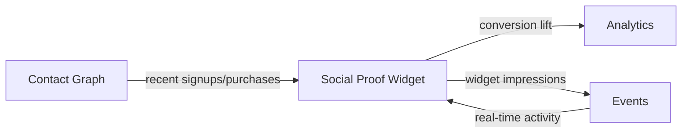

import { Card, CardGrid, LinkCard, Badge, Tabs, TabItem, Steps, Aside } from '@astrojs/starlight/components';

**Show real-time signup/purchase notifications to boost conversion.**

---

## Scoring Card

| Dimension | Score | Rationale |
|-----------|-------|-----------|
| Pain | 3/5 | Low pain — standalone tools exist but are overpriced for what they do |
| Revenue | 2/5 | Nice-to-have add-on, not a primary purchase driver |
| Build | 4/5 | Simple widget — real-time events + configurable templates |
| Moat | 2/5 | Easy to replicate but integration with contact graph adds value |
| **Total** | **11/20** | |

---

## Classification

<Badge text="Vitamin" variant="caution" />

<Aside type="caution" title="Vitamin">
Social proof widgets are a proven conversion booster (10-15% lift) but rarely the reason a customer buys a growth platform. As a native GrowthOS widget, it becomes a zero-effort add-on that increases the value of the existing stack.
</Aside>

---

## The Pain It Kills

> *"We're paying $29/mo for a popup that says 'John from NYC just signed up.' That's it. That's the whole product."*

- Standalone social proof tools like Proof/UseProof cost **$29-79/mo** for a simple notification widget.
- They have no connection to your actual user data — many use fake or delayed data.
- Proven to increase landing page conversions by **10-15%** when implemented correctly.
- Privacy concerns with third-party scripts that track visitor behavior across sites.

---

## What It Does

- **`<growthOS-social-proof>` Web Component** — drop into any page with one line of HTML.
- **Real-time notifications** — "X people signed up in the last 24 hours" or "John from NYC just purchased Plan Y."
- **Configurable message templates** — choose what data to show, how to format it, and when to trigger.
- **Privacy-safe** — uses only first-party data from your Contact Graph. No external tracking.
- **Position and style options** — bottom-left, bottom-right, top bar, custom CSS.
- **Throttling** — configurable display frequency so users are not overwhelmed.

---

## Competition & What We Replace

| Tool | Pricing | Limitation |
|------|---------|------------|
| Proof / UseProof | $29-79/mo | Disconnected from user data, uses third-party tracking |
| FOMO | $19-39/mo | Limited customization, no contact graph integration |
| ProveSource | $18-66/mo | External script with privacy concerns |

All three are **standalone widgets** with no connection to your growth stack. GrowthOS social proof uses real data from the Contact Graph and feeds conversion metrics back into Analytics.

---

## Moat & Defensibility

**Integration is the differentiator (2/5).**

- Uses real-time data from the [Contact Graph](/growthos/phase-1/unified-contact-graph/) — no fake notifications.
- Activity events feed directly from the GrowthOS event bus — zero configuration for existing customers.
- Conversion lift data flows into [Cohort Analytics](/growthos/phase-3/cohort-analytics/) — measure actual impact.

The widget itself is simple to replicate, but the data pipeline behind it is unique to GrowthOS.

---

## Interoperability Advantage

---

## What Ships

- **`<growthOS-social-proof>` Web Component** — embeddable in any page
- **Configurable message templates** — text, data fields, formatting
- **Real-time updates** — powered by the GrowthOS event bus
- **Privacy controls** — choose which data to display, anonymization options
- **Position and style options** — corner popups, top bars, inline
- **Display throttling** — frequency caps per visitor session

---

## What Does NOT Ship

- Review aggregation (pulling reviews from G2, Capterra)
- Video testimonials (see [Testimonial Collector](/growthos/phase-3/testimonial-collector/))
- Custom animations or advanced visual effects
- A/B testing of widget variants (use [A/B Testing Framework](/growthos/phase-3/ab-testing/))

---

## Build vs Buy

**BUILD.**

No open-source social proof widget exists with multi-tenant support and native event bus integration. The build is straightforward — a Web Component consuming real-time events and rendering configurable templates.

**Estimated effort:** 2-3 weeks.

---

## Dependencies

| Dependency | Why |
|-----------|-----|
| [Contact Graph (P1-01)](/growthos/phase-1/unified-contact-graph/) | Source of real-time signup and purchase data for notifications. |
