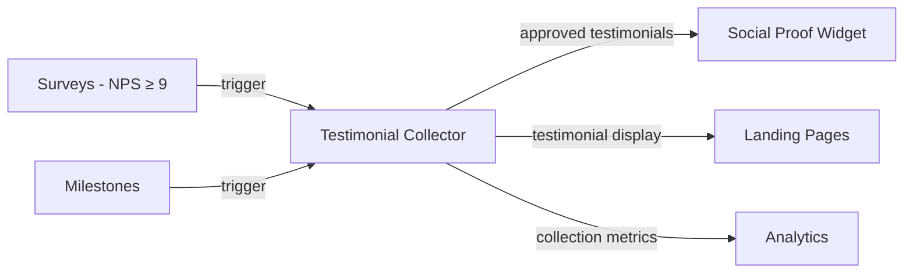

import { Card, CardGrid, LinkCard, Badge, Tabs, TabItem, Steps, Aside } from '@astrojs/starlight/components';

**Collect text and video testimonials from happy users at the right moment.**

---

## Scoring Card

| Dimension | Score | Rationale |
|-----------|-------|-----------|
| Pain | 2/5 | Manual testimonial collection works but is tedious and poorly timed |
| Revenue | 3/5 | Testimonials feed into social proof and landing pages, improving conversion |
| Build | 4/5 | Straightforward — form, video widget, approval workflow, embedding |
| Moat | 2/5 | Integration with surveys and social proof creates a unique testimonial pipeline |
| **Total** | **11/20** | |

---

## Classification

<Badge text="Vitamin" variant="caution" />

<Aside type="caution" title="Vitamin">
Testimonial collection is a support feature that enhances other GrowthOS modules — social proof widgets, landing pages, and advocacy programs. The key innovation is **timing**: requesting testimonials when satisfaction signals are strongest.
</Aside>

---

## The Pain It Kills

> *"We ask for testimonials via a Google Form link in our monthly newsletter. Response rate is 2%. We have 5 testimonials after 2 years."*

- Manual testimonial collection (email requests, Google Forms) has **abysmal response rates** (1-3%).
- The key to high response rates is **timing** — ask when the user is happiest (after a positive NPS, milestone achievement, or successful outcome).
- Standalone tools like Testimonial.to cost **$20-50/mo** but have no connection to user satisfaction data.
- Collected testimonials sit in a separate tool with no connection to the website, social proof widgets, or landing pages.

---

## What It Does

- **Testimonial request triggers** — automatically request testimonials after NPS score ≥ 9, milestone achievement, or configurable event.
- **Text collection form** — simple, branded form with guided questions and character limits.
- **Video recording widget** — in-browser video recording for video testimonials (no app install required).
- **Approval workflow** — review and approve testimonials before they go live.
- **Embeddable testimonial display** — `<growthOS-testimonials>` component for websites and landing pages.

---

## Competition & What We Replace

| Tool | Pricing | Limitation |
|------|---------|------------|
| Testimonial.to | $20-50/mo | No satisfaction signal integration, manual request timing |
| VideoAsk | $24-40/mo | Video-focused, no text testimonials, no approval workflow |
| Manual collection | Free | Low response rates, poor timing, no centralized management |

GrowthOS testimonial collection is **trigger-based** — requests are sent when satisfaction data indicates the highest probability of a positive response.

---

## Moat & Defensibility

**Satisfaction-triggered collection (2/5).**

- Testimonial requests triggered by [Surveys](/growthos/phase-1/surveys-nps/) — NPS ≥ 9 automatically prompts for a testimonial.
- Milestone achievements from [Milestone Cards](/growthos/phase-3/milestone-cards/) can trigger collection.
- Approved testimonials feed into the [Social Proof Widget](/growthos/phase-3/social-proof-widget/) and [Landing Pages](/growthos/phase-3/landing-page-builder/).
- The closed loop from satisfaction measurement to testimonial collection to social proof display is unique to GrowthOS.

---

## Interoperability Advantage

---

## What Ships

- **Testimonial request triggers** — NPS-based, milestone-based, event-based
- **Text collection form** — branded, guided questions, character limits
- **Video recording widget** — in-browser recording, no app install required
- **Approval workflow** — review queue, approve/reject, edit before publishing
- **Embeddable testimonial display** — `<growthOS-testimonials>` Web Component
- **Testimonial management dashboard** — view, filter, tag, and organize all collected testimonials

---

## What Does NOT Ship

- AI-generated testimonials (only real user-submitted content)
- Testimonial editing tools (minor formatting only, no content rewriting)
- Stock video integration
- Automated social media posting of testimonials

---

## Build vs Buy

**BUILD.**

No open-source testimonial collection tool exists with NPS-triggered requests and multi-tenant embeddable display. The build is straightforward — forms, video recording (MediaRecorder API), approval workflow, and a display component.

**Estimated effort:** 3-4 weeks.

---

## Dependencies

| Dependency | Why |
|-----------|-----|
| [Surveys (P1-04)](/growthos/phase-1/surveys-nps/) | NPS score ≥ 9 triggers testimonial request. |
