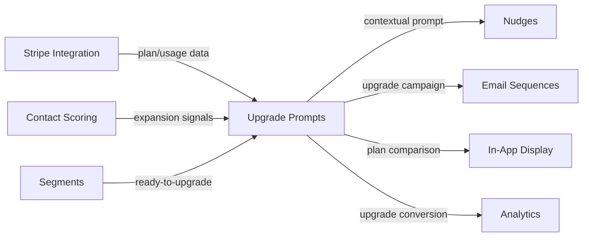

import { Card, CardGrid, LinkCard, Badge, Tabs, TabItem, Steps, Aside } from '@astrojs/starlight/components';

**Intelligently prompt users to upgrade when they hit plan limits or show expansion signals.**

---

## Scoring Card

| Dimension | Score | Rationale |
|-----------|-------|-----------|
| Pain | 4/5 | Most SaaS teams show generic "upgrade" banners with no intelligence or timing |
| Revenue | 5/5 | Directly drives expansion revenue — the highest-revenue-impact feature in Phase 3 |
| Build | 3/5 | Moderate — Stripe usage monitoring, signal detection, nudge/email orchestration |
| Moat | 3/5 | Combines billing data, usage patterns, and scoring into intelligent upgrade timing |
| **Total** | **13/20** | |

---

## Classification

<Badge text="Painkiller" variant="tip" />

<Aside type="tip" title="Painkiller">
Upgrade prompt orchestration is the **highest revenue-impact feature** in Phase 3. It directly drives expansion revenue by connecting usage data (from Stripe), engagement signals (from Contact Scoring), and delivery channels (nudges, email) into a single intelligent system.
</Aside>

---

## The Pain It Kills

> *"We show a yellow banner that says 'Upgrade to Pro' to everyone. Power users ignore it. New users are confused by it. Nobody clicks it."*

> *"A user hit their API limit on a Tuesday evening. We sent the upgrade email on Friday morning. They had already churned."*

- Most SaaS teams show a **generic "upgrade" banner** — no connection between usage patterns, billing data, and prompt timing.
- Upgrade prompts fire at the wrong time — either too early (user is not ready) or too late (user has already churned or found a workaround).
- No existing tool connects **Stripe billing data** (plan limits, usage) with **engagement signals** (inviting team members, hitting feature limits) and **delivery channels** (in-app nudge, email, push).
- Custom-built upgrade logic is fragile and hardcoded — changing plan tiers requires code changes.

---

## What It Does

- **Usage monitoring** — track usage against plan limits via Stripe Integration (API calls, team members, storage, features).
- **Expansion signal detection** — identify users showing upgrade intent: inviting team members, hitting feature limits, exploring premium features, increasing usage velocity.
- **Contextual upgrade nudges** — show in-app nudges at the moment of need ("You've used 90% of your API quota. Upgrade to Pro for unlimited access.").
- **Upgrade email sequences** — triggered email campaigns for users showing expansion signals.
- **Plan comparison display** — dynamic plan comparison that highlights the specific features the user needs.
- **Conversion tracking** — track upgrade conversion rates by signal type, channel, and timing.

---

## Competition & What We Replace

| Tool | Pricing | Limitation |
|------|---------|------------|
| Custom-built | Weeks of engineering | Hardcoded logic, no connection to growth stack |
| Stripe Billing Portal | Included with Stripe | Basic "manage subscription" page, no intelligence |
| Profitwell Retain | Varies | Churn prevention focused, not expansion focused |
| Baremetrics | $50-500/mo | Analytics only, no upgrade prompting |

GrowthOS upgrade orchestration combines **billing data + engagement signals + intelligent timing + multi-channel delivery** — a complete expansion revenue system.

---

## Moat & Defensibility

**Data convergence (3/5).**

- Usage and plan data from [Stripe Integration](/growthos/phase-2/stripe-integration/) — real billing context, not guesswork.
- Engagement signals from [Contact Scoring](/growthos/phase-2/contact-scoring/) — expansion score based on behavior patterns.
- Ready-to-upgrade segment from [Segment Builder](/growthos/phase-2/segment-builder/) — dynamic audience of expansion candidates.
- In-app prompts via [Nudges](/growthos/phase-2/in-app-nudges/) — contextual, non-intrusive upgrade suggestions.
- Email campaigns via [Email Sequences](/growthos/phase-1/lifecycle-emails/) — multi-touch upgrade nurturing.

The convergence of billing, behavior, and delivery data creates intelligence that no single-purpose tool can match.

---

## Interoperability Advantage

---

## What Ships

- **Usage monitoring** — real-time tracking of usage vs plan limits from Stripe
- **Expansion signal detection** — configurable rules for identifying upgrade-ready users
- **Contextual upgrade nudges** — in-app prompts at the moment of need
- **Upgrade email sequences** — triggered multi-step email campaigns
- **Plan comparison display** — dynamic comparison highlighting user-relevant features
- **Conversion tracking** — per-signal, per-channel upgrade conversion metrics

---

## What Does NOT Ship

- Billing management (plan creation, pricing changes — use Stripe directly)
- Payment processing (checkout, invoicing — use Stripe directly)
- Plan creation UI (plans configured in Stripe, synced to GrowthOS)
- Downgrade prevention flows (churn prevention is a separate concern)

---

## Build vs Buy

**BUILD.**

No existing tool combines Stripe billing data with engagement scoring and multi-channel delivery for upgrade prompting. The build leverages existing Stripe Integration, Contact Scoring, Nudges, and Email Sequences infrastructure.

**Estimated effort:** 4-5 weeks.

---

## Dependencies

| Dependency | Why |
|-----------|-----|
| [Stripe Integration (P2-31)](/growthos/phase-2/stripe-integration/) | Plan limits, usage data, and billing context for upgrade timing. |
| [Nudges (P2-14)](/growthos/phase-2/in-app-nudges/) | In-app delivery channel for contextual upgrade prompts. |
| [Contact Scoring (P2-18)](/growthos/phase-2/contact-scoring/) | Expansion signal detection and upgrade-readiness scoring. |
| [Segments (P2-06)](/growthos/phase-2/segment-builder/) | Dynamic "ready-to-upgrade" audience segment. |
