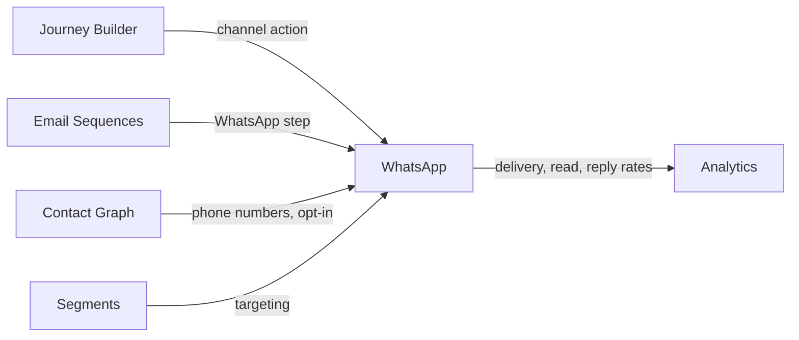

import { Card, CardGrid, LinkCard, Badge, Tabs, TabItem, Steps, Aside } from '@astrojs/starlight/components';

**Send WhatsApp messages as part of growth journeys — 90%+ open rates vs 18% email.**

---

## Scoring Card

| Dimension | Score | Rationale |
|-----------|-------|-----------|
| Pain | 4/5 | India/emerging markets: WhatsApp has 90%+ open rate vs 18% email. Growth tools are email-only. |
| Revenue | 4/5 | Unlocks India and emerging markets — massive expansion opportunity |
| Build | 2/5 | WhatsApp Business API integration is complex — template approval, rate limits, compliance |
| Moat | 3/5 | WhatsApp as a first-class journey channel — not just a standalone messaging tool |
| **Total** | **13/20** | |

---

## Classification

<Badge text="Painkiller" variant="tip" />

<Aside type="tip" title="Painkiller">
In India and emerging markets, email is nearly useless for growth (18% open rate). WhatsApp has **90%+ open rates** and is the primary communication channel. Adding WhatsApp as a first-class GrowthOS channel unlocks an enormous market that email-only tools cannot serve.
</Aside>

---

## The Pain It Kills

> *"Our users are in India. Email open rate is 12%. WhatsApp open rate is 93%. But our growth stack is entirely email-based."*

> *"We use Gupshup for WhatsApp delivery, but it has zero growth logic. We can't trigger a WhatsApp message when a user hits a milestone or enters a segment."*

- India and emerging markets: **WhatsApp has 90%+ open rate** vs 18% email. Growth tools are email-only, making them useless for these markets.
- WhatsApp Business API providers (Gupshup, Twilio) handle **delivery only** — no segmentation, no journey integration, no growth logic.
- Building WhatsApp into a growth workflow requires custom engineering to connect delivery providers with user data and triggers.
- Compliance is complex — template pre-approval, opt-in management, rate limiting.

---

## What It Does

- **WhatsApp Business API integration** — via Gupshup or Twilio as delivery providers.
- **Template messages** — pre-approved message templates with dynamic placeholders (name, coupon code, referral link).
- **Transactional messages** — order confirmations, password resets, payment receipts.
- **Conversational replies** — basic reply handling for user responses.
- **Journey Builder integration** — WhatsApp as a first-class action node in multi-step journeys.
- **Sequence integration** — add WhatsApp steps to lifecycle email sequences (email → wait → WhatsApp).
- **Opt-in management** — track and enforce WhatsApp consent per contact.

---

## Competition & What We Replace

| Tool | Pricing | Limitation |
|------|---------|------------|
| Gupshup | Per-message pricing | Delivery provider only, no growth logic or segmentation |
| Twilio | Per-message pricing | Delivery infrastructure, no orchestration or journey building |
| WebEngage | $500+/mo | Full-stack but expensive, complex setup, enterprise-focused |
| Interakt | $49+/mo | WhatsApp CRM but no growth module integration |

GrowthOS uses Gupshup/Twilio for **delivery** but adds the growth intelligence layer — segments, journeys, scoring, and cross-channel orchestration.

---

## Moat & Defensibility

**Channel + intelligence (3/5).**

- WhatsApp messages are triggered by [Journey Builder](/growthos/phase-3/journey-builder/) conditions — not just batch sends.
- Contact phone numbers and opt-in status come from the [Contact Graph](/growthos/phase-1/unified-contact-graph/).
- Delivery, read, and reply rates flow into Analytics for channel performance comparison.
- Cross-channel journeys (email → WhatsApp → nudge) are unique to an integrated platform.

---

## Interoperability Advantage

---

## What Ships

- **WhatsApp template messages** — with dynamic placeholders
- **Transactional messages** — event-triggered delivery
- **Delivery tracking** — sent, delivered, read, replied status
- **Opt-in management** — per-contact consent tracking and enforcement
- **Journey Builder integration** — WhatsApp as a first-class action node
- **Sequence integration** — WhatsApp steps in lifecycle sequences
- **Provider abstraction** — swap Gupshup/Twilio without changing journey logic

---

## What Does NOT Ship

- WhatsApp chatbot (conversational AI)
- WhatsApp commerce (product catalogs, cart, checkout)
- Bulk unsolicited messaging (compliance-first approach)
- WhatsApp group management

---

## Build vs Buy

**BUILD integration layer, BUY delivery.**

Use Gupshup or Twilio for WhatsApp Business API delivery. Build the integration layer that connects WhatsApp to the GrowthOS event bus, journey builder, and contact graph.

**Estimated effort:** 3-4 weeks.

---

## Dependencies

| Dependency | Why |
|-----------|-----|
| [Comms Engine (P1)](/growthos/phase-1/lifecycle-emails/) | Shared delivery infrastructure for message queuing, rate limiting, and retry logic. |
| [Contact Graph (P1-01)](/growthos/phase-1/unified-contact-graph/) | Phone numbers and opt-in status for WhatsApp delivery. |
| Gupshup or Twilio | WhatsApp Business API delivery provider. |
