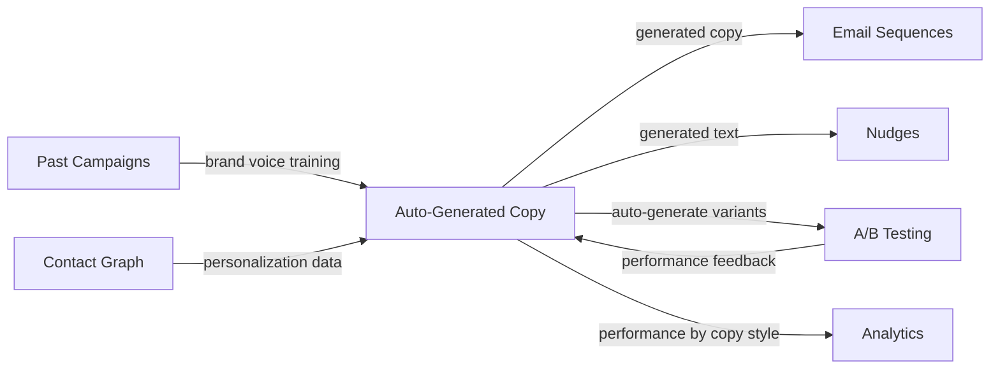

import { Card, CardGrid, LinkCard, Badge, Tabs, TabItem, Steps, Aside } from '@astrojs/starlight/components';

**LLM generates email subjects, body copy, and nudge text — tuned to your brand voice.**

---

## Scoring Card

| Dimension | Score | Rationale |
|-----------|-------|-----------|
| Pain | 2/5 | Copy writing is tedious but not blocking — teams ship with mediocre copy |
| Revenue | 2/5 | Nice-to-have for upsell, not a primary purchase driver |
| Build | 3/5 | LLM API integration is straightforward; brand voice tuning adds complexity |
| Moat | 2/5 | LLM wrappers are low-moat; value is in the integration context |
| **Total** | **9/20** | |

---

## Classification

<Badge text="Vitamin" variant="caution" /> <Badge text="AI Layer" variant="default" />

<Aside type="caution" title="Vitamin">
Auto-generated copy saves hours of writing time per campaign and unlocks A/B testing at scale (because generating 5 variants costs no extra effort). It is a **convenience multiplier**, not a must-have. The moat comes from context — GrowthOS knows the contact, the campaign history, and the brand voice.
</Aside>

---

## The Pain It Kills

Writing campaign copy is the most time-consuming part of launching a growth campaign. Most indie teams fall into one of two traps:

- **Reuse the same templates forever** — "Hey \{name\}, check out our new feature!" gets stale fast. Open rates decay as contacts tune out repetitive copy.
- **Skip A/B testing entirely** — testing 3 subject line variants means writing 3 subject lines. Most teams test zero.
- **Hire a copywriter they can't afford** — freelance SaaS copywriters charge $100–$500 per email. At 4 campaigns/month, that is $400–$2,000/mo for copy alone.
- **Use ChatGPT manually** — copy-paste between ChatGPT and the email tool, losing context and consistency every time.

---

## What It Does

<Steps>
1. **Learn brand voice** — analyze past campaigns, website copy, and tone preferences to build a brand voice profile per tenant.
2. **Generate email subjects** — 3–5 subject line variants per campaign, optimized for open rates.
3. **Generate body copy** — full email body with personalization tokens, matching brand voice and campaign intent.
4. **Generate nudge text** — short-form copy for in-app nudges, push notifications, and WhatsApp messages.
5. **Auto-generate A/B variants** — produce multiple copy variants for automated A/B testing with zero extra effort.
6. **Human approval workflow** — all generated copy goes through a review-and-approve step before sending. No fully autonomous sends.
</Steps>

---

## Competition & What We Replace

| Tool | Pricing | Limitation |
|------|---------|------------|
| Jasper | $49+/mo | General-purpose, no email platform integration, no brand voice from past campaigns |
| Copy.ai | $36+/mo | Generic templates, no contact-aware personalization |
| ChatGPT | $20/mo | Manual copy-paste workflow, no campaign context, no A/B variant generation |
| Braze AI Copywriter | $60K+/yr | Enterprise-only, locked behind Braze platform |

GrowthOS auto-copy is **context-aware** — it knows the contact's lifecycle stage, past interactions, and campaign history. Generic LLM tools generate copy in a vacuum.

---

## Moat & Defensibility

**Integration context is the moat (2/5).**

- The LLM wrapper itself is low-moat — anyone can call GPT-4 or Claude. The value is in the **context passed to the LLM**: contact data, campaign history, brand voice profile, past open/click rates by copy style.
- Over time, the system learns which copy styles perform best for each tenant's audience — a feedback loop that generic AI writing tools cannot replicate.
- Tight integration with [A/B Testing](/growthos/phase-3/ab-testing/) closes the loop: generate variants, test them, learn what works, generate better variants next time.

---

## Interoperability Advantage

The feedback loop between auto-generated copy, A/B testing, and analytics means the system **gets smarter with every campaign sent**. This is impossible with standalone AI writing tools.

---

## What Ships

- **Email subject generation** — 3–5 variants per campaign with predicted open-rate ranking
- **Body copy generation** — full email body with personalization tokens and brand voice
- **Nudge text generation** — short-form copy for in-app nudges, push, and WhatsApp
- **Brand voice learning** — automatic tone/style extraction from past campaigns
- **A/B variant auto-generation** — generate N variants for testing with one click
- **Human approval workflow** — review, edit, approve before any generated copy sends

---

## What Does NOT Ship

- **Image generation** — no AI-generated images, banners, or visual assets
- **Landing page copy** — generation is scoped to campaign messages (emails, nudges, push), not full pages
- **Social media posts** — no Twitter/LinkedIn/Instagram copy generation
- **Fully autonomous sending** — all generated copy requires human approval before delivery; no "set and forget" AI sends

---

## Build vs Buy

**BUILD (thin wrapper).**

The core LLM capability is bought (OpenAI GPT-4 / Anthropic Claude API). What we build is the integration layer: brand voice extraction, contact-aware prompt engineering, A/B variant generation, approval workflow, and the feedback loop from analytics back to the model.

**Estimated effort:** 4–5 weeks.

---

## Dependencies

| Dependency | Why |
|-----------|-----|
| LLM API (OpenAI / Anthropic) | Core text generation capability |
| [Lifecycle Emails (P1-03)](/growthos/phase-1/lifecycle-emails/) | Primary destination for generated copy |
| [In-App Nudges (P2-14)](/growthos/phase-2/in-app-nudges/) | Destination for generated nudge text |
| [A/B Testing (P3-21)](/growthos/phase-3/ab-testing/) | Variant testing and feedback loop |
| Past campaign data | Brand voice extraction and copy style learning |
