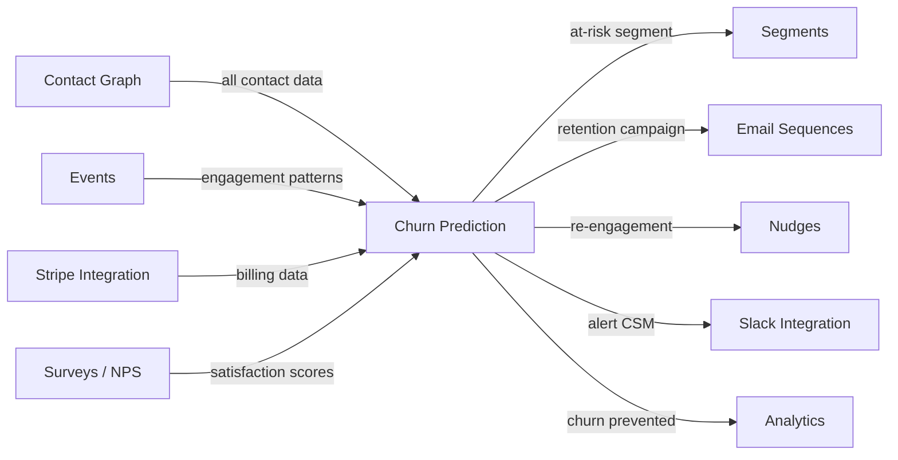

import { Card, CardGrid, LinkCard, Badge, Tabs, TabItem, Steps, Aside } from '@astrojs/starlight/components';

**Predict which users are likely to churn before they cancel — and trigger retention flows.**

---

## Scoring Card

| Dimension | Score | Rationale |
|-----------|-------|-----------|
| Pain | 3/5 | Churn is the silent killer — most teams react after cancellation |
| Revenue | 3/5 | Retained revenue is the highest-ROI dollar; justifies enterprise tier |
| Build | 2/5 | ML pipeline, multi-signal feature engineering, threshold tuning |
| Moat | 2/5 | Model improves with data but churn prediction is a known ML pattern |
| **Total** | **10/20** | |

---

## Classification

<Badge text="Vitamin" variant="caution" /> <Badge text="AI Layer" variant="default" />

<Aside type="caution" title="Vitamin">
Churn prediction transforms reactive customer success into proactive retention. Teams survive without it, but those who activate it catch at-risk users **weeks before cancellation** — turning a loss into a save. It is the AI feature most likely to justify enterprise pricing on its own.
</Aside>

---

## The Pain It Kills

By the time a user hits the cancel button, it is too late. The decision was made days or weeks ago, and no last-minute discount can reliably reverse it.

- **Churn costs 5–25x more to replace than to retain.** Acquiring a new customer at $50–$200 CAC vs. sending a retention email at $0 cost.
- Most indie SaaS teams discover churn from their Stripe dashboard — after the fact.
- Teams that do track engagement signals do it manually: "check who hasn't logged in this week" — unscalable and unreliable.
- No affordable tool connects engagement data, billing data, support signals, and NPS scores into a single churn probability.

---

## What It Does

<Steps>
1. **Ingest multi-signal data** — engagement patterns (logins, feature usage, session depth), billing data (plan changes, failed payments), support tickets, NPS scores.
2. **Train a churn prediction model** — ML model (gradient-boosted trees or logistic regression) trained per-tenant on historical churn events.
3. **Score every contact** — output a churn probability (0–100%) updated daily.
4. **Auto-trigger retention flows** — when churn probability exceeds a configurable threshold (default: 70%), automatically enroll the contact in a retention sequence.
5. **Surface feature importance** — explain *why* this contact is at risk (e.g., "login frequency dropped 60% in last 14 days", "NPS score declined from 8 to 4").
</Steps>

---

## Competition & What We Replace

| Tool | Pricing | Limitation |
|------|---------|------------|
| ProfitWell Retain | Acquired by Paddle | Billing-focused, no engagement data, no multi-channel retention |
| ChurnZero | Custom pricing (expensive) | Enterprise-only, heavy implementation, 6+ week onboarding |
| Custom ML | $0 + engineering time | 4–8 weeks to build, requires dedicated ML engineer to maintain |
| Baremetrics | $50–$500/mo | Analytics only — no prediction, no automation |

GrowthOS churn prediction is **integrated, automated, and affordable** — it combines engagement data, billing signals, and NPS scores that no standalone tool can access without complex integrations.

---

## Moat & Defensibility

**Data breadth is the moat (2/5).**

- Churn prediction ML is a known pattern — the algorithm is not the moat. The moat is having **all the signals in one place**: engagement events, billing data, NPS scores, support interactions, and contact metadata.
- Standalone churn tools must integrate with 3–5 systems to get the same data that GrowthOS already has natively.
- The model improves per-tenant over time — 3 months of data produces a useful model, 12 months produces a strong one.

---

## Interoperability Advantage

The power of churn prediction in GrowthOS is that every input signal and every output action is **already connected**. No Zapier. No CSV exports. No manual workflows.

---

## What Ships

- **Churn probability score per contact** — 0–100%, updated daily
- **At-risk-of-churn segment** — auto-populated, usable across all modules
- **Auto-trigger retention flows** — configurable threshold triggers email sequences, nudges, or Slack alerts
- **Churn risk dashboard** — tenant-level view of at-risk contacts, trends, and saves
- **Feature importance** — per-contact explanation of why the model flagged them (top 3 contributing factors)
- **Historical accuracy tracking** — model precision/recall over time, so tenants can see the model improving

---

## What Does NOT Ship

- **Custom ML model training** — no tenant-facing training UI; model trains automatically on tenant data
- **Win-back campaigns** — use [Email Sequences](/growthos/phase-1/lifecycle-emails/) for post-churn win-back; churn prediction focuses on *prevention*
- **Revenue impact forecasting** — no "this churn will cost you $X" projections; we show probability, not financial modeling
- **Real-time scoring** — scores update daily, not in real-time; sufficient for retention use cases

---

## Build vs Buy

**BUILD.**

No open-source churn prediction system exists with multi-tenant support and native integration to a contact graph. The ML component is standard (scikit-learn / XGBoost), but the feature engineering pipeline that pulls from events, billing, surveys, and contact data must be built natively.

**Estimated effort:** 5–6 weeks.

---

## Dependencies

| Dependency | Why |
|-----------|-----|
| [Contact Graph (P1-01)](/growthos/phase-1/unified-contact-graph/) | Central data record for all contact signals |
| [Lifecycle Emails (P1-03)](/growthos/phase-1/lifecycle-emails/) | Retention sequences triggered by churn prediction |
| [Stripe Integration (P2-31)](/growthos/phase-2/stripe-integration/) | Billing data — plan changes, failed payments, downgrades |
| [Surveys & NPS (P1-05)](/growthos/phase-1/surveys-nps/) | Satisfaction signal — NPS decline is a strong churn predictor |
| Event data (3+ months) | Model requires historical engagement and churn events to train |
